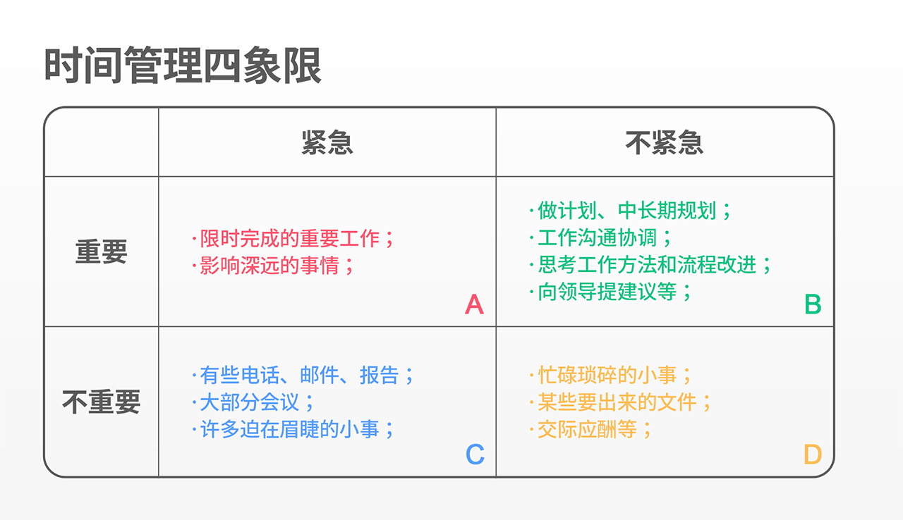

2019-02-05  
我也不记得怎么买了这本书就买了一本看看，大概是学习一下不一样的读书方法？？希望能有所收获😶
(啊希望过年这一周不适合好好学习的时间内能把这本书看完🤔)
<!-- more -->

## 前言
- 麦肯锡的思考方式：对于前景未明的状况与没有正确答案的问题，关键是确定“在了解了各种事实与信息之后，自己应该怎样做”(即具体方案)，仅仅收集信息是无济于事的。

> “从今往后，是大脑的时代，也就是知识与想法创造价值的时代。”————大前研一

## 麦肯锡的专业作风
- 倘若不能设身处地地感受客户的困境，是无法解决任何问题或提出任何建议的，也无法标榜自己做到了“客户第一”。
- 麦肯锡的客户第一是要亲自前往客户的用户所在的地方，去实地感受客户的困境，切身的感受困境，收集一手的信息，才能得到真实的情况。并且在现场与客户交流，与社交式的会议不同，融入对方的日常工作，了解客户的行业，对方会很自然地说出真心话。
- PMA是最重要的(Positive Mental Attitude)，无论出现什么情况都不能退缩，不要忘记思考自己可以做什么。绝不逃避，是新人培训中的第一要素。
- 曾经有这么一个传言：大前先生看了资料后，直接把资料扔进了粉碎机。事实就是如此的严格，麦肯锡要求工作、资料做的尽善尽美。
- 要么继续创造价值，要么离开。任何工作都是这样。**如果无法持续创造出能令客户满意的价值，就将被迫退出竞争。**
- 实际上真正出色的人才具备一种艺术家的灵感。逻辑性是工作的必要条件，但不是充分条件。
- 逻辑上给予正确的引导，同时带来心灵的感触，会让团队成员感到安心。
- **再兢兢业业的人，也不免会被周围迟缓倦怠的氛围感染，以致兴致低落。**严格的环境中，令新人坚持下去的原因，应该就在于“严于律己之人”聚集的工作环境。
- 也许这就是为什么要考一个好大学，要考入一个学习氛围浓厚，整体环境积极向上的学校，这也是大多数重点学校的优势所在，聚集优秀之人，凝聚优秀之气。
- 优秀、有魅力且具有真才实学的人，才是所谓的“麦肯锡人”。
- 制作图表的关键，不是制作自己想制作的图表，而是制作对方能够理解的图表。
- 多问问这么做结果如何？
- 制作问卷本身并不是目的，必须考虑借助于问卷要达成什么目的，以及利用从中获得的有价值的分析结果，可以描绘出怎样的解决方案。
- 所谓“行家”是指的这样一类人：与之交谈时，对方能够从不同于自己的视角出发，提出许多妙趣横生的想法。
- 是否混淆了问题本身？找到真正的问题是什么，是很关键也很困难的事。

## 麦肯锡式解决问题的基本步骤
- 解决问题并不是应对已经发生的事情，而是深入研究问题的本质。
- 任何事件或结果，都不可能独立存在————分解问题
- 分解问题：  
  1. 不重不漏
  2. 基于事实进行分解：避免感情和个人感觉
  3. 抓住主要矛盾和矛盾的主要方面
- 根据关键问题提出假说，进行分析
- 使用由关键问题推导出来的诸多要素，验证假说：  
  1. 设置边界条件
  2. 逻辑严谨
  3. 根据偏差修正要点
- 推到解决方案：空·雨·伞：  
  1. 空：事实/列举现象——>乌云密布
  2. 雨：解释/解读现象——>将要下雨
  3. 伞：行动/应对措施——>持伞出门🌂/亦可赛艇⛵
- 不要过度收集信息————浪费收集和分析的时间
- 不要过分局限与现在的情况或制约条件：  
  1. 不要限制事物之间的联系，Everything is connected.
  2. 以核心目标为为起点，提出对策，付诸行动。
- 时刻保持逻辑性
- 反复重复“为什么”
- 针对性要明确，企业：“针对谁，做什么，如何做”

## 麦肯锡框架的工具包
- 框架是为了有效深入思考的工具，如果脱离目的，便毫无意义
- 
### 整体流程————>商业体系(流程图)  
  1. 便于追溯需要改善的源头
  2. 不要只关注发生问题的步骤，要进行回溯

### 战略的基本面————>3C框架  
  1. Customer | Competitor | Company
  2. “通过分析自己公司**现在所处**的经营环境，灵活地开发经营课题、制定战略等”
  3. 保持自己战略的客观性

### 评估组织————>7S框架  
- 将构成组织的要素分为“硬件”和“软件”加以分析
- 硬件：  
  1. 战略：打造企业优势，定位企业方向性的活动及计划
  2. 组织构造：组织形态和管理体制
  3. 公司体系：信息体系、经营计划、预算管理、决策结构、人事评定、聘用培养等
- 软件：  
  1. 组织文化：经营方式、风气、文化、传统
  2. 组织具有的优势：组织具有的优越性
  3. 人才：拥有的各种人才
  4. 共同的价值观：共有理念、梦想、目标及开展活动时依据的价值观

### 选择困难————位置矩阵

- 可以建立类似二维甚至多维的图表来选择符合条件的方案等，或者选择优先级最高的

### 寻求问题的真正解决方法————逻辑树
- 关键在于，时刻注意第一层与第二层的不重不漏。
- 在核对逻辑要素是，发现了可能成为问题点的要素，需要考虑今后是否能解决这个问题并在该点再次展开逻辑树框架

## 处理信息的技巧
### 调查要基于原始材料
- 不原封不动地接受信息，自己直接前往信息发生的现场，可能会有意想不到的收获。
- 前往现场并非只是调查，要亲身感受现场环境，与客户交谈并进行观察。
- 在现场取得原始材料，并对假说进行分析、验证。

### 全面地运用信息(性感地运用信息)
- 原封不动地仅仅分析眼前已有地信息或数据，不会产生新的价值。
- 不仅需要分析，而且必须从中创造
- 对于特定目标而言，或许按照好恶地坐标展开也许更利于创造价值
- **“其实就是按照什么样地切入点划分人类的欲望”**

### 事物都是广泛联系的
- 按照视角的不同将这类实例进行框架化整理之后，询问意义。
- **“风吹过，做木桶的人的获利方式如何变化？”**
- 针对不一样的目的，用不同的方式使用信息
- 关键不在于“会怎样”，而是“希望怎样”
- (脑洞开的大也能赚钱的吗？？？🤔)

## 提高解决问题能力的思考方法
- 通过自问自答的训练，在发生问题时，便可以不慌不忙，采取必要的行动。
- 思考的顺序是：  
  1. 首先，思考从这件事情中可以学到什么，以及其带来的意义；
  2. 其次，改变视角，按照空·雨·伞的逻辑，落实应采取的行动
- 解决问题要关注长远发展
- 逻辑总能成立，但结果却未必可塑。
- 解决问题的决定因素并非框架和逻辑，而是竭尽全力、决不放弃的决心(主观能动性非常重要🧐)
- 不要让自己身陷疲惫，要让身体健康、清醒，保持五官的敏锐，才能使思维变得敏捷
- **“正是因为繁忙，所以更要抽出厘清思路的时间”**
- 放松并集中精力很重要。  
  1. 休息
  2. 运动
  3. 玩乐
- 利用框架工具
- 突破思维和观念障碍，移除不必要的枷锁
- 区分事实和意见————一边倾听一边分解事实与意见
- 目标是什么？关键是什么？应该如何做？
- 将愿望化为疑问，从疑问开始展开思考与验证，便可以逐渐形成正确的判断
- 疑问的核心是什么？矛盾的主要方面是什么？？————尝试用最简洁的方式概括这个疑问和核心
- 该疑问产生的源头是什么？这个疑问真的需要吗？真实吗？提出明确的、真正的疑问
- 统观全局，不要纠结眼前的小利益

## 提高自身能力的方法
- 审视外表与内在，注重外表指的是重视将内在的东西展现出来
- 只有自己的内在充实丰满，才能在外表上有所体现。
- 与其花费时间与精力借助工具对信息加以分类，不如全面地吸收所获取的有效信息，构建一个数据库。
- **留在笔记本上的自然都是真正需要的东西**，“一边记录一边吸收”才是目的。
- 如果拥有过多的物品或信息，会被无用之物拖累，以致丧失清晰的思维(看起来就像生化危机2重制版——>背包危机2)
- 必要时像别人请教，**“富兰克林效应”**会让我们获得更多帮助
- 避免直接进行评判，保持顺从，非常重要
- **经常和大佬们一起吃饭😶**

## 创造成果的能力
- 在限定时间内取得成果
- 锻炼忍耐孤独的意志————精神变得强大，面对任何事情都能独立自主地展开行动
- 人际关系并非工作的中心，以“取得什么样的成果”为轴心展开思考和行动，也发挥了重要作用。
- 最大化发挥个人能力绝不是在工作环境中执意保持孤立。
- **即便无法喜欢他，也可以与之产生共鸣、实现共享**
- 首先，清楚对方是什么类型的人。其次，有意识地关注对方的优点与长处也很重要。
- 在领导询问前汇报————>**及时反馈信息**以获得及时的支援
- **如何获得存在感：只要他在这个团队中，成员们就会感到安心；或如果他在的话，工作就会进展顺利。**
- 积极面对，开放头脑，集中精力完成工作————提高存在感，即使是领导者也需要如此
- 不要一个人完成所有工作，向他人请教很重要，很高效
- 规划工作：  
  1. 初衷
  2. 问题定位
  3. 视角
  4. 完成时间
- 复盘，回顾原来的想法、目标、方法等，有助于把握关键

## 演示的技巧
- 促使听取演示的一方思想的萌芽，感觉得到启发的演示才是好的演示。
- **在使用PPT前，先自己消化一下内容的核心**：事情的真相、原因以及推导的方案
- **明确链条的核心**
- 金字塔结构的的链条：以事实作为依据，通过事实寻找理由/解释，并提出最终的提案，**一切都源于事实**。
- 剔除多余的解释，归纳希望传达的内容
- 传递空·雨·伞的逻辑
- 良好的语言能力(我语文。。不好(￣ ‘i ￣;))

## END
看倒是看完了，
- 不知道笔记本平时自己会不会记得用
- 不知道自己用的时候会不会记得空·雨·伞= =
- 还有一件事，提高自身竞争力的方法也许在初中、高中老师们就已经教给了我们，只是我们并没有在意，但是仔细想一想感觉老师们在开会、上课等过程中不知不觉就用自己的行为引领了我们。
- 大年初二去看了电影(￣▽￣)"
- 然后还有一件事：**流浪地球我吹爆！**♪(´▽｀)