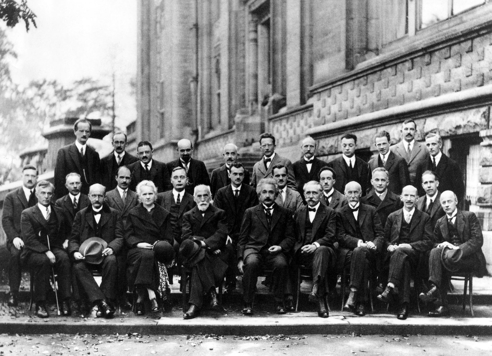

> “没有科学史的科学哲学是空洞的，没有科学哲学的科学史是盲目的”————拉卡托斯 

- 这本书好像是我在知乎上被安利的吧？🤔，据说本书名列 **“20世纪最佳书目”** 当中，***但是这书的翻译让我看起来很难受。这@@是博士生导师翻译出来的？？？***
- 这本书从科学史的视角探讨常规科学和科学革命的本质，第一次提出了**范式理论以及不可通约性、学术共同体、常态、危机**等概念，提出了**革命是世界观的转变**的观点。

<!-- more -->

## **THE STRUCTURE OF SCIENTIFIC REVOLUTIONS**
- 作者[美] Thomas S. Kuhn
- 导读[加] Ian Hacking
- 北京大学出版社

## 不知道说什么的开头

这书看的我一点也不明白，本来就是复杂的**概念论述**，这书的翻译还翻的一团糟，文不文，白不白，**这翻译的都是人话吗(+_+)?**   

所以我现在这种层次，只能争取找找框架，找找重点之类的记录一下。🤔  

<iframe src="//player.bilibili.com/player.html?aid=51661150&cid=90430254&page=1" scrolling="no" border="0" frameborder="no" framespacing="0" allowfullscreen="true" autoplay="true" style="position: absolute; width: 100%; height: 100%; left: 0; top: 0;"> </iframe>

**放个鬼畜压压惊**

## 导读与序

- 《科学革命的结构》或许更相关于科学史上已经过去了的那个时代，而不尽然是今天被实践着的科学。
- 科学革命的结构如下：  
  1. 具有一个范式和致力于解谜的常规科学
  2. 严重的反常引发危机
  3. 由于新的范式的诞生，危机得以平息
- 不可通约性
- > 新的理论取代了旧的理论与其说是其更真，不如说是世界观的转变，也就是说进步不是走向单一真理的简单直线。
- > 这种看法也遭到了怀疑论知识分子的滥用，用以质疑真理这一观念的存在，这就像当初在政治课讨论的那个问题：真理是我们认识到的还是客观存在的？？(完了，想到考研还要考政治就隐隐发慌＞﹏＜)
- 康德提出的两次科学革命：
  1. 数学实践从巴比伦和埃及的技术转向希腊的假设——证明模式
  2. 伽利略发端的实验方法与实验室的诞生
- “革命”一词已经被滥用，在美国甚至意味着“共产主义”，而这会增添我们理解库恩使用的“革命”原本的意义。
- 库恩的理论更着重于理论的，而忽视了实验的与工具的。人们关注的往往是技术，而技术本身并不是理论的
- Margaret Masterman在一篇鲜有人读过却常被引用的文章中提到库恩在《结构》中对“范式”一次有21种不同的用法。(猜猜茴字有几种写法🤨)
- (一堆我放弃理解的语法和词语来源以及拉丁文🤒)
- “拒绝一个范式而不同时用另一个去取而代之，也就等于拒斥了科学本身”
- > 破旧不立新，如同毁灭一切。
- > 
- > 也许是需要思考是否一切创新都是“革命性”的
- 在革命之后，那些在一个被改变了的领域中的科学家，其实是在另一个世界中从事研究。
- > 一个发生了变革的领域，对待世界的观念变了，看到的世界也就不一样了？我们究竟是在改变世界，还是在改变我们的世界观？
- 库恩所赞同的科学理论的五项标准是：  
  1. 理论应当能精确地预言
  2. 应当是自洽的
  3. 应当有广泛的覆盖面
  4. 应当能以有序、一致的方式呈现现象
  5. 应当能有效地预见新现象或现象之间的关系
- > 实践是检验真理的唯一标准
- 质疑“理论选择”观念：研究者并不因为选择了一个理论，就可以说他们正在选择自己的未来生活道路。

我还是读正文吧。。。导读最后重读的时候再看可能才能理解😅  
Here we go~
## 绪论：历史的作用

区分**常规科学**与**科学革命**这两个互补的概念。**常规科学**更多的是从科学教科书上得出，是一种通过积累而得到的科学，受到传统的束缚。而如果我们主要是寻求和考察那些从科学教科书中得出的、不含历史的旧规老套的问题的回答贰继续使用历史资料的话，那么，新科学观就不可能从历史中产生。  

有时，一个应该用已知规则和程序加以解决的常规问题，科学共同体内最杰出的成员们做了反复的研究以后，仍未能获得解决。在别的场合，为常规研究而设计制造的仪器未能按预期方式运行，由此而揭示出一种反常，虽经一再努力，仍不能与共同体预期相一致。这就到了科学团体不能再回避**破坏现有传统**的反常时期，就开始了非常规的研究，最终导致科学共同体做出一系列新的承诺，建立一个科学实践的新基础，这些非常规时期被称为**科学革命**。科学革命是打破传统的活动，是对常规科学的补充。  

其实很多其他并不明显具有革命性的研究，也同样具有改变原有标准的特征，这是一种内在的革命过程。而改变很少是由一个人或者一夜之间完成的。

## 通向常规科学之路

在本书中，**『常规科学』是指坚实地建立在一种或多种过去科学成就基础上的研究，这些科学成就为某个学科共同体在一段时期内公认为是进一步实践的基础。**这些著作之所以能起到这样的做用，就在于它们共同具有两个基本特征：

- 它们的成就空前地吸引一批坚定的拥护者，使他们脱离科学活动的其他竞争形式。
- 这些成就足以无限制地为重新组成的一批实践者留下有待解决的种种问题

凡是共有这两个特征的成就，我此后便称之为『范式』，这是一个与『常规科学』密切有关的术语。  

- 一种范式通过革命向另一种范式的过渡便是成熟科学通常的发展模式。  

- 历史向我们提示出，通向一种坚实的研究共识(research consensus)的路程是及其艰难的。  

- 技术经常在新科学的突现中起着重要的作用。

> 真理从错误中比从混乱中更容易出现。——弗兰西斯·培根

## 常规科学的本质

- 一个范式就是一个公认的模型或模式(Pattern)
- 范式之所以获得了它们的地位，是因为它们比它们的竞争对手能更成功地解决一些问题，而这些问题又为实践者团体认识到是最为重要的。

- 如果不是一门成熟科学的实际实践者，就很少有人会认识到一种范式给人们留下非常多的扫尾工作要做，而完成这些扫尾工作又是多么地令人迷醉。这两个要点人们必须理解到。大多数科学家倾其全部科学生涯所从事的正是这些扫尾工作。这些工作构成了我在这里所称的常规科学。
- 常规科学的目的既不是去发现新类型的现象，也不是发明新理论，而在于澄清范式所已经提供的那些现象和理论。

## 常规科学即是解密

> 如果常规科学的目的不是为了去发现重大的实质性的新事物——如果研究结果与预期的不符通常就被认为是科学家的失败——的话，那么，为什么还要去致力于这些问题的研究呢？

- 常规科学之所以看起来进步得如此神速，其理由之一乃在于，它的实践者们集中于解决**只有缺乏才智的人才不能解决的问题**上。

- 一个科学家必须致力于理解世界，并扩展这种使世界有序化的精度和广度。这种承诺反过来又必定会导致科学家自己或他的同事以丰富的经验细致地考察自然界的某个方面。如果这种考察发现明显的无序(disorder)，那就迫使他精练他的观测技巧，或者迫使他进一步阐明他的理论。  

- 常规科学是一种高度确定性的活动，但它又不必要完全由规则所确定。这就是为什么在本文开始时我引进共有范式而不用共有规则、假定和观点作为常规研究传统连贯性源泉的原因。我认为，规则导源于范式，但即使没有规则，范式仍能指导研究。
- 我认为，规则导源于范式，但即使没有规则，范式仍能指导研究。

## 范式的优先性

- 他们能够同一确认一个范式，但不会同意对范式的完整（进行）**诠释**或**合理化**，也不会去这样做。

> 为了既明白又不引起争议地使用“椅子”、“树叶”或“游戏”这些词，我们需要知道些什么呢？——维特根斯坦

## 反常与科学发现的突现

- 在任何一门科学的发展过程中，最先接受的范式，通常会让人感觉到它对于科学研究者容易理解的大多数观察和实验，能给予相当成功的说明。因此，进一步的发展通产高要求建构精巧的装置，发展出一套深奥的词汇和技巧，精练概念，使之不断地减少与它们通常的常识原型(prototypes)之间的相似性。  

- 这些科学发现既是范式变化的原因，又是范式变化的结果；而且隐含在这些发现中的变化，既是建设性的又是破坏性的。*（是不是听起来很熟悉）*

## 危机与科学理论的突现

- 在每个案例中，一个新理论只有在常规的问题解决活动宣告失败之后才凸显出来。……理论的崩溃和增生作为危机的一个信号，在新理论崛起之前一二十年就出现了。新理论好像是对危机的一个直接回答。导**致理论崩溃的那些的那些问题都是那些早已被认识到了的问题。**……造成危机的每个问题的解，在相应的科学中危机还未出现时，至少已经部分地被预见过；而在没有危机的情况下，这些预见被忽视了。  

- 科学中像制造业中一样，更换工具是一种浪费，只有在不得已时才会这么做。**危机的意义就在于：它指出更换工具的时机已经到来了。**

## 对危机的反应

- 一个科学理论，一旦达到范式的地位，要宣布它无效，就必须有另一个合适的候选者取代它的地位才行。

- 拒斥一个范式而又不同时用另一个范式去取而代之，也就是拒斥了科学本身。……他必然会被他的同行看做是“只会责怪他的工具的木匠”。

- 谜的存在只是因为没有任何范式能为科学研究提供完全解决它的所有问题的基础。只有极少几个似乎曾是这样的学科，但却在很短的时间内就根本不能提供进行研究的问题，而变成解决工程问题的工具了。

> 低劣的木匠才会责怪他的工具。

- 当一个反常变得似乎不只是常规科学的另一个谜时，向危机和向非常科学的转变就开始了。
- 起初对难题的进攻，都还能相当密切地遵循范式规则。但由于难题继续存在，越来越多地进攻就会包含着对范式做某些小的或者不那么小地修改，这些修改各不相同，各显其能，但没有一个会成功到足以让团体当作范式来接受。……常规科学的规则也就越来越模糊，虽则范式依然存在，但很少有实践者能同意别人对它的诠释。
- 从一个处于危机的范式，转变到一个常规科学的新传统能从其中产生出来的新范式，远不是一个累计过程，即远不是一个可以经由对旧范式的修改或扩展所能达到的过程。

## 科学革命的本质与必然性

- 科学革命也起源于科学共同体中某一小部分人逐渐感觉到：他们无法利用现有范式有效地探究自然界的某一方面，而以前范式在这方面的研究是起引导作用的。  
- 科学革命只有对那些其研究领域受到范式转换直接影响的研究者，才会有革命性的感觉。

> 每一学派都用它自己的范式去为这一范式辩护。

- 原则上，只有三类现象可以引发新理论。第一类是那些现存范式已妥为解释的现象，但它们很少成为科学家创建新理论的动机或出发点。第二类现象是指那些其本质已为现有范式所表明，但其细节的理解却有待范式的完善的现象，它们是科学家常规研究的对象。但是这种研究的目的在于完善现有范式，而非发明新范式。只有当这种完善工作失败后，科学家才会遭遇第三类现象，即公认的反常现象，其特征是无法被现有范式同化。只有这类现象才会促成新理论的发明。

## 革命

- 革命是世界观的改变
- 革命是无形的
- 革命的解决
- 通过革命而进步

## 后记

- 范式是团体承诺的集合
- 范式是共有的范例

## 参考链接

- [【科学革命的结构】读书笔记](https://wdxtub.com/2017/05/31/structure-of-science-revolution-clip/)