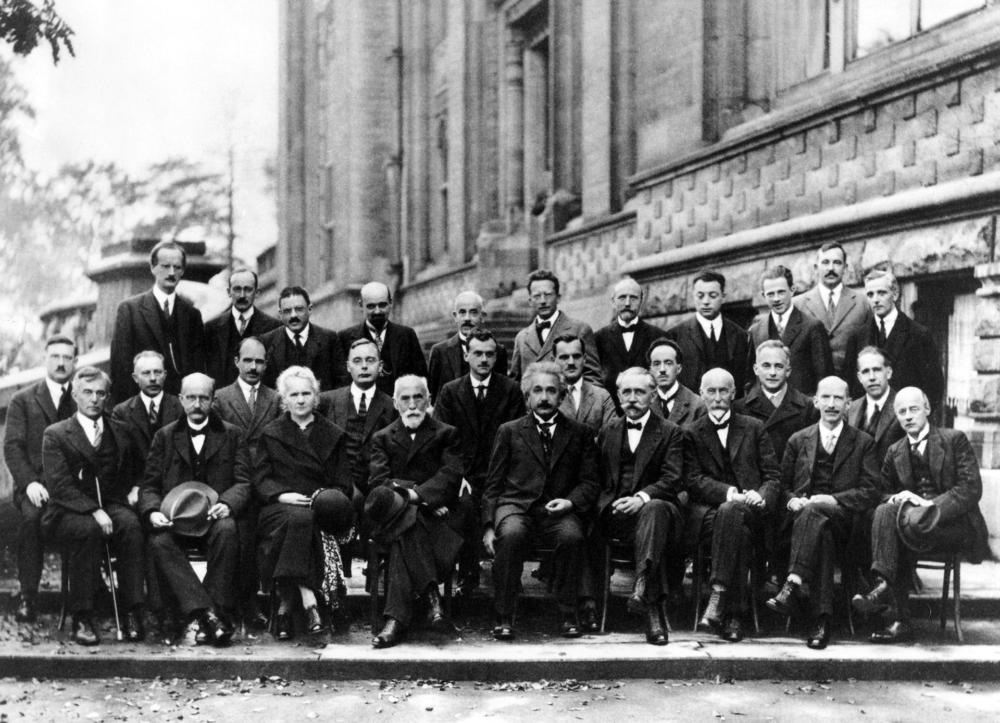

[未完成]  
`“没有科学史的科学哲学是空洞的，没有科学哲学的科学史是盲目的”————拉卡托斯`  
- 这本书好像是我在知乎上被安利的吧？🤔，据说本书名列 **“20世纪最佳书目”** 当中，本书有一篇长达30页的导读(正文总共也就170多页)，估计可以很快看完。
- 这本书从科学史的视角探讨常规科学和科学革命的本质，第一次提出了**范式理论以及不可通约性、学术共同体、常态、危机**等概念，提出了**革命是世界观的转变**的观点。

<!-- more -->

## **THE STRUCTURE OF SCIENTIFIC REVOLUTIONS**
### 作者[美] Thomas S. Kuhn
### 导读[加] Ian Hacking
### 北京大学出版社

## 导读与序
- 《科学革命的结构》或许更相关于科学史上已经过去了的那个时代，而不尽然是今天被实践着的科学。
- 科学革命的结构如下：  
  1. 具有一个范式和致力于解谜的常规科学
  2. 严重的反常引发危机
  3. 由于新的范式的诞生，危机得以平息
- 不可通约性
- > 新的理论取代了旧的理论与其说是其更真，不如说是世界观的转变，也就是说进步不是走向单一真理的简单直线。
- > 这种看法也遭到了怀疑论知识分子的滥用，用以质疑真理这一观念的存在，这就像当初在政治课讨论的那个问题：真理是我们认识到的还是客观存在的？？(完了，想到考研还要考政治就隐隐发慌＞﹏＜)
- 康德提出的两次科学革命：
  1. 数学实践从巴比伦和埃及的技术转向希腊的假设——证明模式
  2. 伽利略发端的实验方法与实验室的诞生
- “革命”一词已经被滥用，在美国甚至意味着“共产主义”，而这会增添我们理解库恩使用的“革命”原本的意义。
- 库恩的理论更着重于理论的，而忽视了实验的与工具的。人们关注的往往是技术，而技术本身并不是理论的
- Margaret Masterman在一篇鲜有人读过却常被引用的文章中提到库恩在《结构》中对“范式”一次有21种不同的用法。(猜猜茴字有几种写法🤨)
- (一堆我放弃理解的语法和词语来源以及拉丁文🤒)
- “拒绝一个范式而不同时用另一个去取而代之，也就等于拒斥了科学本身”
- > 破旧不立新，如同毁灭一切。
- > 
- > 也许是需要思考是否一切创新都是“革命性”的
- 在革命之后，那些在一个被改变了的领域中的科学家，其实是在另一个世界中从事研究。
- > 一个发生了变革的领域，对待世界的观念变了，看到的世界也就不一样了？我们究竟是在改变世界，还是在改变我们的世界观？
- 库恩所赞同的科学理论的五项标准是：  
  1. 理论应当能精确地预言
  2. 应当是自洽的
  3. 应当有广泛的覆盖面
  4. 应当能以有序、一致的方式呈现现象
  5. 应当能有效地预见新现象或现象之间的关系
- > 实践是检验真理的唯一标准
- 质疑“理论选择”观念：研究者并不因为选择了一个理论，就可以说他们正在选择自己的未来生活道路。
- 库恩认为，科学是达尔文式的，其中革命经常就好似物种形成的事件。
- 
## 绪论：历史的作用

## 通向常规科学之路
## 常规科学的本质
## 常规科学即是解密
## 范式的优先性
## 反常与科学发现的突现
## 危机与科学理论的突现
## 对危机的反应
## 科学革命的本质与必然性
## 革命是世界观的改变
## 革命是无形的
## 革命的解决
## 通过革命而进步
## 后记
