2019-01-05  
2018年12月29日，学校组织四方奖学金获得者前往北京四方公司进行了参观访问，此行了解了四方的起源、四方的业务内容、型式研究所和光伏研究所，
并聆听了人事、外勤、研发部门的主管向我们介绍四方的用人与对我们的建议。
<!-- more -->

## 四方与华电
`北京四方继保自动化股份有限公司，是一家成立于 1994 年的国家高新技术企业、国家级企业技术中心和上市公司，其创始人是中国工程院首批院士杨奇逊教授—— “中国的微机继电保护之父”，我国电气自动化领域的一代宗师。`
四方和华电关系很深，从起源到发展都密不可分
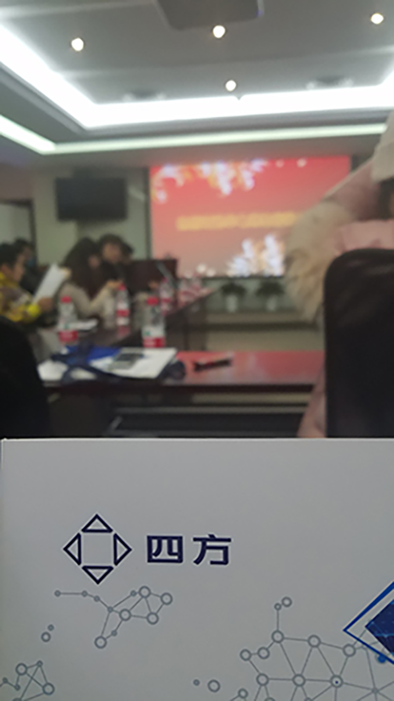
### 起源
四方建立时是由四个投资方投资建立的，故名四方，四个投资方之一就有华电。四方的创始人是[杨奇逊教授](https://baike.baidu.com/item/%E6%9D%A8%E5%A5%87%E9%80%8A/5334170?fr=aladdin)，杨教授曾是华电四方所的所长，（现在的所长是毕天姝）。
四方起源于华电保定校区的一个小房子里，在一间小屋中诞生了中国第一台微机继电保护装置。
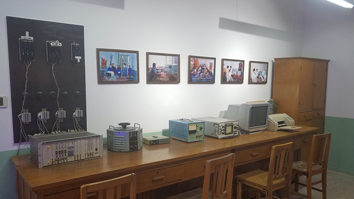
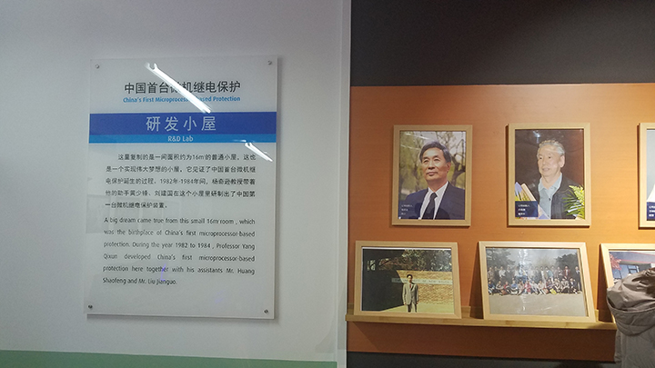
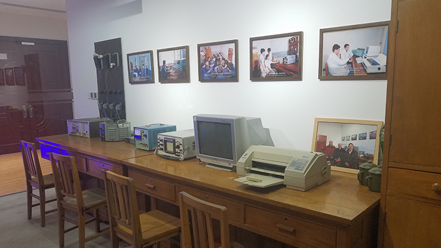
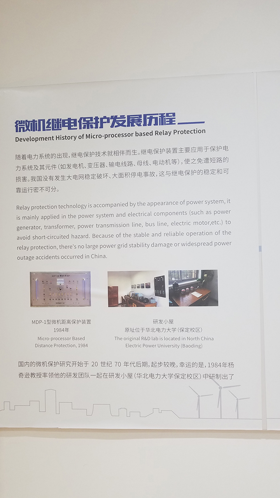

### 发展
四方发展路上，永远都有华电的影子，四方的总工副总工，四方的高管到普通员工，华电的毕业生总共占有将近10%的比例。
在华电60年校庆上，可以看到华电校友在企业中的位置很重啊。（不过那些大佬的名字我都不记得，大概放几个人物链接好了）
[黄少锋](https://baike.baidu.com/item/%E9%BB%84%E5%B0%91%E9%94%8B/7741933?fr=aladdin)
[王增平](https://baike.baidu.com/item/%E7%8E%8B%E5%A2%9E%E5%B9%B3/7328011?fr=aladdin)
[王绪昭](https://baike.baidu.com/item/%E7%8E%8B%E7%BB%AA%E6%98%AD/10372451?fr=aladdin)

## 参观
参观路上看到了好多只在书本上看到的东西，什么HVDC的换流阀（模型）、电力网络图、继电保护装置在网络中的位置（哦这个还没在书上见过，还没学）等等。
和通信行业不同，电力行业在国内的设备已经实现全部国产化，四方在行业内也是龙头企业，四方南瑞许继南自，国内四大继电保护企业。
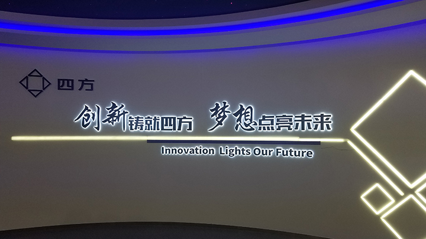
创新铸就四方，梦想点亮未来  
emmm参观的内容没有太多可以说的，只能简单介绍下的样子。
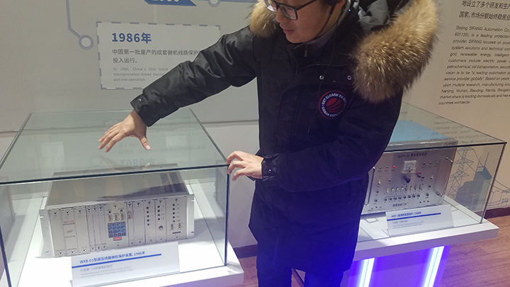
中国第一套成套微机保护与第一台微机保护
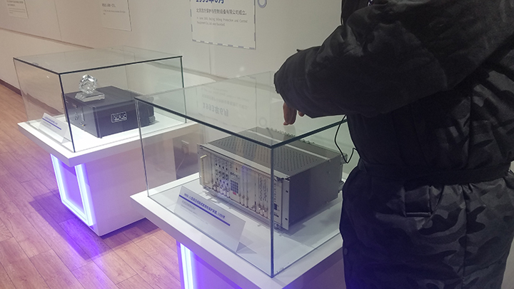
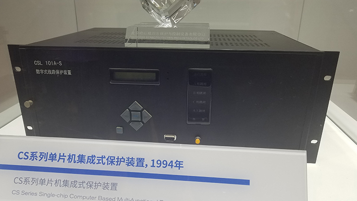
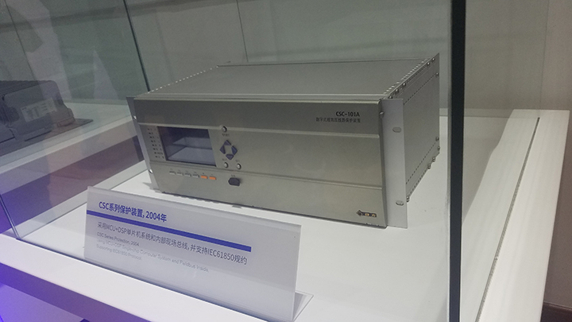
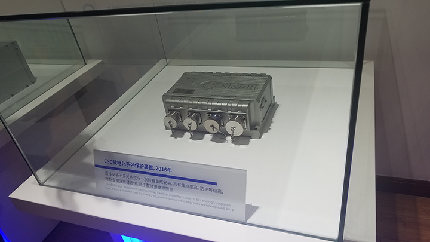
⬆这小别致长得真东西
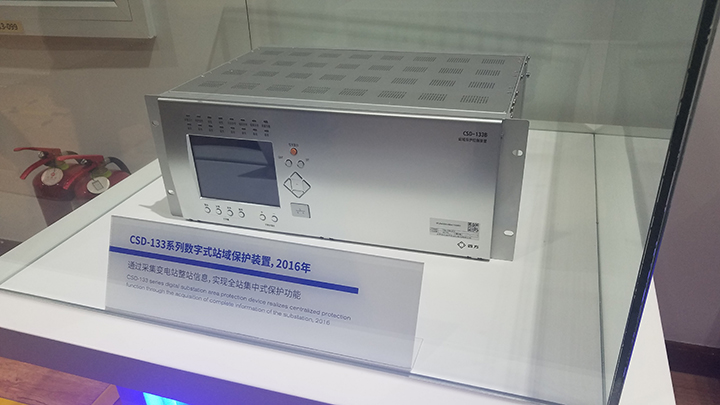
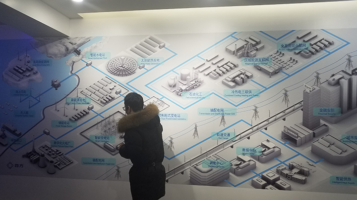
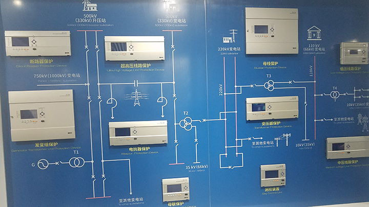
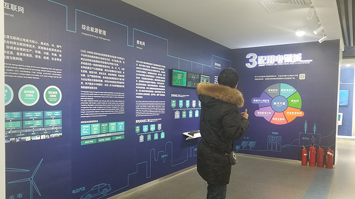
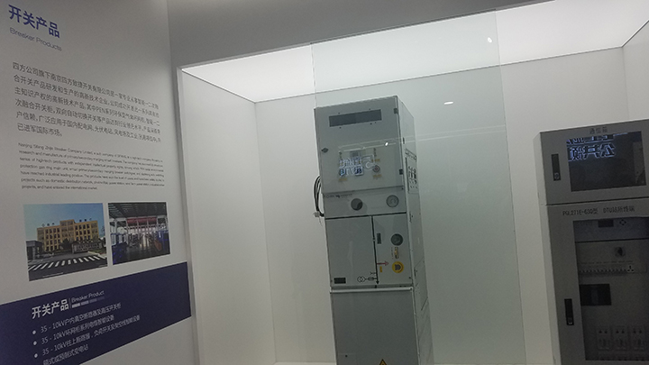
⬆“这玩意是怎么搬进来的？？”
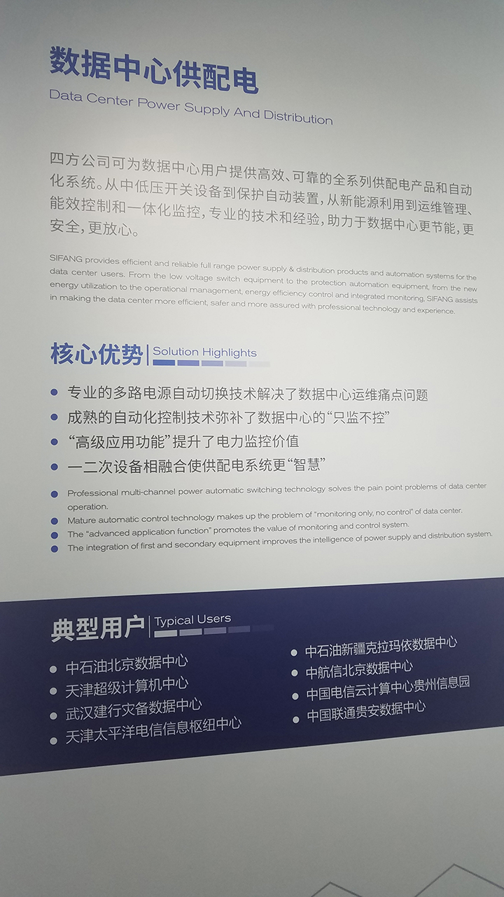
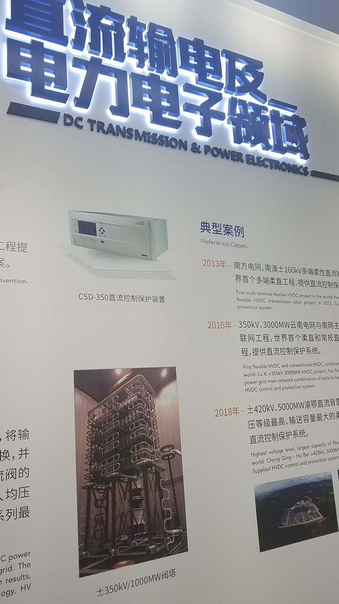
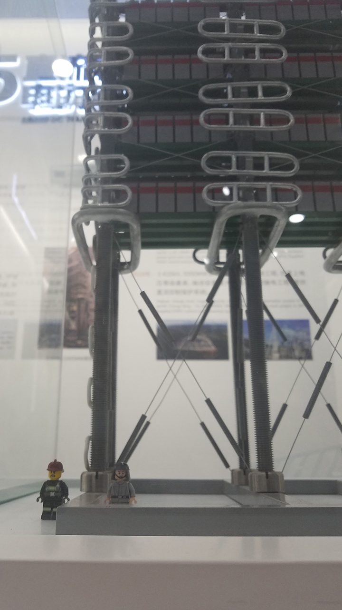
⬆233333高度计量单位：乐高小人↓
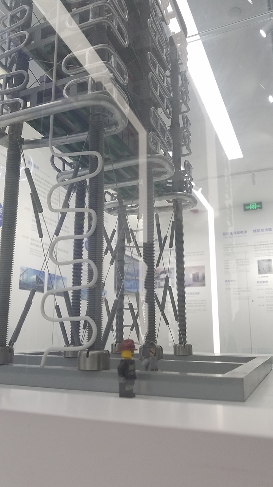
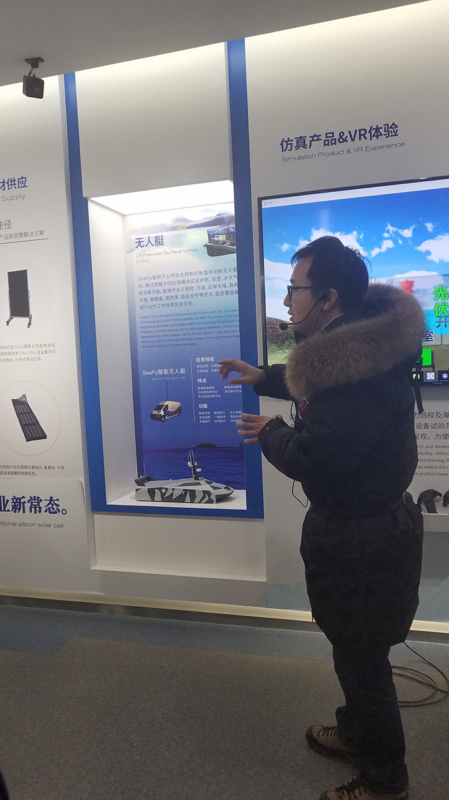
⬆南海赛。。赛艇？？
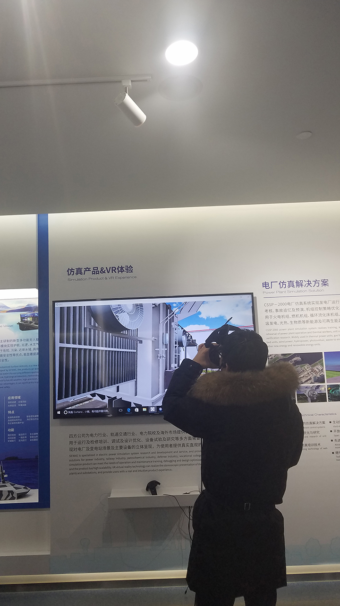
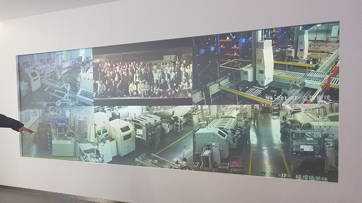

⬆emmmm

## 实验室
实验室里不让照相，所以就没有照片了。
### 光伏
光伏是一个交叉学科，所以里面会有很多不同专业的研究僧一起工作，讲解小哥哥告诉我们，四方的太阳能板光伏转换效率已经接近国际最高水平。
他们在用奇怪的材料搭在各种奇怪的靶材上，做出柔软的太阳能板，寿命更长(+_+)。唔，在里面见到了些没有见过的东西，看到了他们在做奇奇怪怪的实验= =，看的人发际线都变高了。

### 型式
四方的型式实验室通过了各种国际认证，可以对待测设备做很多暴力测试，火烧水淹，沙尘电击，电网的生命就由他们保护。
嗯，型式实验室看起来没有那么高级，不过据说一个木桌子都好几W???(´⊙ω⊙`)（就让我听风就是雨吧）。

## 座谈会
座谈会上，各位前辈用亲身和员工的亲身经历告诉我们，专业可能会与职业无关，看自己的品质如何，机会总会有（当然四方也会努力提供给员工机会），但是一切都要靠自己的奋斗去争取，晋升、入职其他岗位都要满足用人的素质要求。
### 技术英才大佬
在开发中，C语言和其他计算机应用技术很重要，当然如果从事电气行业，学校里的专业课基础也很重要，不然工作还要再来一遍。⊙ω⊙
在技术储备不足的地方要研，而构建产品要发，合称为研发。技术方向做好了很吃香，年终奖30W。（0.0）
### 人事主管
企业用人有要求，但是专业不是限制自己的枷锁，如果自己能多掌握一项素质便会多一份竞争力，比如他就是机械转人事（他说是不想呆在厂子里了），现在搞得挺好。四方的人才管理以人为本，如果员工满足岗位要求就会给机会进行调动，如果员工有想法就会给风投进行创业，（南海无人赛艇就是其中之一）。不是说自己现在什么专业或者研究生什么方向未来工作就一定要是那个方向，路要靠自己越走越宽。
### 外勤主管（我也不记得那个部门的名字叫什么了）
外勤就像是移动的工程部门那种样子，跑各种电厂变电所，可能还会出国比如像马尔代夫这种地方做项目，从现场接水晶头到独立完成设备安装调试，从不明所以的小白到独当一面的骨干，从吃泡面到吃火锅，体验不同的生活，成为岗位调动高层抢着要的抢手资源，大概就是这个部门工作的状况。这个大佬也是毕业浪荡了几年，曾经甚至还在想开自己的摄影店，后来来了四方从基层做起了。

## 总结吧？
华电的毕业生遍布全国电力行业各个部门，也许这是普遍状况，但是也如他们所说，专业不是限制自己的，我依然坚定地走我现在想走的路。
对于个人来说，机会、能力、素质、眼界，所有的一切都要成为自己竞争力的体现，一个人能挣多少钱要看他有多大价值，他的能力有多少价值，除了技术水平有多高，在行业中也要有横向地比较才能比较准确的获得价值定位。
对于企业而言，对人才的管理关乎企业的存亡，为员工提供足够的生活和安全保障，才会有更稳定的发展。企业对创新的管理关乎企业的未来前景，激励创新，孵化创新成果，在行业内推动行业发展，在业务范围外合理扩大业务，推动企业自身发展。
这次参观也算是见到了真实的工作环境是什么样子的，社会竞争很残酷，自己要做好准备。**不要求自己一帆风顺，只希望当困难来临时自己能是它的对手**

⬆这下我完全懂了呢
