2019-01-08  
2019年1月8日，学校组织的电气认识实习安排我们前往昌平区的特高压直流试验基地进行参观。我们参观了各种红警磁暴线圈画风的各种电源和实验设备，嗯，金钱的味道。
**图片已经过压缩，所以不会那么清晰**
“西电东送、北电南供、水火互剂、风光互补”/中国能源互联网
<!-- more -->

## 为何要使用特高压输电
```
参考书目：
1. 特高压交直流电网 刘振亚
2. 读懂中国制造2025
```
在**中国制造2025规划纲要**中提到其中一个战略任务和重点是：大力推动重点领域突破发展，而这里的重点领域除了信息技术（新一代），还包括了电力设备等。

### 满足大规模远距离电力输送要求
* UHV DC：远距离，大容量点对点输电
* UHV AC：接入、传输、消纳十分灵活，交流电压等级越高，电网结构越强，输送能力越大，承受扰动能力越强
根据中国能源和负荷的分布特点，**特高压交流输电**定位于主网架建设和跨大区联网输电，同时为直流输电提供重要的支撑；**特高压直流输电**定位于大型能源基地的远距离，大容量外送。

### 保护生态环境
`推动清洁能源发展与煤电布局优化`
* 推动国家清洁能源开发目标实现及清洁能源的高效利用。
* 促进以电代煤和煤电布局优化，大幅度减少“三华”电网范围内燃煤消耗，有效利用洗精煤和外来电力，提高已有电厂燃煤质量和利用效率，改善当地环境质量。（( •̀ ω •́ )y和雾霾对抗到底）

### 提高电网运行安全性和社会综合效益
有利于在全国范围内实现土地资源优化开发与节约利用。特高压输电大量节省输电走廊，显著提高单位走廊宽度的输送容量和走廊的输电效率，节约宝贵的土地资源。

### 提高能源输送保障能力
“输煤输电并举、加快发展输电”是解决中国煤电运综合平衡难题的关键举措，对于提高能源生产、转换、输送和利用效率，优化利用全国环境资源，增强能源供给的安全性意义重大。

## 参观
因为参观大部分的地方都不让照相，所以就展馆和试验线路照了些相。
（50W警告）
### 室内外各种实验室
* 特高压户外试验场
* 污秽及环境实验室
* 直流换流阀实验室
* 避雷器实验室
* 绝缘子实验室/毫无印象，莫得参观吧
* 试验大厅/电磁屏蔽性能70dB/对超厚超贵的屏蔽层印象深刻/还有大风勿开却开了的大门= =  

**太怂不敢传照片，图就看特高压那本书吧**

那来给大家做个试验吧  

### 试验线段&&电晕笼
/这个没有50W警告，所以有几张照片/
双回线±1200kV设计，据说曾经还进行过带电检修测试，吓skr人(⊙o⊙)
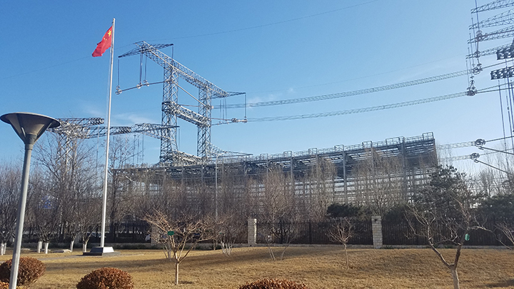
方方的是电晕笼，具有电缆自然下垂的弧度  
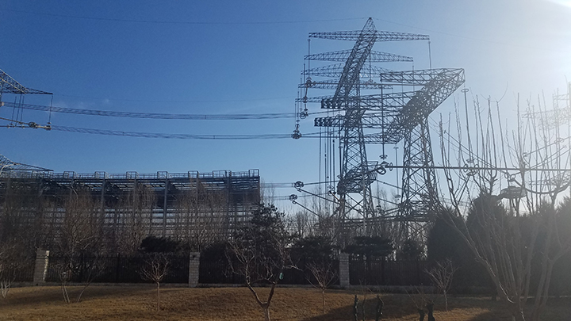
好像是送电部分  
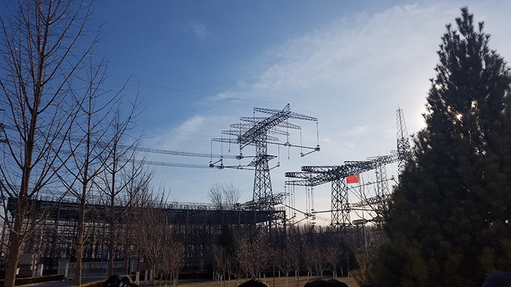
👆走之前拍的  
这种时候只有这个表情包符合现状了：

嗯嗯嗯  

## 展馆
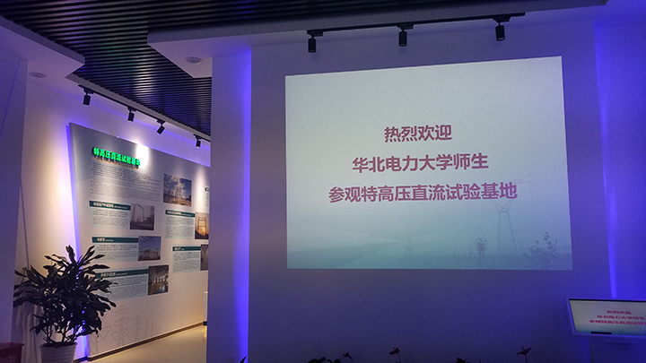
起步(⊙o⊙)  

中间就是介绍各个试验基地以及各基地的作用和配置
还有全国建成和待建的线路
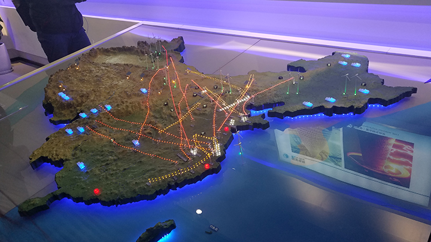
👆还有全国能源和负荷的大致分布  
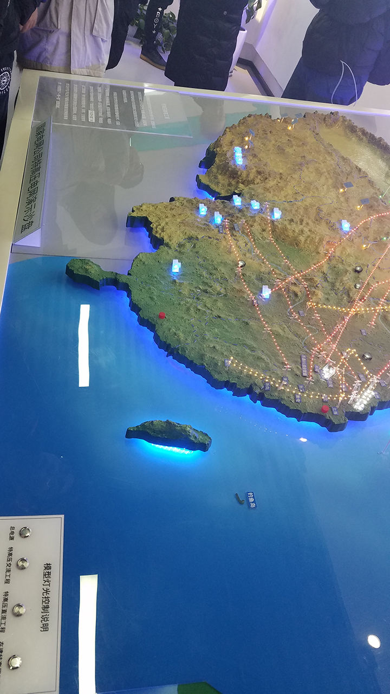
没错，钓鱼岛瞩目📌  

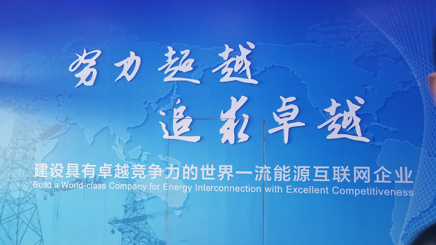
↑结束/你们为什么一定要挡着苯宝宝拍照╰（‵□′）╯  

## 目前的四大特高压基地（的模型(￣▽￣)"）
### 特高压直流试验基地/北京昌平
此行参观的基地，主要进行超/特高压直流输电关键技术领域的研究，能满足特高压直流输电关键技术研究的需求，具备更高电压等级（±1000kV,±1200kV）研究能力。

你看这线路又高又长和那铁笼又弯又宽(￣┰￣*)
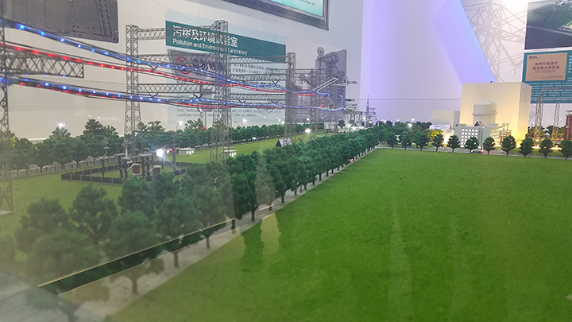
↑可以看到那长长的试验线路和电晕笼  

### 特高压交流试验基地/湖北武汉
唔，这个当然就是研究特高压交流输电关键技术的了，和直流基地的一样，已经有很多研究成果投入到了实际运行当中。
嗯这个里面还养了各种小动物(●ˇ∀ˇ●)，极低频电磁场生态影响长期观测基地，可开展大型的动植物电磁波长期暴露试验。
**（造谣的是不是可以去体验一下━┳━　━┳━）**
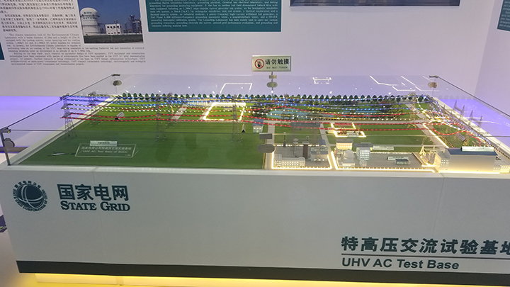
展台：莫挨老子  

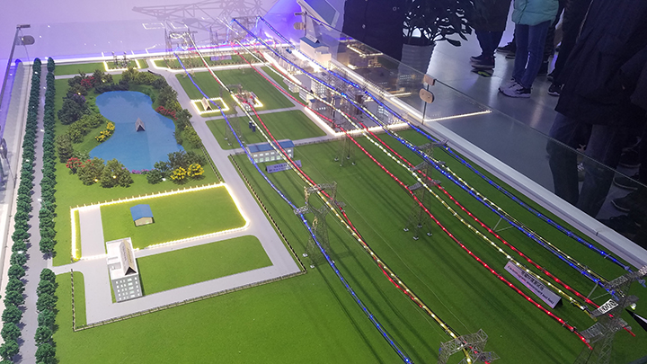
👆据说水池边高压线下就是生态观测基地,,ԾㅂԾ,,  

### 西藏高海拔试验基地/西藏羊八井
在高海拔地区进行有关试验，也是为设备外输做准备。
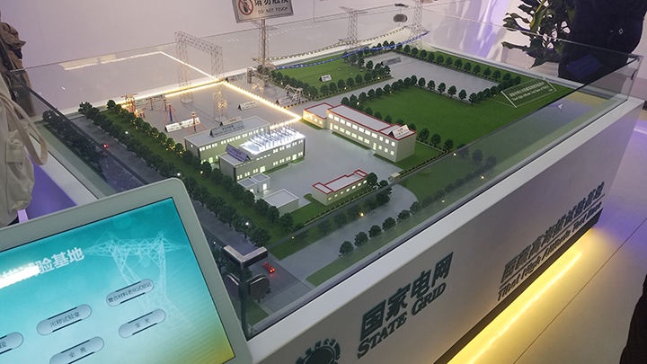
感觉高海拔基地是最小的诶  

### 特高压杆塔试验基地/河北霸州
看展示，这个很暴力，检验杆塔是否满足结构强度和经济设计指标，暴力拉断杆塔。。。0.0
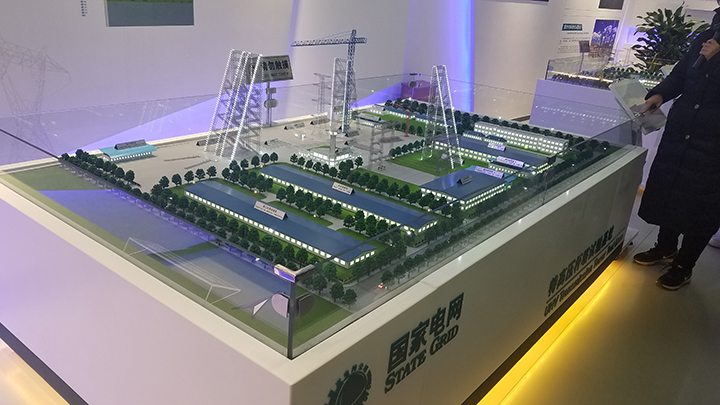
据说铁塔倒下就像拉断的面条？？？  

## 总结
嗯，有一点搞懂了，原来磁暴线圈的圈圈是均压环？？
那
* 为什么连接机械机构的固定线缆上要有好多间隔的圆圆的片子呢？？
* 为什么在试验线段的很多线路连接部分的末端也会有很多小圆圈，也是均压环吗？？
* 还有广东的负荷中心为啥还没有接特高压线路(哈哈哈哈为什么觉得好惨)
* 那么海南岛也会/必要/可能接上特高压线路吗🤔
* 还有进行过暴露试验后的鱼还好吃不emmm(°ー°〃)


↑"我懂了/我明白了/我学会了"
