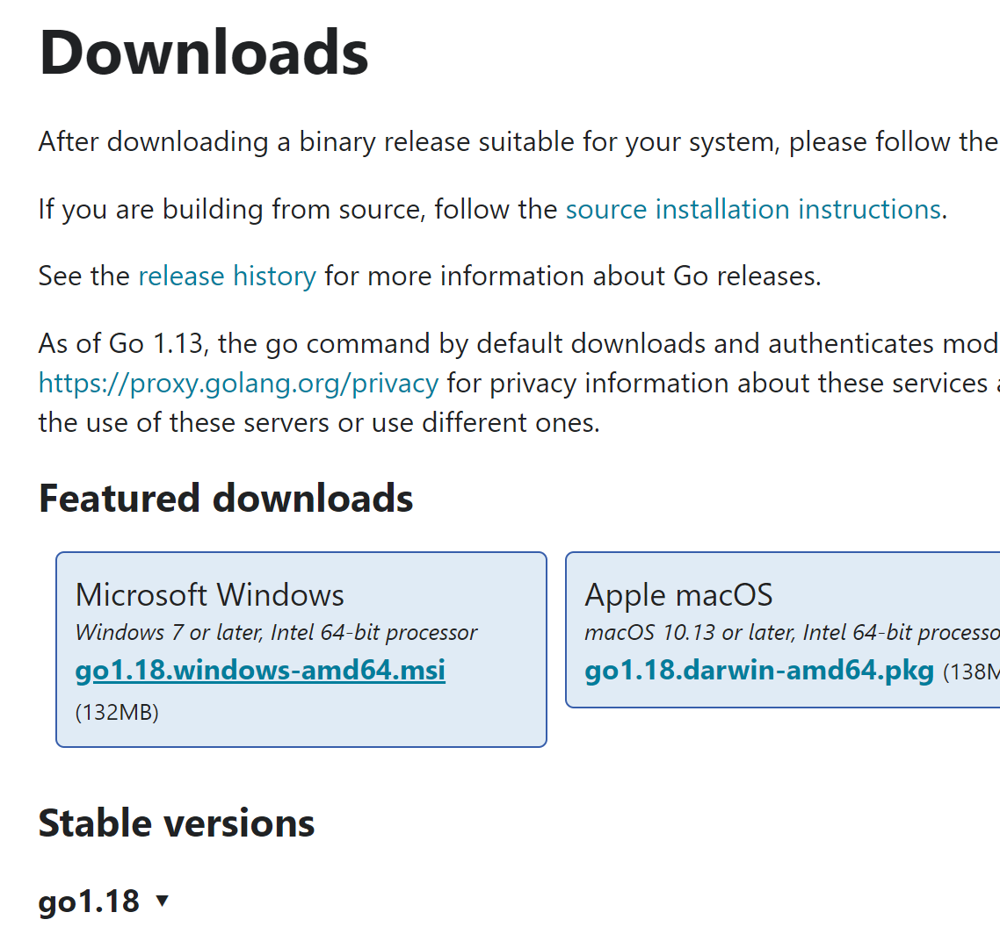
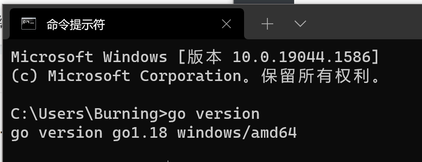
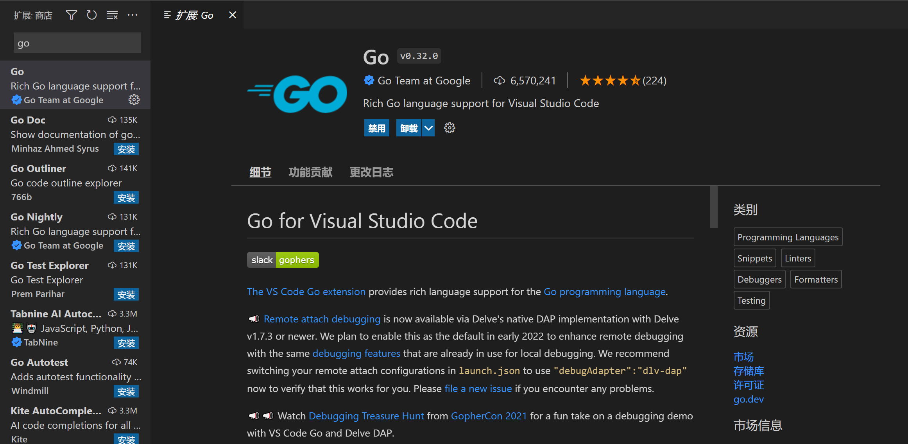
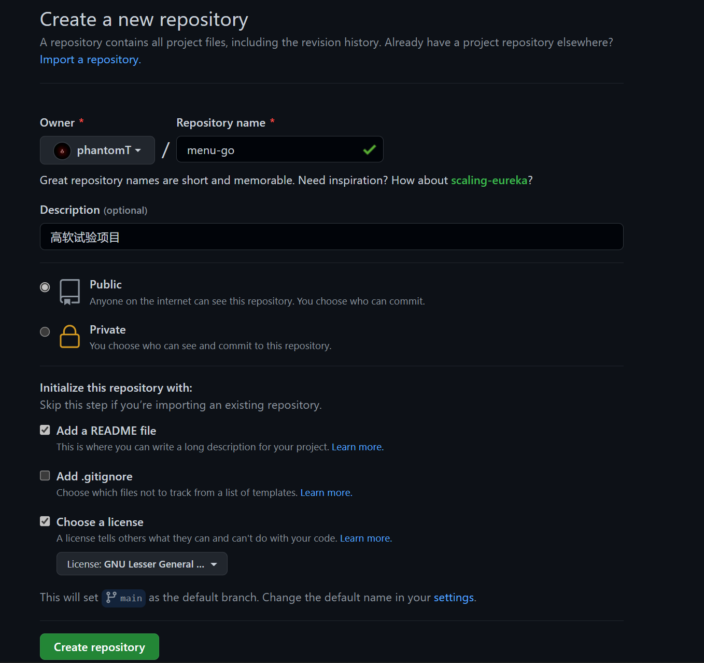
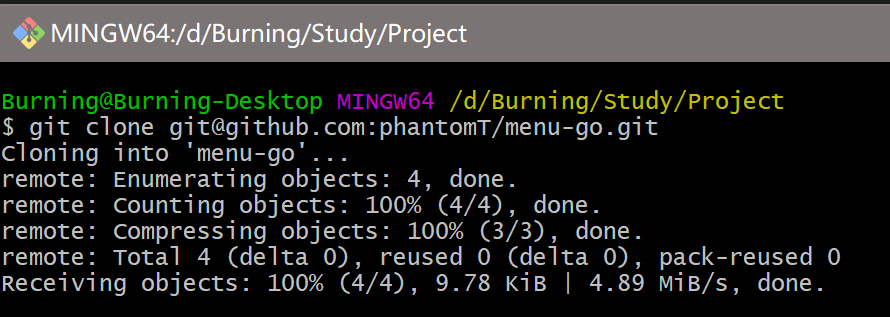
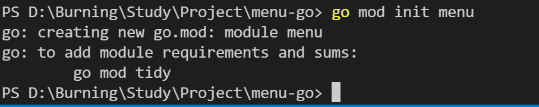
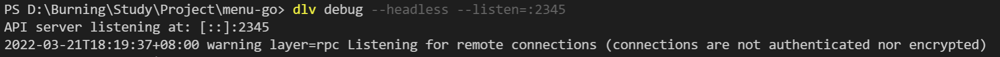
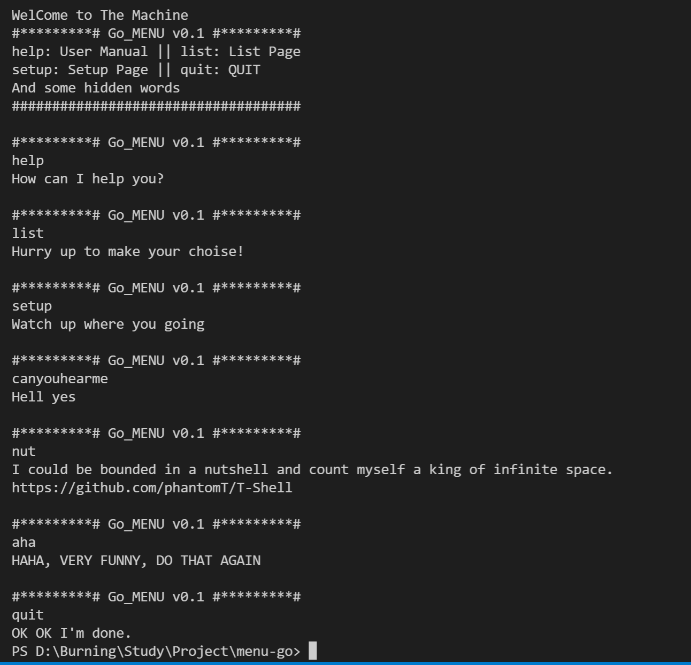
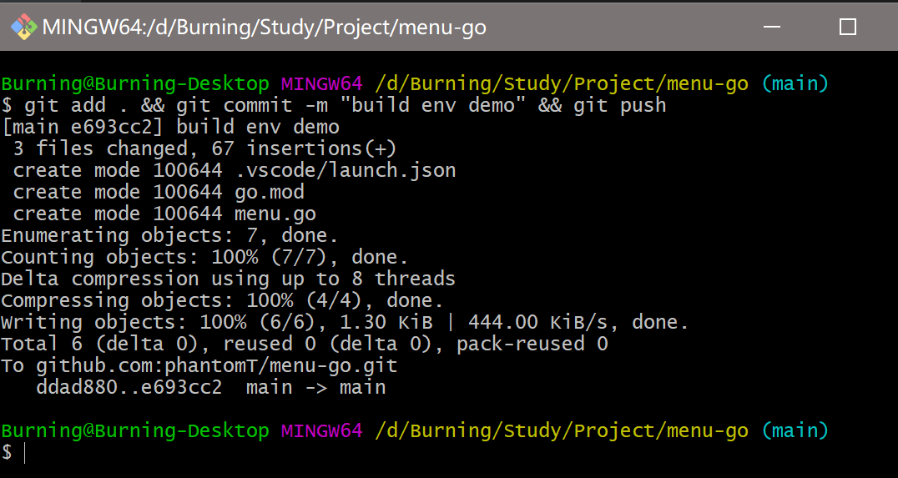
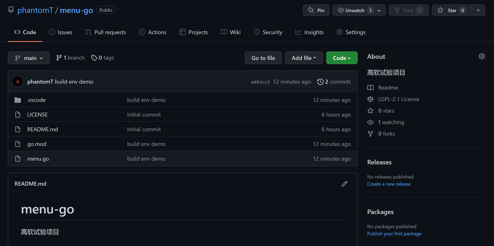

使用`Golang`编写`menu`项目，创建一个版本库，采用`VSCode`作为编译调试环境。记录从创建版本库、配置`VSCode`编译调试环境、编写`menu`第一版简单程序，以及最终调试运行，提供一个`Go+VSCode`的开发环境配置与工作流程的参考。

<!-- more -->

# 开发环境准备

## Go安装

1. 官网下载安装`Windows`版安装文件并安装

   

2. 

   在命令行中输入`go version`显示版本信息表示安装成功

## VS Code环境准备

1. 在插件中搜索`Go`并安装插件

# 创建GitHub版本库

1. 创建新的`repository`
2. 将仓库克隆到本地文件夹

# 编写`menu`第一版程序

1. 使用`go mod init menu`初始化目录

2. 新建`menu.go`文件，编写代码，运行前`VSCode`会提示安装`Go`相关工具，直接`install all`就完事了嗷

   ```go
   package main
   
   import (
   	"fmt"
   	"os"
   )
   
   // dlv debug --headless --listen=:2345
   
   func main() {
   	var cmdline string
   	fmt.Println("WelCome to The Machine")
   	fmt.Println("#*********# Go_MENU v0.1 #*********#")
   	fmt.Println("help: User Manual || list: List Page")
   	fmt.Println("setup: Setup Page || quit: QUIT")
   	fmt.Println("And some hidden words")
   	fmt.Println("####################################")
   	for true {
   		fmt.Println("\n#*********# Go_MENU v0.1 #*********#")
   		fmt.Scan(&cmdline)
   
   		switch cmdline {
   		case "help":
   			fmt.Println("How can I help you?")
   			break
   		case "list":
   			fmt.Println("Hurry up to make your choise!")
   			break
   		case "setup":
   			fmt.Println("Watch up where you going")
   			break
   		case "quit":
   			fmt.Println("OK OK I'm done.")
   			os.Exit(0)
   		case "canyouhearme":
   			fmt.Println("Hell yes")
   			break
   		case "nut":
   			fmt.Println("I could be bounded in a nutshell and count myself a king of infinite space.")
   			fmt.Println("https://github.com/phantomT/T-Shell")
   			break
   		default:
   			fmt.Println("HAHA, VERY FUNNY, DO THAT AGAIN")
   		}
   	}
   }
   
   ```

3. 由于调试控制台中无法直接获取输入，因此需要使用“远程调试”方法，使用`dlv --headless`模式监听端口，在终端中进行调试，建立`VSCode`调试配置`launch.json`，**注：默认创建的配置中，`debugAdapter`是不配置的，不配置时默认值为`legacy`，此时运行会报错而且无法进行调试。**

   ```json
   {
       // 使用 IntelliSense 了解相关属性。 
       // 悬停以查看现有属性的描述。
       // 欲了解更多信息，请访问: https://go.microsoft.com/fwlink/?linkid=830387
       "version": "0.2.0",
       "configurations": [
           {
               "name": "Connect to server",
               "type": "go",
               "request": "attach",
               "debugAdapter": "dlv-dap",
               "mode": "remote",
               "remotePath": "${workspaceFolder}",
               "port": 2345,
               "host": "127.0.0.1"
           }
       ]
   }
   ```

   并在调试前使用终端输入`dlv debug --headless --listen=:2345`，开启监听

4. 运行程序

# 上传同步

1. 使用`git add . && git commit -m "build env demo" && git push`上传文件至远程仓库
2. 可以看到远程仓库已经更新了

作者：406
