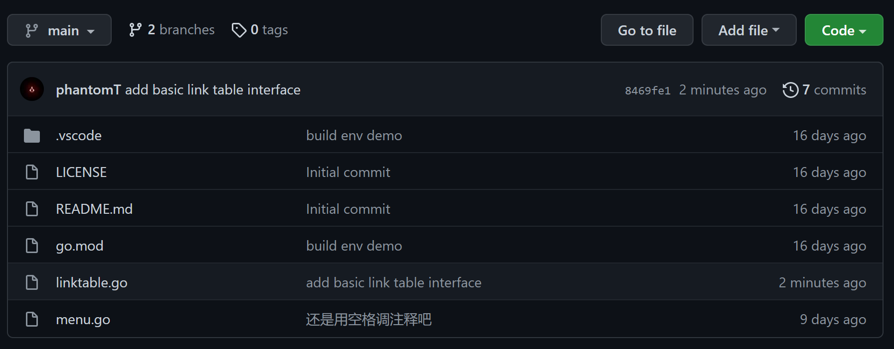

使用`Go`语言编写一个`Linktable`的库并分享定义接口和设计一个程序库的心得体会，将代码上传至`GitHub`

[代码参考Lab4](https://gitee.com/mengning997/se/tree/master/src/lab4)

<!-- more -->

# 编写`LinkTable`库

## 定义结点和链表

```go
/*
 * Define LinkTable Node
 */
type LinkTableNode struct {
	pNext *LinkTableNode
}

/*
 * Define LinkTable
 */
type LinkTable struct {
	pHead     *LinkTableNode
	pTail     *LinkTableNode
	SumOfNode int
	mutex     sync.Mutex
}
```


## 定义`LinkTable`的创建与删除操作

```go
/*
 * Create a LinkTable
 */
func CreateLinkTable() *LinkTable {
	var pLinkTable *LinkTable = new(LinkTable)
	if pLinkTable == nil {
		return nil
	}
	pLinkTable.pHead = nil
	pLinkTable.pTail = nil
	pLinkTable.SumOfNode = 0
	return pLinkTable
}

/*
 * Delete a LinkTable
 */
func DeleteLinkTable(pLinkTable *LinkTable) int {
	if pLinkTable == nil {
		return FAILURE
	}
	for pLinkTable.pHead != nil {
		var p *LinkTableNode = pLinkTable.pHead
		pLinkTable.mutex.Lock()
		pLinkTable.pHead = p.pNext
		pLinkTable.SumOfNode--
		pLinkTable.mutex.Unlock()
	}
	pLinkTable.pHead = nil
	pLinkTable.pTail = nil
	pLinkTable.SumOfNode = 0
	return SUCCESS
}
```


## 定义`LinkTable`中结点的插入和删除操作

```go
/*
 * Add a LinkTableNode to LinkTable
 */
func AddLinkTableNode(pLinkTable *LinkTable, pNode *LinkTableNode) int {
	if pLinkTable == nil || pNode == nil {
		return FAILURE
	}
	pNode.pNext = nil
	pLinkTable.mutex.Lock()
	if pLinkTable.pHead == nil {
		pLinkTable.pHead = pNode
	}
	if pLinkTable.pTail == nil {
		pLinkTable.pTail = pNode
	} else {
		pLinkTable.pTail.pNext = pNode
		pLinkTable.pTail = pNode
	}
	pLinkTable.SumOfNode++
	pLinkTable.mutex.Unlock()
	return SUCCESS
}

/*
 * Delete a LinkTableNode from LinkTable
 */
func DelLinkTableNode(pLinkTable *LinkTable, pNode *LinkTableNode) int {
	if pLinkTable == nil || pNode == nil {
		return FAILURE
	}
	pLinkTable.mutex.Lock()
	if pLinkTable.pHead == pNode {
		pLinkTable.pHead = pLinkTable.pHead.pNext
		pLinkTable.SumOfNode--
		if pLinkTable.SumOfNode == 0 {
			pLinkTable.pTail = nil
		}
		pLinkTable.mutex.Unlock()
		return SUCCESS
	}
	var pTempNode *LinkTableNode = pLinkTable.pHead
	for pTempNode != nil {
		if pTempNode.pNext == pNode {
			pTempNode.pNext = pTempNode.pNext.pNext
			pLinkTable.SumOfNode--
			if pLinkTable.SumOfNode == 0 {
				pLinkTable.pTail = nil
			}
			pLinkTable.mutex.Unlock()
			return SUCCESS
		}
		pTempNode = pTempNode.pNext
	}
	pLinkTable.mutex.Unlock()
	return FAILURE
}
```


## 定义`LinkTable`的基础查找操作

```go
/*
 * get LinkTableHead
 */
func GetLinkTableHead(pLinkTable *LinkTable) *LinkTableNode {
	if pLinkTable == nil {
		fmt.Println("LinkTable is empty")
		return nil
	}
	return pLinkTable.pHead
}

/*
 * get next LinkTableNode
 */
func GetNextLinkTableNode(pLinkTable *LinkTable, pNode *LinkTableNode) *LinkTableNode {
	if pLinkTable == nil || pNode == nil {
		fmt.Println("Linktable is empty")
		return nil
	}
	var pTempNode *LinkTableNode = pLinkTable.pHead
	for pTempNode != nil {
		if pTempNode == pNode {
			return pTempNode.pNext
		}
		pTempNode = pTempNode.pNext
	}
	return nil
}
```

menu的命令修改下次一定，库的接口设计尽量与业务逻辑独立，从而提高程序的复用性

# 在GitHub上更新代码

[代码地址](https://github.com/phantomT/menu-go)

```
git add linktable.go
git commit -m "add basic link table interface"
git push
```



> 作者：406
