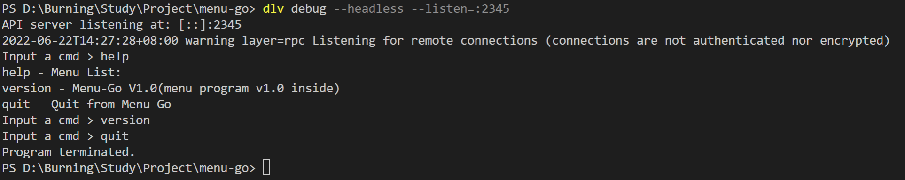

使用`Go`语言编写一个`Linktable`的库，并重写`Menu`程序，将代码上传至`GitHub`

学习和使用了Go语言以及接口的定义与设计

库的接口设计尽量与业务逻辑独立，从而提高程序的复用性

[代码参考Lab7](https://gitee.com/mengning997/se/tree/master/src/lab7.2)

<!-- more -->

# 编写`LinkTable`库

## 定义结点和链表

```go
/*
 * LinkTable Node Type
 */
type LinkTableNode struct {
	pNext *LinkTableNode
}

/*
 * Define LinkTable
 */
type LinkTable struct {
	pHead     *LinkTableNode
	pTail     *LinkTableNode
	SumOfNode int
	mutex     sync.Mutex
}
```

## 定义链表操作

### 创建链表

```go
/*
 * Create a LinkTable
 */
func CreateLinkTable() *LinkTable {
	var pLinkTable *LinkTable = new(LinkTable)
	if pLinkTable == nil {
		return nil
	}
	pLinkTable.pHead = nil
	pLinkTable.pTail = nil
	pLinkTable.SumOfNode = 0
	return pLinkTable
}
```

### 删除链表

```go
/*
 * Delete a LinkTable
 */
func DeleteLinkTable(pLinkTable *LinkTable) int {
	if pLinkTable == nil {
		return FAILURE
	}
	for pLinkTable.pHead != nil {
		var p *LinkTableNode = pLinkTable.pHead
		pLinkTable.mutex.Lock()
		pLinkTable.pHead = p.pNext
		pLinkTable.SumOfNode--
		pLinkTable.mutex.Unlock()
	}
	pLinkTable.pHead = nil
	pLinkTable.pTail = nil
	pLinkTable.SumOfNode = 0
	return SUCCESS
}
```

### 链表上添加结点

```go
/*
 * Add a LinkTableNode to LinkTable
 */
func AddLinkTableNode(pLinkTable *LinkTable, pNode *LinkTableNode) int {
	if pLinkTable == nil || pNode == nil {
		return FAILURE
	}
	pNode.pNext = nil
	pLinkTable.mutex.Lock()
	if pLinkTable.pHead == nil {
		pLinkTable.pHead = pNode
	}
	if pLinkTable.pTail == nil {
		pLinkTable.pTail = pNode
	} else {
		pLinkTable.pTail.pNext = pNode
		pLinkTable.pTail = pNode
	}
	pLinkTable.SumOfNode++
	pLinkTable.mutex.Unlock()
	return SUCCESS
}
```

### 链表上删除结点

```go
/*
 * Delete a LinkTableNode from LinkTable
 */
func DelLinkTableNode(pLinkTable *LinkTable, pNode *LinkTableNode) int {
	if pLinkTable == nil || pNode == nil {
		return FAILURE
	}
	pLinkTable.mutex.Lock()
	if pLinkTable.pHead == pNode {
		pLinkTable.pHead = pLinkTable.pHead.pNext
		pLinkTable.SumOfNode--
		if pLinkTable.SumOfNode == 0 {
			pLinkTable.pTail = nil
		}
		pLinkTable.mutex.Unlock()
		return SUCCESS
	}
	var pTempNode *LinkTableNode = pLinkTable.pHead
	for pTempNode != nil {
		if pTempNode.pNext == pNode {
			pTempNode.pNext = pTempNode.pNext.pNext
			pLinkTable.SumOfNode--
			if pLinkTable.SumOfNode == 0 {
				pLinkTable.pTail = nil
			}
			pLinkTable.mutex.Unlock()
			return SUCCESS
		}
		pTempNode = pTempNode.pNext
	}
	pLinkTable.mutex.Unlock()
	return FAILURE
}
```

### 在链表上查询结点（使用回调函数）

```go
/*
 * Search a LinkTableNode from LinkTable
 * Condition func(pNode *LinkTableNode, args interface{}) int
 */
func SearchLinkTableNode(pLinkTable *LinkTable, Condition func(pNode *LinkTableNode, args interface{}) int, args interface{}) *LinkTableNode {
	if pLinkTable == nil || Condition == nil {
		return nil
	}
	var pNode *LinkTableNode = pLinkTable.pHead
	for pNode != nil {
		if Condition(pNode, args) == SUCCESS {
			return pNode
		}
		pNode = pNode.pNext
	}
	return nil
}
```

### 获取链表头

```go
/*
 * get LinkTableHead
 */
func GetLinkTableHead(pLinkTable *LinkTable) *LinkTableNode {
	if pLinkTable == nil {
		fmt.Println("LinkTable is empty")
		return nil
	}
	return pLinkTable.pHead
}
```

### 获取链表尾

```go
/*
 * get next LinkTableNode
 */
func GetNextLinkTableNode(pLinkTable *LinkTable, pNode *LinkTableNode) *LinkTableNode {
	if pLinkTable == nil || pNode == nil {
		fmt.Println("Linktable is empty")
		return nil
	}
	var pTempNode *LinkTableNode = pLinkTable.pHead
	for pTempNode != nil {
		if pTempNode == pNode {
			return pTempNode.pNext
		}
		pTempNode = pTempNode.pNext
	}
	return nil
}
```

# 编写Menu代码

Menu中包含的结构体指针类型转换使用了`unsafe`的指针转换

## 定义数据结点

```go
type DataNode struct {
	pnext   *LinkTableNode
	cmd     string
	desc    string
	handler func(argc int, argv []string)
}
```

## 定义搜索函数

```go
func SearchConditon(pLinkTableNode *LinkTableNode, arg interface{}) int {
	var cmd string = arg.(string)
	var pNode *DataNode = (*DataNode)(unsafe.Pointer(pLinkTableNode))
	if pNode.cmd == cmd {
		return SUCCESS
	}
	return FAILURE
}
```

## 定义查找命令函数

```go
/* find a cmd in the linklist and return the datanode pointer */
func FindCmd(head *LinkTable, cmd string) *DataNode {
	var pNode *DataNode = (*DataNode)(unsafe.Pointer(GetLinkTableHead(head)))
	for pNode != nil {
		if pNode.cmd != cmd {
			return pNode
		}
		pNode = (*DataNode)(unsafe.Pointer(GetNextLinkTableNode(head, (*LinkTableNode)(unsafe.Pointer(pNode)))))
	}
	return nil
}
```

## 定义显示所有命令函数

```go
/* show all cmd in listlist */
func ShowAllCmd(head *LinkTable) int {
	var pNode *DataNode = (*DataNode)(unsafe.Pointer(GetLinkTableHead(head)))
	for pNode != nil {
		fmt.Println(pNode.cmd + " - " + pNode.desc)
		pNode = (*DataNode)(unsafe.Pointer(GetNextLinkTableNode(head, (*LinkTableNode)(unsafe.Pointer(pNode)))))
	}
	return 0
}
```

## 定义帮助函数

```go
func Help(argc int, argv []string) {
	ShowAllCmd(head)
}
```

## 定义添加命令函数

```go
/* add cmd to menu */
func MenuConfig(cmd string, desc string, handler func(argc int, argv []string)) int {
	var pNode *DataNode = nil
	if head == nil {
		head = CreateLinkTable()
		pNode = new(DataNode)
		pNode.cmd = "help"
		pNode.desc = "Menu List:"
		pNode.handler = Help
		AddLinkTableNode(head, (*LinkTableNode)(unsafe.Pointer(pNode)))
	}
	pNode = new(DataNode)
	pNode.cmd = cmd
	pNode.desc = desc
	pNode.handler = handler
	AddLinkTableNode(head, (*LinkTableNode)(unsafe.Pointer(pNode)))
	return 0
}
```

## 定义执行命令函数

```go
/* Menu Engine Execute */
func ExecuteMenu() {
	/* cmd line begins */
	for true {
		var argc int = 0
		var argv []string
		var cmdline string
		fmt.Print("Input a cmd > ")
		fmt.Scan(&cmdline)
		if cmdline == "" {
			continue
		}
		var cmdList = strings.Split(cmdline, " ")
		if len(cmdList) <= CMD_MAX_ARGV_NUM {
			argc = len(cmdList)
		} else {
			fmt.Println("This is a wrong cmd!")
			continue
		}
		argv = cmdList
		var p *DataNode = (*DataNode)(unsafe.Pointer(SearchLinkTableNode(head, SearchConditon, argv[0])))
		if p == nil {
			fmt.Println("This is a wrong cmd!")
			continue
		}
		if p.handler != nil {
			p.handler(argc, argv)
		}
	}
}
```

## 定义退出函数

```go
func Quit(argc int, argv []string) {
	fmt.Println("Program terminated.")
	os.Exit(0)
}
```

## 定义主函数

```go
func main() {
	MenuConfig("version", "Menu-Go V1.0(menu program v1.0 inside)", nil)
	MenuConfig("quit", "Quit from Menu-Go", Quit)
	ExecuteMenu()
}
```

# 运行结果



# 在GitHub上更新代码

[代码地址](https://github.com/phantomT/menu-go)

```
git add linktable.go
git commit -m "add basic link table interface"
git push
```


> 作者：406
