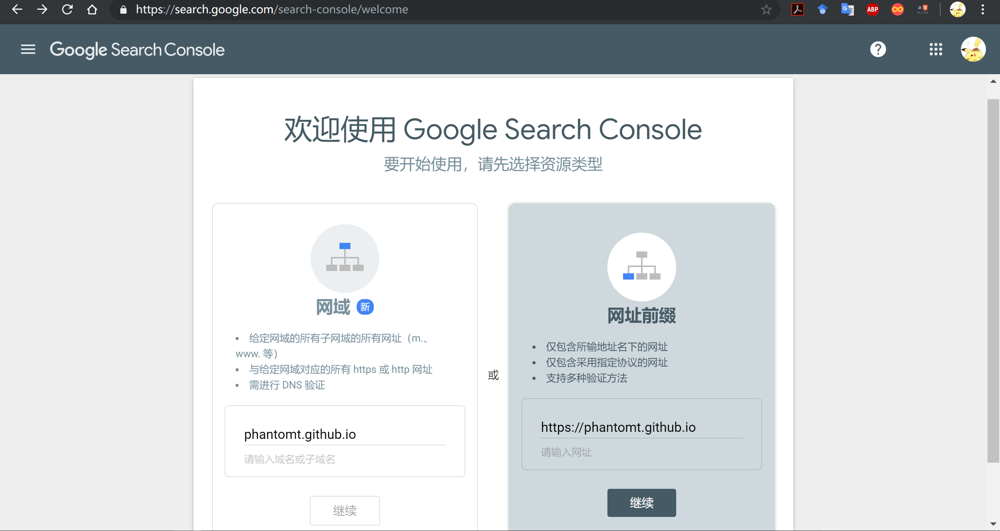

2018-08-09  
最近正好在写记录，正好设置一下网站，添加了一下站点地图并添加了谷歌的SEO，而为什么没有添加百度的呢？emmm百度实名认证有点恶星，拒绝为百度直接提供更多个人信息。
- [Google Search Console](https://www.google.com/webmasters/tools/home)

<!-- more -->

首先上图


---
## 添加站点地图
### 站点地图是什么
* 站点地图描述了一个网站的架构。它可以是一个任意形式的文档，用作网页设计的设计工具，也可以是列出网站中所有页面的一个网页，通常采用分级形式。这有助于访问者以及搜索引擎的机器人找到网站中的页面。
* 一些开发者认为网站索引是组织网页的一种更合适的方式，但是网站索引通常是A-Z索引，只提供访问特定内容的入口，而一个网站地图为整个站点提供了一般的自顶向下的视图。
* 网站地图通过使所有页面可被找到来增强搜索引擎优化的效果。
* __简单的说站点地图就是为搜索引擎指路，优化搜索结果，让你的网站出现在搜索结果中的地图__

* 因此添加站点地图对与优化SEO来说很重要。

---
* **[更新2019.5.2]**主题更新为**NEXT-Mist**，加载站点地图方式类似。
* 苯宝宝使用的主题环境为 **indigo** ，使用其他主题可能会有略微差异。

---

### 安装hexo-generator-sitemap
* 常规操作，在Git Bash中输入
```
npm install hexo-generator-sitemap --save
```
如果还要安装百度的插件，后面的插件名为`hexo-generator-baidu-sitemap`

* 在 __主题配置文件__ 中添加设置，可以写在最后:
```
## Sitemap
sitemap:
  path: sitemap.xml 
```
如果要添加百度的则添加：
```
## Baidusitemap
baidusitemap:
    path: baidusitemap.xml
```
__格式一定要正确，空格和缩进要有，不然会出错。__

### 设置内容
* 将 __主题配置文件__ 中的`url: `设置成自己的网址：
`url: https://yourwebsite.github.io`
*这个一定要做，我因为忘记了第一次写错了网址(写了仨'/')导致后面抓取不到*
* 配置好后，使用`hexo g`生成命令就能在`yourwebsite.github.io\public`中生成`sitemap.xml`了(百度的还会有`baidusitemap.xml`)这个是要提交给Google的;
* 然后再在`yourwebsite.github.io\source`中新建一个`robots.txt`，这个是**Robots协议**的文件，可以告诉引擎哪些页面可以抓取，哪些不能。
内容可以参考一下：
```
User-agent: *
Allow: /
Allow: /home/
Allow: /archives/
Allow: /tags/

Disallow: /js/
Disallow: /css/
Disallow: /fonts/

Sitemap: https://phantomT.github.io/sitemap.xml
```
1. `Allow: `后面的是可以抓取的内容，是`menu`的内容;
2. `Disallow: `后面的是禁止抓取的内容;
3. 如果使用百度sitemap则最后一行还要添加：`Sitemap: http://yourwebsite.github.io/baidusitemap.xml`。

然后可以`hexo g -d`提交一下

## Google Search Console
- [Google Search Console](https://search.google.com/search-console)
* 注册完成后，添加自己的域名。
  

* **[更新2019.5.2]**NEXT主题标记加入位置：`yourwebsite.github.io\themes\indigo\layout\_partial\head`中的`head.swig`，NEXT主题已经加入了代码模板了，因此只需要加入`yourverification`即可。
  
* 添加域名进行验证，我选择的是备用方案，也就是HTML标记进行验证；
    验证时要往`yourwebsite.github.io\themes\indigo\layout\_partial`中的`head.ejs`添加验证代码；
    
    ```
    <% if(theme.google_site_verification){ %>
    <meta name="google-site-verification" content="yourverification" />
    ```
`yourverification`即为Google在方案中提供的验证代码。

    
* 验证完成后，点击域名进入管理：
  

* 点击左侧的`robots.txt`测试工具，根据提示提交自己的`robots.txt`，提交过了的会进行测试。


__如果有错误要修改，要0错误才可以通过。__

* 提交站点地图
点击左侧的站点地图提交`sitemap.xml`，

已经添加完是这样的，点击右上角添加/测试站点地图。输入`sitemap.xml`先测试，成功再提交。

* 提交完成以后，点击左侧Google抓取工具，这里可以将网址和链接网页提交给引擎索引，这一步也很重要。

* 在这里输入博客的url，不填则表示抓取首页。

* 抓取完成后会有几种结果：完成、部分完成、重定向等，只有这三种情况可以提交索引的，点击提交至索引，可以选择只提交此页面还是包含所有链接页面，链接页面有可能会出现错误。

* 如果robots.txt设置了禁止，会出现下面结果：


* [参考链接](http://www.arao.me/2015/hexo-next-theme-optimize-seo/)

## 结束
配置完成后就可以在Google搜索自己的关键词和title测试一下啦~

*如果有需要，可以自行去购买域名和 DNS以及图床什么的*