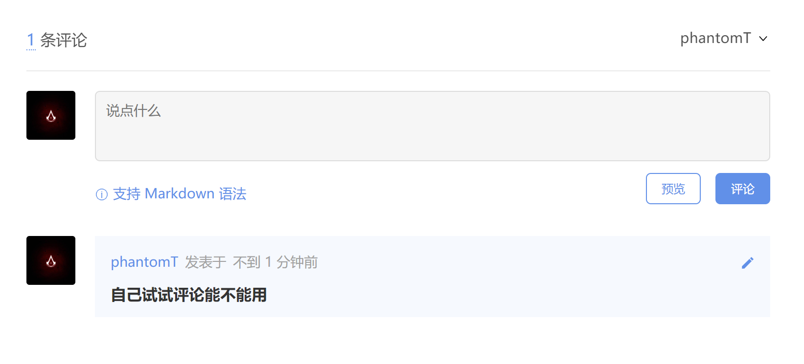
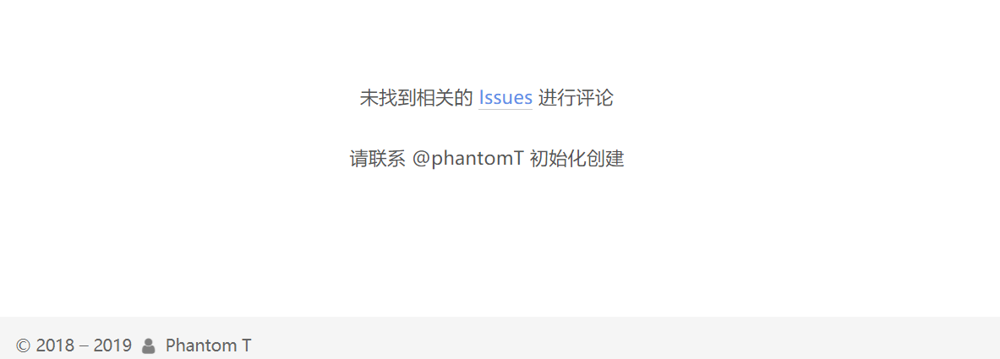

因为看原来的那个博客主题有些审美疲劳，因此决定换一个主题，虽然以前我比较嫌弃NEXT（可能是其他的场景太丑），不过现在看感觉Mist场景还挺好看的（真香）  

除此之外还加入了Gitalk评论模块并搞了一个自动初始化文章的脚本，省的要一个一个点开初始化（虽然效果还达不到手动初始化那么好）。

<!-- more -->

<link rel="stylesheet" href="https://cdn.jsdelivr.net/npm/aplayer/dist/APlayer.min.css">
<script src="https://cdn.jsdelivr.net/npm/aplayer/dist/APlayer.min.js"></script>
<script src="https://cdn.jsdelivr.net/npm/meting@2/dist/Meting.min.js"></script>
<meting-js
	server="netease"
	type="song"
	id="27514423"
    autoplay="true">
</meting-js>



# [Gitalk](https://github.com/gitalk/gitalk#install) 模块
`Gitalk is a modern comment component based on GitHub Issue and Preact.`  

Gitalk 是一个基于 GitHub Issue 和 Preact 开发的评论插件，NEXT 7主题已经集成了这个插件，因此配置起来要更容易一些，网上的教程很多，从**[GitHub Application](https://github.com/settings/applications/new)**到在`theme`的配置文件里加入代码段都很清楚，我就不展开了，直接进入初始化。

# Gitalk 初始化

## 手动初始化

Gitalk是需要一个`repo`的，并且需要创建文章对应的`Issue`进行初始化。  

在未创建`Issue`的情况下会出现以下内容：  



因此我们需要对Gitalk进行初始化，手动的方法就是在页面登录GitHub账户然后做应用关联，以后登录状态进入未初始化的文章后就会进行初始化，相应的在`repo`的`Issue`里也会有相应文章标题的`Issue`出现，此文章的每一条评论都会这个`Issue`下面出现（`Issue`下面的评论就是文章下面的评论）。  

那么就会有一个问题：如果一开始文章很多，加入了Gitalk后手动初始化就意味着要点开**每一篇**文章，这就很麻烦，因此我想到有没有脚本可以用。  

## 脚本的出现

经过一番搜索，找到了两个**node.js**的脚本以及一些**Ruby**的脚本，因为我不会**Ruby**，所以选择了**JS**（虽然**JS**也不怎么会，但想到**node.js**用的是**JS**，还是决定用**JS**的脚本）。  

### 站点地图

脚本是基于网站sitemap的批量刷新，关于sitemap我以前写过一个博文，主要内容差不多：[Hexo添加Sitemap](https://phantomt.github.io/2019/05/02/Hexo-001-sitemap/)  

### Personal Access Token

因为需要调用GitHub API因此需要一个**Personal Access Token**以避免**Rate limiting**，GitHub API对一些接口有调用限制，具体可以查看 [Rate limiting](https://developer.github.com/v3/#rate-limiting) 的解释。对于不同的认证方式，调用限制不同。  

Gitalk使用的是GitHub的**OAuth**认证，请求时必须要有 `clientID` 和 `clientSecret` ，这种方式每小时的 `Rate limiting` 是 **60** 。如果只是发表评论，肯定是够了。  

而如果要批量创建所有文章对应的`Issue`来作为这些文章的评论存储，可能就未必够了。  

好在GitHub提供了另一种认证方式——**Personal access token**，这种方式每小时的限制高达 **5000** 次。所以，第一步就是申请这个**token**。  

从GitHub的 [Personal access token](https://github.com/settings/tokens) 页面，点击 [Generate new token](https://github.com/settings/tokens/new) 。  

- Token description ：描述，随意
- Select scopes：必选的选项为`repo`下的`repo:status`、`repo_deployment`和`public_repo`      

创建完成后，获得一个**Token**，**一定要保存这个Token**

### 关于MD5

因为在配置Gitalk的时候在`id`一栏设置了对`pathname`进行**MD5**加密，因此在自动初始化的脚本中，也要相对的在`label`里对`path`进行**MD5**处理（虽然我程序里的变量名好像不是这个）。  

如果脚本中不进行**MD5**加密，那么创建的`Issue`的`label`就会是原始的文章地址，而Gitalk并不识别这个`Issue`，还是需要手动初始化（两个`Issue`是不会合并的）。  

因此，如果在Gitalk里设置了**MD5**，那么在脚本里同样要进行**MD5**，**同一文件的MD5摘要是一样的。**  

### 代码依赖项

因为我借鉴了两篇文章给出的代码，因此需要结合一下他们的依赖项

```
npm install request --save
npm install xml-parser --save
npm install yamljs --save
npm install cheerio --save
```

其实主要还是第二篇的代码做的主体🤔  

### 脚本文件

在**Hexo**的根目录创建文件`gitalk_init.js`，将下面的代码复制进去并修改相应的配置参数。其中`token`就是上面申请并保存的**Token**。这个`token`我前一天搞得第二天用不了了？？？🤔反正在搞一个就是了，没有`token`是无法使用API的，`token`错误会导致`issues`变量内容错误。

```
const request = require("request");
const fs = require("fs");
const path = require("path");
const url = require("url");
const xmlParser = require("xml-parser");
const YAML = require("yamljs");
const cheerio = require("cheerio");
const crypto = require('crypto');
// 根据自己的情况进行配置
const config = {
    username: "YourGithubUserName", // GitHub 用户名
    token: "YourPersonalAccessToken",  // GitHub Token
    repo: "YourGitalkIssueRepo",  // 存放 issues的git仓库
    // sitemap.xml的路径，commit.js放置在根目录下，无需修改，其他情况自行处理
    sitemapUrl: path.resolve(__dirname, "./public/sitemap.xml"),
    kind: "Gitalk",  // "Gitalk" or "Gitment"
};
let issuesUrl = `https://api.github.com/repos/${config.username}/${config.repo}/issues?access_token=${config.token}`;

let requestGetOpt = {
    url: `${issuesUrl}&page=1&per_page=1000`,
    json: true,
    headers: {
        "User-Agent": "github-user"
    }
};
let requestPostOpt = {
    ...requestGetOpt,
    url:issuesUrl,
    method: "POST",
    form: ""
};

console.log("开始初始化评论...");

(async function() {
    console.log("开始检索链接，请稍等...");
    
    try {
        let websiteConfig = YAML.parse(fs.readFileSync(path.resolve(__dirname, "./_config.yml"), "utf8"));
        
        let urls = sitemapXmlReader(config.sitemapUrl);
        console.log(`共检索到${urls.length-1}个链接`);
        
        console.log("开始获取已经初始化的issues:");
        let issues = await send(requestGetOpt);
        console.log(`已经存在${issues.length}个issues`);
        
        let notInitIssueLinks = urls.filter((link) => {
            return !issues.find((item) => {
                link = removeProtocol(link);
                return item.body.includes(link);
            });
        });
        
        for(let i=0;i<notInitIssueLinks.length;i++)
        {
            if(notInitIssueLinks[i].endsWith("tags/index.html"))
            {
                notInitIssueLinks.splice(i,1);
                i--;
            }
        }

        if (notInitIssueLinks.length > 0) {
            console.log(`本次有${notInitIssueLinks.length}个链接需要初始化issue：`);
            console.log(notInitIssueLinks);
            console.log("开始提交初始化请求, 大约需要40秒...");
            /**
             * 部署好网站后，直接执行start，新增文章并不会生成评论
             * 经测试，最少需要等待40秒，才可以正确生成， 怀疑跟github的api有关系，没有找到实锤
             */
            setTimeout(async ()=>{
                let initRet = await notInitIssueLinks.map(async (item) => {
                    let html = await send({ ...requestGetOpt, url: item });
                    let title = cheerio.load(html)("title").text();
                    let desc = item + "\n\n" + cheerio.load(html)("meta[name='description']").attr("content");
                    let pathLabel = url.parse(item).path;
                    let label = crypto.createHash('md5').update(pathLabel,'utf-8').digest('hex');
                    let form = JSON.stringify({ "body": desc, "labels": [config.kind, label], "title": title });
                    return send({ ...requestPostOpt, form });
                });
                console.log(`已完成${initRet.length}个！`);
                console.log("可以愉快的发表评论了！");
            },40000);
        } else {
            console.log("本次发布无新增页面，无需初始化issue!!");
        }
    } catch (e) {
        console.log(`初始化issue出错，错误如下：`);
        console.log(e);
    } finally {
    
    }
})();

function sitemapXmlReader(file) {
    let data = fs.readFileSync(file, "utf8");
    let sitemap = xmlParser(data);
    return sitemap.root.children.map(function (url) {
        let loc = url.children.filter(function (item) {
            return item.name === "loc";
        })[0];
        return loc.content;
    });
}

function removeProtocol(url) {
    return url.substr(url.indexOf(":"));
}

function send(options) {
    return new Promise(function (resolve, reject) {
        request(options, function (error, response, body) {
            if (!error) {
                resolve(body);
            } else {
                reject(error);
            }
        });
    });
}
```

我自己加了一个筛选文章的过程，不然连标签界面都会生成Issue。

```
if(notInitIssueLinks[i].endsWith("tags/index.html"))
            {
                notInitIssueLinks.splice(i,1);
                i--;
            }
        }
```

确实是得等待40秒才**可能**生成正确的Issue。

### 执行脚本

代码写完以后在Git bash里输入`node gitalk_init.js`即可执行脚本。  

当然如果想要部署博客的时候自动运行可以在Hexo根目录的`package.json`文件里加入

```
"scripts": {
    "deploy": "hexo clean && hexo g -d && node gitalk_init.js"
}
```

之后直接输入`npm run deploy`即可直接执行。

## 后记

这其实是我第一次写**JS**代码，原来看的**JS**代码和别人写好的代码比起来真的是太简单了。。。**JS**的语言特性还不太习惯，比如函数调用和参数传递还有`=>`的使用，虽然靠啃**C/C++**的老底强行写了一下，但是还是有点吃力，主要功夫都花在了看懂代码，实际自己补的内容没几个字母。  

一开始找`sitemap`读出来的内容找了半天，然后在一个错误的地方加了网址过滤导致后面传了空字符串出错，后来大概懂了一些以后才在半路把信息截下来。  

中间还因为**MD5**的问题出现了自动加手动的`Issue`不在一起的问题，换了另一篇文章的代码改然后发现源码就是错的，对`url`的处理规则和自己的情况不一样，又要重写`url`处理，于是还是改回了第一个用的代码，找到那个加入**MD5**的地方。第一次改**JS**代码还是挺有挑战性的。  

经过晚上的测试，`Issue`的内容能基本和手动的类似了，第一行显示`url`，第二行开始显示摘要，虽然不如手动的那么精确，不过还能勉强苟一下😅

`自己写是写不出来的，只能改改代码勉强能用的样子。😕`

# 参考链接

1. [自动初始化Gitalk评论](https://www.codercto.com/a/35485.html)
2. [nodejs版本的Gitalk/Gitment评论自动初始化](https://daihaoxin.github.io/post/322747ae.html)
3. [Linux下的自动化工具配置Gitalk初始化](https://www.codercto.com/a/39036.html)