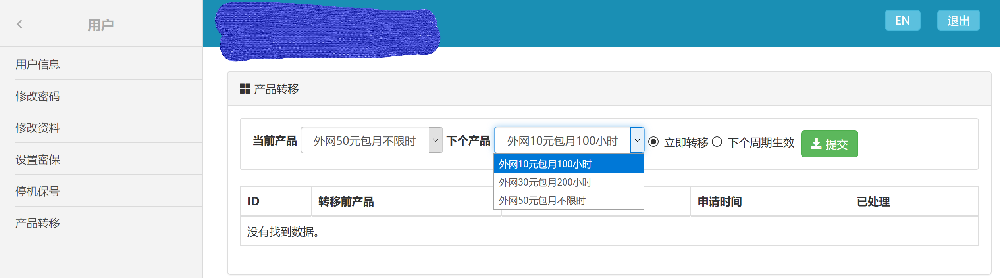
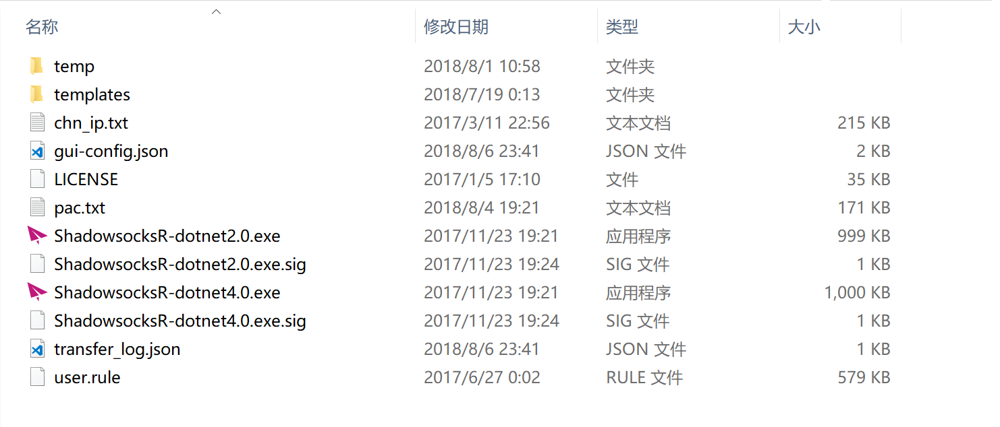
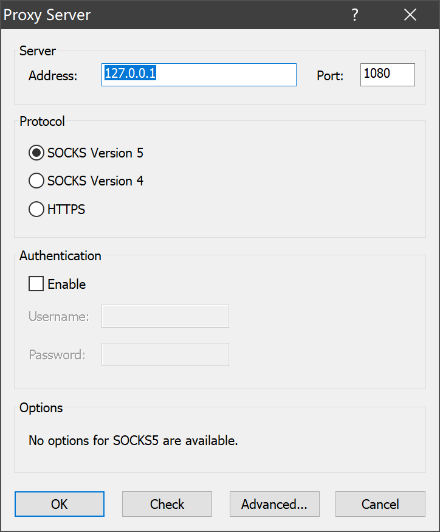
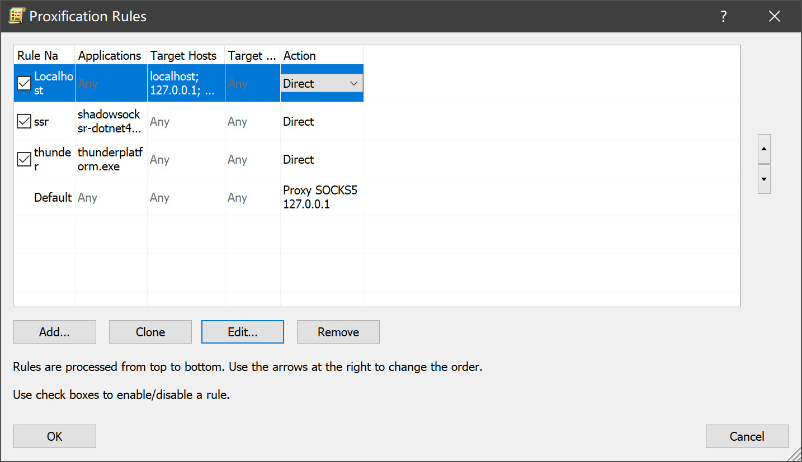

苯宝宝假期呆在学校学习，然而校园网实在坑爹。。所以通过一些教程了解了搭建代理服务器的方式通过IPv6来上网，效果还不错，虽然也有一些问题QAQ
<!-- more -->

## 环境
* 苯宝宝所在华北某校，校园网是IPv6+IPv4；
* 校园网目前针对IPv4收费，IPv6暂时免费，但经过路由器无法使用IPv6；
* 校园网坑爹限速，即使假期也日均200KB/s，GitHub访问速度一度达到11KiB/s,而IPv6速度贼快，Youtube等墙外网站基本1080P+的清晰度随便看，墙内即使是Bilibili，对于一些没有地区限制的视频(非剧集等)，基本上也是1080P+的清晰度流畅观看，下载资源基本满速；
* 校园网网络认证收费，试图使用路由器尝试多拨等(OpenWRT，以后写这个)，但并未破解成功，也未能实现路由器转发IPv6。校园网收费具体如下:
    > * 10元/30天(100小时)
    > * 30元/30天(200小时)  ~~没错，你没有看错，三倍的价格只有两倍的时间~~
    > * 50元/30天(无限时长) ~~但是网速并没有任何改变~~
* 截图为证:


* 一般宿舍都是组团买50元的套餐，但是目前学校好像按照账号限速！！！也就是说我们特么6个人分一个号的速度！！！本来网口只有100兆！而且50块钱也太贵了！更多的吐槽不能乱说了，怕水表。

* __下面开始正题__

## 准备工作
* IPv6环境，大概就是一个支持IPv6的网口，Windows可以通过网络设置查看，若IPv6显示无网络连接，就是不支持了。
* 支持IPv6的服务器，我选的是Vultr的，因为有一个比较便宜。。。大概每个月两顿食堂的饭钱不到，还有更便宜的但是配置实在太低了。。。搬瓦工的VPS有个问题就是他家KVM架构不支持。
* SSH工具，我选择putty
* 电脑和脑子还有搜索引擎

## VPS
* VPS可以选择去www.vultr.com注册一个账号然后买一个鹰酱/脚盆的服务器(测试一下哪个延时低和速度快选哪个)，可以使用支付宝付款的。
推广一下我的[分享链接](https://www.vultr.com/?ref=7480130)，**如果要购买这个再考虑点**，不然别说苯宝宝坑。。。
* ~~安装系统，根据教程我装的是CentOS 6，和以前用的Debian内核的不一样，话说好像6和7都不一样= =；~~
* 安装系统，我选择了CentOS 7，其实装Debian/Ubuntu也可以，后面的**脚本**支持的发行版挺多的。
> 另:搭建服务器时一定要选择"Enable IPv6"选项。
* 购买完成后从Vultr的后台获取服务器的IP地址和root密码，使用[putty](https://www.putty.org/)连接服务器，putty界面中鼠标右键为粘贴。Linux命令行的基本操作要会一些，避免出些基础的错误。

## 搭建
### SSR的搭建
1. 使用[秋水逸冰](https://teddysun.com/486.html)提供的一键安装脚本，可以一键安装Shadowsocks-Python， ShadowsocksR， Shadowsocks-Go， Shadowsocks-libev 版（四选一）服务端；
2. 使用root登录服务器，并运行一下命令:
3. SSR是SS的一个改进版本
```
wget --no-check-certificate -O shadowsocks-all.sh https://raw.githubusercontent.com/teddysun/shadowsocks_install/master/shadowsocks-all.sh
chmod +x shadowsocks-all.sh
./shadowsocks-all.sh 2>&1 | tee shadowsocks-all.log
```
按需求选择shadowsocksR，然后选择端口什么的，
* 服务器端口:自己设定（如不设定，默认从 9000-19999 之间随机生成）
* 密码:自己设定（如不设定，默认为 teddysun.com）
* 加密方式:自己设定（如不设定，Python 和 libev 版默认为 aes-256-gcm，R 和 Go 版默认为 aes-256-cfb）
* 协议（protocol）:自己设定（如不设定，默认为 origin）（仅限 ShadowsocksR 版）
* 混淆（obfs）:自己设定（如不设定，默认为 plain）（仅限 ShadowsocksR 版）
* *备注:脚本默认创建单用户配置文件，如需配置多用户，请手动修改相应的配置文件后重启即可。*

* 安装完成后，会提示如下:
```
Congratulations, your_shadowsocks_version install completed!
Your Server IP        :your_server_ip
Your Server Port      :your_server_port
Your Password         :your_password
Your Encryption Method:your_encryption_method

Your QR Code: (For Shadowsocks Windows, OSX, Android and iOS clients)
 ss://your_encryption_method:your_password@your_server_ip:your_server_port
Your QR Code has been saved as a PNG file path:
 your_path.png

Welcome to visit:https://teddysun.com/486.html
Enjoy it!
```

**卸载方式请看[秋水逸冰](https://teddysun.com/486.html)的原文**

3. 下载ShadowsocksR的客户端
* [常规版 Windows 客户端](https://github.com/shadowsocks/shadowsocks-windows/releases)

* [ShadowsocksR 版 Windows 客户端](https://github.com/shadowsocksrr/shadowsocksr-csharp/releases)

*更多版本请到仓库内自行搜索*

4. 开启SSR
`/etc/init.d/shadowsocks-r start | stop | restart | status`

* 修改配置文件
`vi /etc/init.d/shadowsocks-r.json`
将"server":"0.0.0.0"修改为"server":"::"，然后重启SSR
`/etc/init.d/shadowsocks-r restart`

* 放行IPv6端口
```
/sbin/ip6tables -I INPUT -p tcp --dport "yourport" -j ACCEPT    #将这里的"yourport"改成在上面搭建过程中设置的端口
/etc/rc.d/init.d/ip6tables save    #保存端口放行设置
/etc/init.d/ip6tables restart    #重启ip6tables，应用放行设置
```

### SSR客户端的设置/Windows系统
将SSR客户端下载后解压缩，文件夹大致如图:

双击 __ShadowsocksR-dotnet4.0.exe__ 启动
这时任务栏会出现一个小飞机图标，
双击小飞机，填入服务器数据，如果使用IPv6，则将IP一栏填写成服务器的IPv6地址。
例如:

```
服务器IP: #服务器的ip地址
服务器端口: 8388   #前面设置的服务器端口
密码: #前面设置的SSR密码
加密: aes-256-cfb
协议: 默认的 origin 就行
协议参数: 不用管
混淆: 默认的 plain 就行
混淆参数: 不用管
备注: 随意
Group: 随意
```
右键小飞机，将系统代理模式设置为PAC模式，代理规则为全局，这时小飞机就会变成绿色，像上面的图片一样。
*更多SSR的使用请上网自行搜索，包括二维码、绕行规则什么的*

### 使用Proxifier进行全局代理
* 下载安装[Proxifier](http://www.proxifier.com/)，注册码啥的靠搜索引擎；
* 设置代理服务器:
    1. 点击Profile->Proxy Servers，然后点击右侧添加服务器;
    2. Address填:127.0.0.1;
    3. Port填:1080;
    4. Protocol选择:SOCKS Version 5;
    5. 确定。
    
* 添加代理规则:
    1. 点击Profile->Proxification Rules，逐一添加;
    2. 将ShadowsocksR-dotnet4.0.exe添加到直连;
    3. 将localhost添加到直连;
    4. 将默认设置为Proxy SOCKS5 127.0.0.1。
    


## 使用BBR进行速度优化
_核心方法来自[秋水逸冰](https://teddysun.com/489.html)_
此方法在苯宝宝的服务器上测试通过
* 在TCP连接中，由于需要维持连接的可靠性，引入了拥塞控制和流量管理的方法。Google BBR就是谷歌公司提出的一个 **开源TCP拥塞控制的算法** 。在最新的linux 4.9及以上的内核版本中已被采用。
[BBR算法解析](https://blog.csdn.net/dog250/article/details/52830576)
* 由于Google BBR非常新，**任何低于4.9的linux内核版本都需要升级到4.9及以上才能使用**，故若VPS本身内核版本较低的话，只有KVM架构的VPS才能使用，**openvz的VPS用户若内核版本较低则无法使用！**

---

**由于是使用最新版系统内核，最好请勿在生产环境安装，以免产生不可预测之后果。**

---

### 内核升级方法
首先查看内核版本:
`uname -r`
若符合条件则可以继续
~~一般Vultr新安装的的CentOS 6都是新内核的~~

**我新安装的都是CentOS 7**

否则请升级内核。

* CentOS 系统，执行以下命令即可升级内核:
`yum --enablerepo=elrepo-kernel -y install kernel-ml kernel-ml-devel`
* CentOS 6:
`sed -i 's/^default=.*/default=0/g' /boot/grub/grub.conf`
* CentOS 7:
`grub2-set-default 0`

### 安装BBR
使用root用户登录，运行以下命令:
```
wget --no-check-certificate https://github.com/teddysun/across/raw/master/bbr.sh
chmod +x bbr.sh
./bbr.sh
```
安装完成后，脚本会提示需要重启 VPS，输入 y 并回车后重启。

重启后，进入VPS，验证安装是否成功，分别输入以下命令:
```
sysctl net.ipv4.tcp_available_congestion_control
sysctl net.ipv4.tcp_congestion_control
sysctl net.core.default_qdisc
lsmod | grep bbr
```
这些命令的返回值一般为:
```
net.ipv4.tcp_available_congestion_control = reno cubic bbr
net.ipv4.tcp_congestion_control = bbr
net.core.default_qdisc = fq
tcp_bbr                20480  8
```
如与以上结果类似或相同，则BBR已经启动。

## 结束
那么，使用IPv6的VPS就搭建完成了，可以打开~~Youtube~~等不存在的网站试验以下hhh

### 问题遗留
~~其实还是有一些问题的，比如路由器不能转换IPv6地址(好像是这么描述的)就是连接路由器以后就无法使用IPv6了，也就是说Wi-fi与IPv6不能一起用诶。~~

关于路由器不能转换IPv6地址的问题，已经有**后面的日志**[Netgear WNDR3700V4刷OpenWrt，对校园网IPv6使用的进一步探索](https://phantomt.github.io/2019/05/02/Linux-001-OpenWrt/)进行解决。

希望自己也可以成为大佬>_<

### 参考链接[更新]
[某前辈的博客](https://www.iamzs.top/archives/ssr-ipv6-proxifier.html)