2018-08-12  
用闲鱼上淘的Netgear路由器刷Openwrt系统，设置IPv6，尝试shadowsocks，实现校园网加速/不完美免费免流，路由器的ss感觉并不能达到要求。。
ss代理

* 支持Windows 10/Linux
* 支持安卓(测试Android 8，三丧OEM)
* iOS需要购买代理软件
IPv6仅对于pc端使用有效，安卓能获取IPv6地址但不知道为啥连不上v6的代理？？

<!-- more -->


## 设备介绍

网件WNDR3700V4路由器，大概是14年出的，价位大概300+左右，配置还是很豪华的，毕竟是专业的厂家，和某些贴牌的不一样。

### 硬件配置
    > latform:  Atheros AR9344
    > Target:   ar71xx
    > Instruction Set:  MIPS32
    > Sub Instruction Set:  MIPS32 74K series
    > Bootloader:   U-Boot
    > CPU MHz:  560
    > Flash MB: 128NAND
    > RAM MB:   128
    > Ethernet 100M ports:  -
    > Ethernet GBit ports:  5
    > Modem:    No
    > Comments network ports:   1 WAN + 4x LAN
    > VLAN: Yes
    > WLAN Hardware:    AR9582 [an 2x2:2] + AR9344 [bgn 2x2:2]
    > WLAN 2.4GHz:  b/g/n
    > WLAN 5.0GHz:  a/n
    > WLAN Comments:    2x2:2 MIMO
    > Detachable Antennas:  -
    > USB ports:    1x 2.0
    > SATA ports:   -
    > Serial:   Yes
    > JTAG: Yes

数据来自[OpenWrt的Wiki](https://wiki.openwrt.org/toh/hwdata/netgear/netgear_wndr3700_v4)，刷机固件等也来自于此。
[WNDR3700各个版本的对比](https://wiki.openwrt.org/toh/netgear/wndr3700#tab__hardware_details)
> 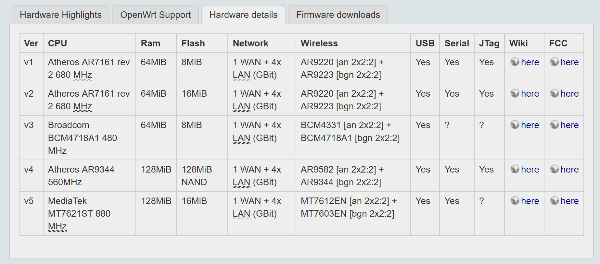

### 开箱
在闲鱼上花了100块钱淘到的：
> 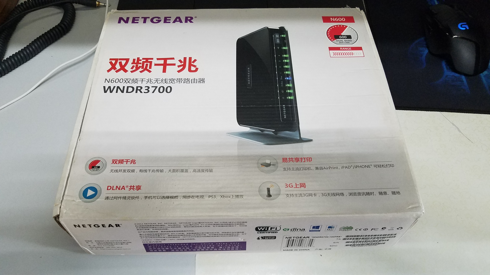
> 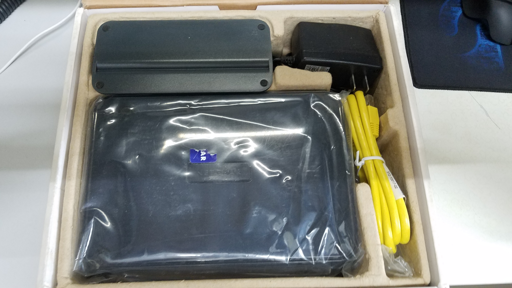
> 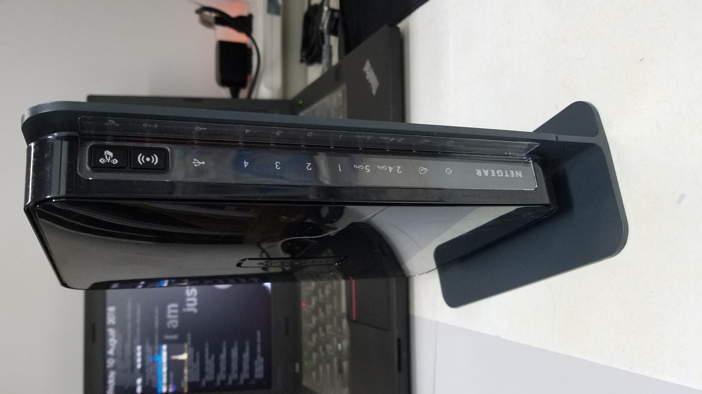
> 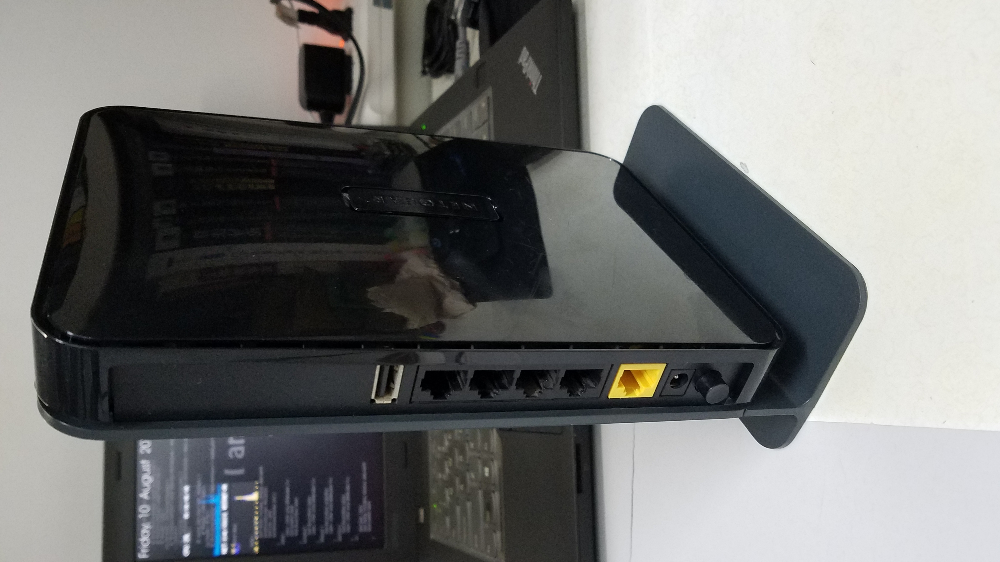


## 刷机
### 准备工作
* OpenWrt的官方固件(其实是因为我不会自己编译emmmm)
* 路由器
* 电脑(Windows 10)
* 网线
* SSH工具(我选择putty)
* SCP传输工具(我选择WinSCP)
* 牙签(避免变砖应急用的)
* tftp工具和Netgear的官方固件(同上，救砖)

固件版本：Openwrt Chaos Calmer 15.05.1，使用官方提供的固件。
固件可以从[OpenWrt的Wiki](https://wiki.openwrt.org/toh/hwdata/netgear/netgear_wndr3700_v4)中获得。

### 先前的尝试
* 因为前一段时间刷过一个小的路由器，TP-Link的WR720N V4，但是ROM太小了没有加什么插件之类的。
* 那个路由器先刷的解锁Bootloader的OpenWrt固件，
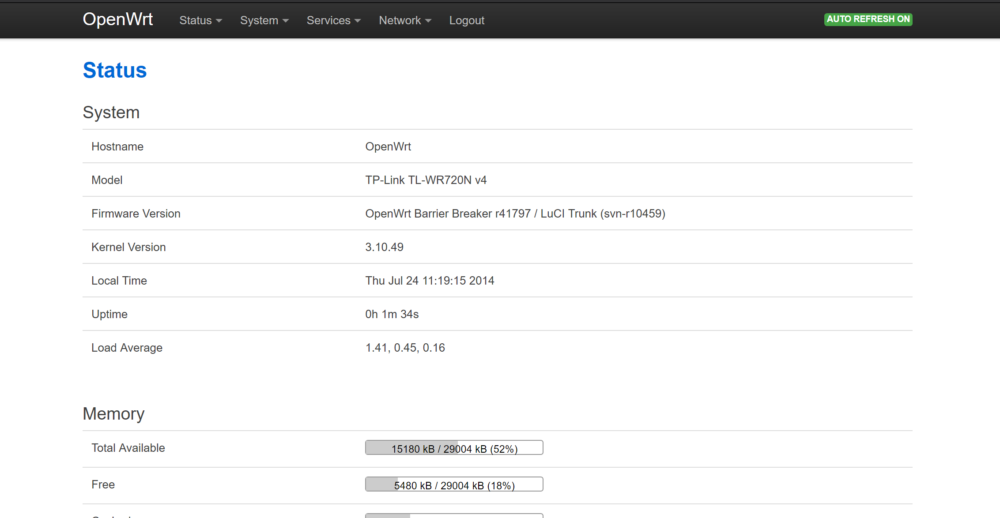
* 然后刷了Breed的Bootloader，最后在用Breed升级的正常的OpenWrt。
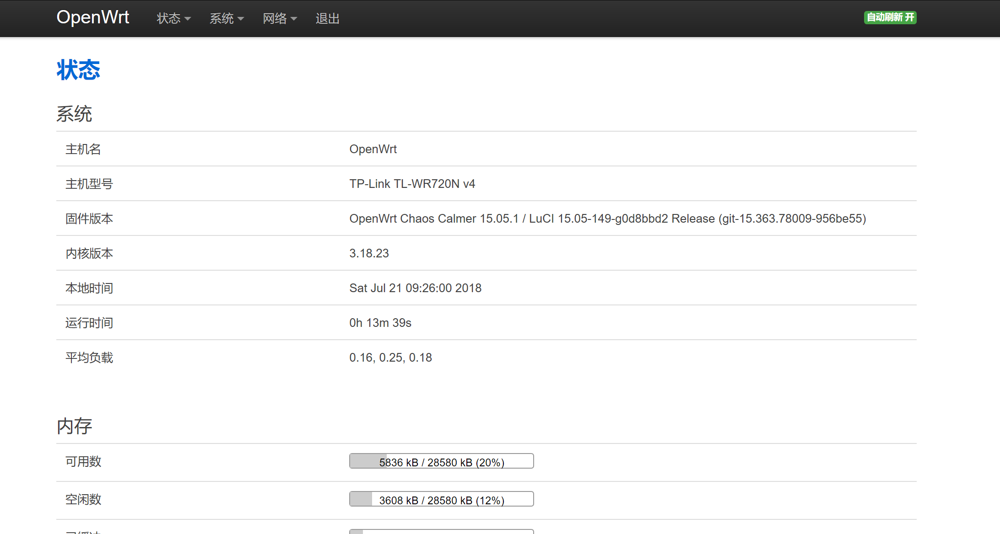
* 期间，变砖一次，抢救一下午，一开始以为没救了，直到一次偶然启动发现灯亮了，于是抢救一下，也不知道是怎么搞得就不停的传最后就救回来的。
总的来说就是安全模式感天动地。= =
* 救砖的时候不小心还用 __*？？？码*__ 进入了楼里的一个华为路由器(/交换机？？)，平时检测不到大概是因为ip地址与路由器的局域网地址冲突了，也许这就是为什么学校通告里写的要关闭路由器的DHCP服务(虽然不关也能用诶)。
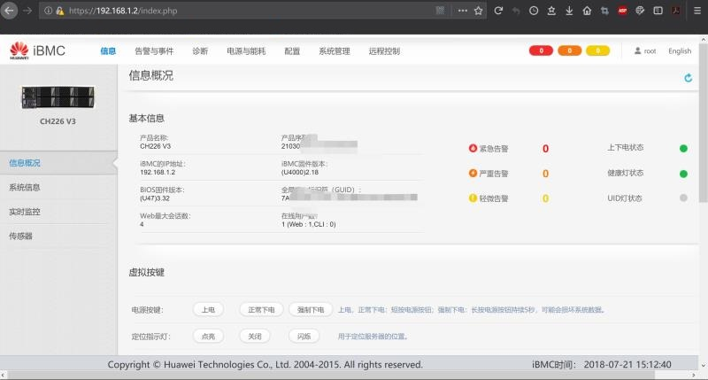

准备好固件和路由器还有救砖的准备就可以开始了。

因为现在系统就是原版的，可以直接用后台上传固件。
### 物理连接
第一步是物理连接，路由器是原版的系统，因为为了避免在刷机过程中没有网，于是我把正在用的另一个路由器的地址改成了`10.0.0.1`

使用时我先试的将Internet口，也就是WAN口与笔记本的网口进行连接，然后使用cmd进行`ping`连接测试，

登录`192.168.1.1`，输入默认用户名和密码，进入后台。

上传固件。
重新启动。

### 进入后台
* 启动后依然输入`192.168.1.1`进入管理界面，这是会自动跳转至Openwrt的Web界面(Luci)。
用户名：`root`
密码：随意设置
* 然后页面上方会有一段提示未设置密码的英文，点进去设置一下就行，__这步必须做__ 否则SSH可能无法登录。

* 设置完密码后，Luci界面的概况如下：
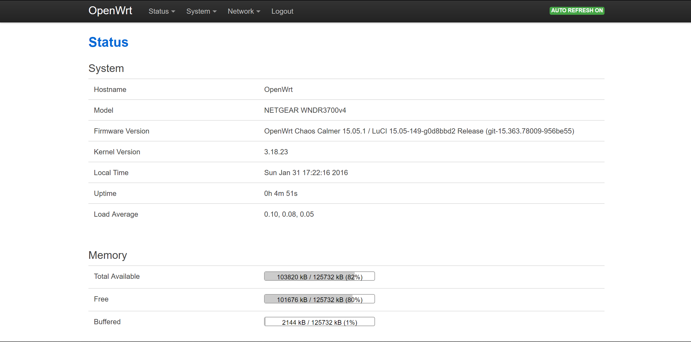
* 使用putty登入路由器后台，就会显示以下界面：
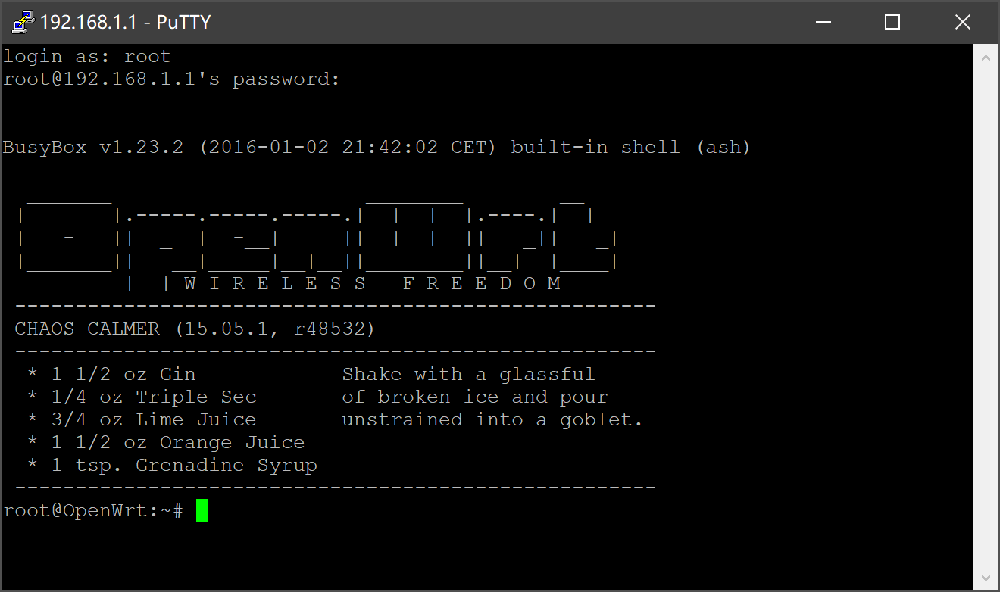
* 首先要更新配置源，也就是安装包的来源：
`opkg update`
* 然后可(yi)能(ding)会出现类似以下的报错：
```
opkg_conf_load: Could not lock /var/lock/opkg.lock: Resource temporarily unavailable.
```

* 这时就要依次输入以下并重新更新源：
```
echo "nameserver 114.114.114.114">/tmp/resolv.conf
rm -f /var/lock/opkg.lock
opkg update
```
以上可以看为添加国内域名解析到临时分区，并且对安装源的锁解锁/删除，然后更新的命令

* 等源更新完后，再次出现root命令输入时，输入：
`opkg install wget`
安装GNU wget模块，为后面做准备。

然后可以选择从web界面中添加软件包也可以选择从命令行(CLI)添加。
* 如果英文界面看着不爽，可以安装`luci-i18n-base-zh-cn`简中的界面语言包，安装完成后，到`系统-系统-语言与界面`中更换中文界面。
在同一级界面中可以将路由器时间改到`Asia/Shanghai`。

### 开启wifi
可以选择现在开启wifi，也可以最后配置完再开启，因为wifi直接桥接的`lan`口，所以应该时无所谓的。
直接在`网络-无线`界面中配置即可，802.11an协议的是5G信号的wifi，另一个则是2.4G的。
添加前可以使用扫描来查看现有环境中的所有广播的Wifi信号以及它们的信息如信道等。
设置的时候选择一个使用人数最少的信道，功率可以调到最大，一定不要`隐藏ESSID`，SSID相当与Wifi的名字，默认都是广播的，隐藏了就只能手动输入添加连接了。
安全设置中加密方式选择`WPA2-PSK`，算法自动，添加密码。

## 设置网络并开启IPv6
### 什么是IPv6
* IPv6是Internet Protocol Version 6的缩写。IPv6是IETF（互联网工程任务组，Internet Engineering Task Force）设计的用于替代现行版本IP协议（IPv4）的下一代IP协议。IPv6的允许的庞大地址数量也使得其成为物联网时代的关键，最近我国也出台了相应的IPv6发展计划，将大力推动IPv4向v6过渡。
* IPv6对于普通用户来说和IPv4是一样的，只是地址表示不同，IPv6网速快其一是用的人少，加上本身的网络层次扁平，使得链路拥塞较少(因为IPv6的设定是全球每台设备都有唯一的地址，因此 __*就像*__ 一个局域网一样);其二是基础设备建设更优秀，带宽更大，因此网速也就会快一些，据说将现有的IPv4用户全部转移至IPv6网络，网速依然可以提高10倍。

### IPv6的特点
IPv6有诸多不同，也使得其配置方式和IPv4不一样。
* 具有更大的地址空间：128位
* 使用更小的路由表
* 增强的组播支持以及对流的控制
* 无状态自动配置
* 强制使用IPSec加密通讯，更安全
* ···更多具体内容参见维基百科与计算机网络书籍

* *如果是windows系统，为了保护mac地址会额外生成一个临时IPv6地址，并使用这个临时地址通信，禁用这个临时地址使用命令：netsh interface IPv6 set privacy state=disable*

### 从IPv4到IPv6
#### 过渡
1. 隧道
    隧道（Tunneling）是另一个用来链接IPv4与IPv6的机制。为了连通IPv6互联网，一个孤立主机或网络需要使用现存IPv4的基础设施来携带IPv6数据包。这可由将IPv6数据包装入IPv4数据包的隧道协议来完成，实际上就是将IPv4当成IPv6的链接层。
    IP协议号码的41号用来标示将IPv6数据讯框直接装入IPv4数据包。IPv6亦能加入UDP数据包，如为了跨过一些会阻挡协议41流量的路由器或NAT设备。其它流行的封装机制则有AYIYA和GRE。 
    
2. 双堆栈
    双堆栈（Dual IP stack implementation）是将IPv6视为一种IPv4的延伸，以共享代码的方式去实现网络堆栈，其可以同时支持IPv4和IPv6，如此是相对较为容易的。如此的实现称为“双堆栈”，并且，一个实现双堆栈的主机称为“双堆栈主机”。这步骤描述于RFC 4213。
    目前大部分IPv6的实现使用双堆栈。一些早期实验性实现使用独立的IPv4和IPv6堆栈。 
#### IPv6的链路方式
一方面可以看成过渡，另一方可以看成IPv6协议所在的链路环境

1. NATIVE
    这个需要运营商（ISP）支持，这种方式允许路由器下级的客户端与拨号服务器直接通信并获取原生IPv6地址，如果在支持的ISP下，选择路由器上的NATIVE就可以了，NATIVE下可以配置无状态配置IPv6或者静态IPv6或者DHCP分配IPv6。

2. PASSTHROUGH/RELAY(中继模式)
    在这个模式下，路由器成为下一跳，与NAT的区别是，路由器只会转发数据包，并不会修改源地址。
    在这种模式下，可以使用客户端无状态自动生成的IPv6地址，也可以停用本机接受RA广播并使用自己配置的地址，比如拨号获取了`2001：250：7801：7788：`的前缀，你可以把设备配置成`2001：250：7801：7788：：2`并且可以通信。但是一定要关闭RA广播防止设备通过DHCP来获取地址，与IPv4不同，在IPv6协议中，网卡可以同时有多个IPv6地址，并且DHCP获取地址的优先级高于静态地址。__路由器配置也着重讲这个方法__
    理论上说，如果你有一台支持IPv6的足够强大的路由器（使用relay方式），你可以将 **65536^4** 个设备都连接到路由器上共享你的带宽，而且可以实现全球可达。

3. NAT
    这种方式就是像在IPv4模式下一样，路由器替换源地址，并且分配给你的是内网的IPv6地址，也就是前缀第一部分在2000-3FFF之外的地址。
    个人比较抵制这种方式，除了因为尝试了这个方案并失败了的原因以外，

    1. 新版本的固件已经不再支持有关的依赖包;
    2. NAT本身是一种IPv4地址不够用而IPv6协议还未推广时的 **妥协** 方案，是IPv4的~~续命~~方式，也是阻碍推广IPv6的一大因素;
    3. NAT会使得本身扁平化的网络结构被强行分层，增加路由表长度;
    4. NAT获得的地址 **全球不可达** ，而长远来看全球可达地址对于游戏、PT下载等需要外网可达地址才能发挥高性能的程序有巨大意义。

### 添加设置
考虑到学校网络貌似不资瓷NATIVE，以及地址分配针对设备分配，和针对NAT的看法和尝试失败后，我选择使用中继方式使路由器可以"分发"IPv6地址。

* 进入路由器后台，可以使用WinSCP软件登录后台，直接双击目标文件打开编辑，`Ctrl+S`保存。
    如果会用vim，直接用vim编辑即可。
* `/etc/config/dhcp`: 配置好relay
```
config dhcp 'lan'
    option interface 'lan'
    option start '100'
    option limit '150'
    option leasetime '12h'
    option ra 'relay'
    option dhcpv6 'relay'
    option ndp 'relay'

config dhcp 'wan'
    option interface 'wan'
    option ignore '1'

config dhcp 'wan6'
    option interface 'wan'
    option ra 'relay'
    option dhcpv6 'relay'
    option ndp 'relay'
    option master 1
```
* `/etc/config/network` 在wan口启用IPv6并设置wan6口
```
config interface wan
    option IPv6 1

config interface 'wan6'
    option ifname 'eth0.2'
    option proto 'dhcpv6'
```
* `/etc/config/firewall` 在防火墙中禁用对IPv6的过滤，防止LAN口IPv6配置信息被过滤
`option disable_IPv6 '1'`

* 以上设置就可以实现向设备分配IPv6了。

* 对于openwrt+脚本存在这样的问题，就是路由表不正确，就是路由表把本应该路由到lan口地址路由到wan口，形成loop直至ttl耗尽。
为了解决这个问题使用了大佬的脚本：

1. 新建/usr/sbin/route6并输入以下内容：
```
while true
do
    pfix=`ip -6 route| grep default| grep ::/64|cut -d " " -f 3`
    result=`ip -6 route|grep pppoe-wan |grep $pfix | grep -v 'default'`
if [[ "$result" != "" ]]
then
    ip -6 route del $pfix
    ip -6 route add $pfix dev br-lan
fi
sleep 1
done
```
2. chmod +x /usr/sbin/route6

3. 新建/etc/init.d/route6并输入以下内容：
```
#!/bin/sh /etc/rc.common
# /init.d/route6

START=99

start() {
    route6 >/dev/null 2>&1 &
}

stop() {
    killall route6
}
```
4. 
```
chmod +x /usr/sbin/route6
chmod +x /etc/init.d/route6
```
5. `ln -s /etc/init.d/route6 S99route6`

* 这样的设置能使出错的路由表在1s内被修正，实测占用cpu不高，也不影响通信。

* 以上是IPv6的设置部分，设置完成后，电脑的网络设置中应该可以获得如下信息：
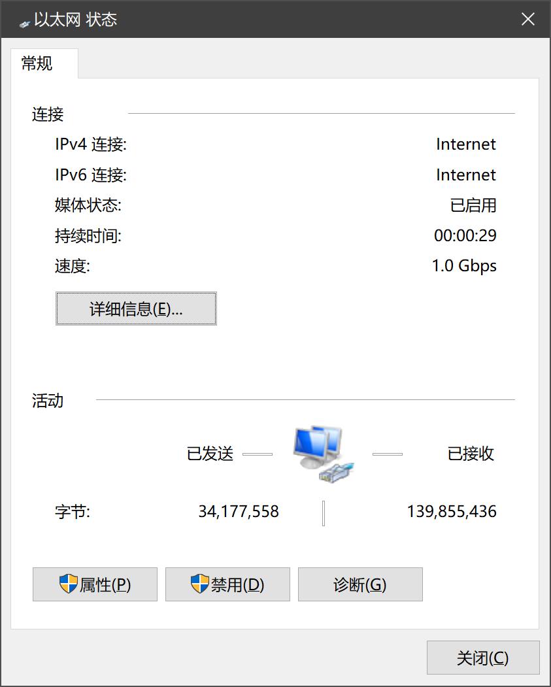

__那么！为了避免后面的步骤出问题又要重来的尴尬，现在去系统的`备份与升级`界面中将现在的系统备份下载下来__
__一定要做这一步！！！__
完成以后重启试试~

## 过渡段落
**警示：** 从原理上说，目前在笔记本电脑和手机已经可以像[上一篇文章](https://phantomt.github.io/2019/05/02/Linux-000-VPS/)中设置的那样使用ss进行校园网穿透了，也就是说以下步骤并不必要。
我是为了试验才进行的下面步骤。
**以下步骤不一定可以成功，仅供参考，如发生意外情况，请还原到上面备份好的系统使用。**

## 安装shadowsocks
*以下步骤均需要完成`opkg update`后进行。*

### 方案一/部分一
#### 一次配置
* 下载[shadowsocks-libev-spec](https://sourceforge.net/projects/openwrt-dist/files/shadowsocks-libev/)和[luci-app-shadowsocks-spec](https://sourceforge.net/projects/openwrt-dist/files/luci-app/shadowsocks-spec/)
* 还需要已经默认安装的`dnsmasq`为子网提供DHCP和DNS，和一开始下载的GNU wget来完成https下载。

* 将下载完的文件使用WinSCP上传到路由器的`/tmp`目录中，并使用putty进入`/tmp`：
`cd /tmp`
* 然后就可以使用`opkg install xx.ipk`来安装了。
*Linux命令行使用技巧：1. 先使用`ls`命令查看文件夹内的文件; 2. 填写文件名时使用`Tab`键尝试自动补全*
* 安装完成后便可以在Luci的界面看到`服务`下的shadowsocks了。

* 暂时先不开启ShadowSocks，接着配置dns避开DNS污染。
```
mkdir /etc/dnsmasq.d
//新建一个dnsmasq.d的目录
//这里边存放dns规则
 
echo "conf-dir=/etc/dnsmasq.d" >> /etc/dnsmasq.conf
//使dnsmasq.d目录内的规则生效
```
* 下载UDP有关的包
`opkg install iptables-mod-tproxy`
* 依次使用如下命令来下载国内域名加速列表和污染地址屏蔽列表，这两个列表一个是用来设定国内访问白名单，一个是用来屏蔽污染IP的黑名单，具体内容你也可以来[这里](https://github.com/felixonmars/dnsmasq-china-list)瞧瞧。
```
wget -4 --no-check-certificate -O /etc/dnsmasq.d/accelerated-domains.china.conf https://raw.githubusercontent.com/felixonmars/dnsmasq-china-list/master/accelerated-domains.china.conf
 
wget -4 --no-check-certificate -O /etc/dnsmasq.d/bogus-nxdomain.china.conf https://raw.githubusercontent.com/felixonmars/dnsmasq-china-list/master/bogus-nxdomain.china.conf
 
echo "server=/#/127.0.0.1#7913" > gfwlist.conf
//最后一句是让其他不在列表中（即国外域名）都走代理解析，端口7913。
```

* 下面进入shadowsocks界面添加自己的代理，注意：要添加服务器的 **IP地址** ，填写域名可能导致无法解析。
* 然后配置UDP转发，如果刚才没有安装`iptables-mod-tproxy`，则会显示其缺失。
勾选，然后根据前边`dnsmasq`的配置，我们设置 **本地端口为对应的7913** 以接收DNS查询包，然后填写转发地址，我们让这些查询包通过SS代理，然后访问到谷歌的公共DNS __`8.8.4.4`的53端口__ 上(`8.8.8.8`也行)。

* 这样一来，就实现了国内国外智能选用DNS(查看`accelerated-domains.china.conf`以确认哪些域名会被发送到国内的`114.114.114.114`解析。)
* 开启ShadowSocks，然后在CLI界面输入`/etc/init.d/dnsmasq restart`以重启dnsmasq服务。

#### 自动更新
* 建立更新那两个列表的脚本
* 在`/usr/bin`目录下做如下命令：
```
touch updatednsmasq
//创建一个空文件
chmod +x updatednsmasq
//给予执行权限
```
* 编辑updatednsmasq：
(可以使用vim，也可以直接用WinSCP打开修改)
```
cnlist() {
    wget -4 --no-check-certificate -O /etc/dnsmasq.d/accelerated-domains.china.conf https://raw.githubusercontent.com/felixonmars/dnsmasq-china-list/master/accelerated-domains.china.conf
    wget -4 --no-check-certificate -O /etc/dnsmasq.d/bogus-nxdomain.china.conf https://raw.githubusercontent.com/felixonmars/dnsmasq-china-list/master/bogus-nxdomain.china.conf
}
cnlist
```

* 新建一个计划任务，让它每天中午12点跑一次。
* 在Luci界面中，打开`系统-计划任务`，输入：
`* 12 * * * /usr/bin/updatednsmasq`
* 这样每天中午12点，只要有网，那么DNS这两个列表就都会更新一次。

### 方案二/部分二
方案二是用另外的方式来制定转发规则的，**如果两种方案一起用可能会出现问题**。
#### 一次配置
* 同样安装那两个包以及后面的UDP相关的包
* 下载忽略文件列表，忽略国内网站，避免过度代理
```
wget -O- 'http://ftp.apnic.net/apnic/stats/apnic/delegated-apnic-latest' | awk -F\| '/CN\|ipv4/ { printf("%s/%d\n", $4, 32-log($5)/log(2)) }' > /etc/ignore.list
```

* 进入Luci界面的shadowsocks界面，将底部的访问控制中，在`被忽略IP列表`填写第1步下载的`/etc/ignore.list`。
* 到`网络-DHCP/DNS-基本设置`，把DNS转发地址填上`127.0.0.1#7913`
* 到`网络-DHCP/DNS-host和解析文件里`把`忽略解析文件`勾上。

**苯宝宝只进行到这里，因为后面的加入了出现了问题如无法联网，甚至连`202.204.67.15`都打不开的问题，因此下面的脚本请谨慎使用**

#### 自动更新list
* 在`/etc/`目录下新建一个`ignore.list.update.sh`脚本文件，内容如下：
```
wget -O- 'http://ftp.apnic.net/apnic/stats/apnic/delegated-apnic-latest' | awk -F\| '/CN\|ipv4/ { printf("%s/%d\n", $4, 32-log($5)/log(2)) }' > /etc/ignore.list
/etc/init.d/shadowsocks restart
```
* 给予执行权限:
`chmod +x /etc/ignore.list.update.sh`
* 可以用`sh ignore.list.update.sh`命令执行看看有没有正确执行。

* 同样使用计划任务是其每天12点执行一次更新：
`* 12 * * *sh /etc/ignore.list.update.sh`


## 结束
那么到这里配置就全部完成了，可以进行IPv6网络测试，
### 测试
下面有几个测试网站：
[kame](http://www.kame.net/)，这个网站中如果能够使用IPv6则能看到一只动态的小乌龟，如果不能使用则是静止的。

[ipv6-test](http://ipv6-test.com/)，测试带宽以及连接状况
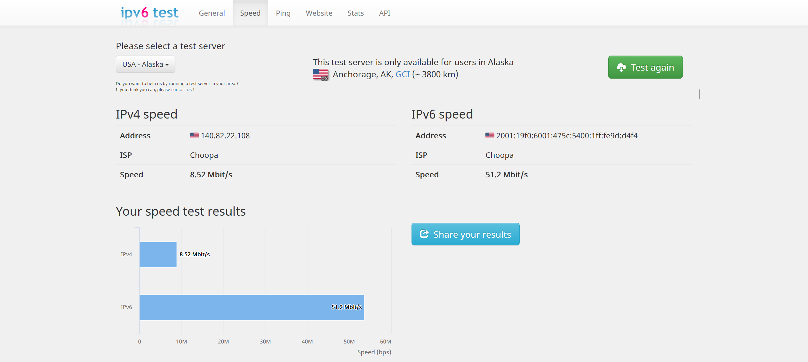
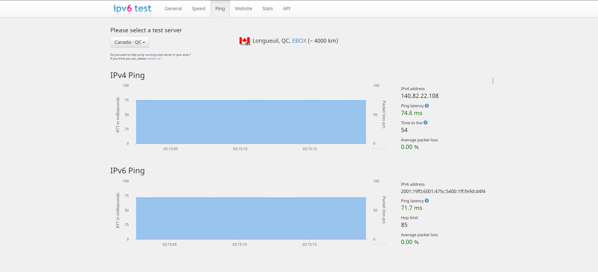
下面是手机在 **能够连接IPv6代理时** 进行测速的结果
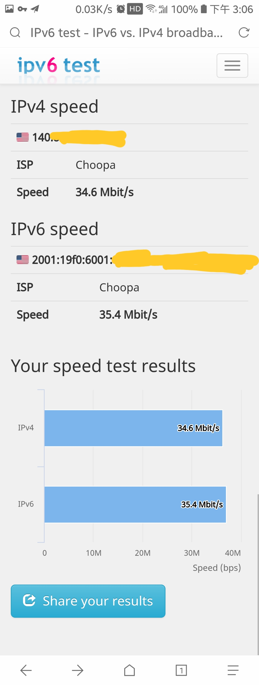

可以看到，相比于日常网速300kB/s的IPv4网络来说，IPv6网络换算的速度4MB/s快了很多，而实际使用上最快可以达到20MB/s的速度。
手机连接ss后可以访问谷歌全家桶以及Instagram等APP。

### 缺点
坑爹的哔哩哔哩客户端居然不支持在不连校园网仅连代理免流的情况下打开，而其他的软件都可以成功打开使用，只有 **哔哩哔哩客户端不行** ，这一点可以说是非常不完美了。
iOS系统的代理软件国区被下架，剩余的软件需要花钱购买，因此不才没有进行测试。(Android大法好~)
如果没有ss代理，目前是不能实现完美校园网免流的，但是速度会有提升。
使用ss代理可以 __提速并*基本*实现免流__ 。

**如果有大佬能够解决这个问题，或者有更好的配置方法，请一定告诉我。**

## 感受与吐槽
为了完成这个目标，苯宝宝真是看了网上能找到的所有Openwrt以及相关开源系统的IPv6设置，其中也有一些其他学校同学的记录，
比如：华南理工，清华，北邮，北航，哈工大等，(清华大佬的博客居然要用代理才能连上= =)，其中NAT方案的组件一种来自北邮，要通过开始的编译加入;另一种来自西电研究生的作品，以安装形式加入。无论如何设置，理论联系实际总是充满艰辛。
我也看了下Openwrt的官方指导(也没怎么看懂)，大概确认了现在的方向，可能和大佬们的结果有些差距，不过我觉得还是很符合我自己的需求的，如果可能的话，再对路由器的ss进行优化修改。
DHCPv6和中继模式的IPv6地址应该是不一样的。

**IPv6也是未来的趋势**，随着设备和系统的更迭升级，以后的配置肯定也会越来越简单，同样随着我国网民的认知水品以及判断力的不断提高，G*W肯定也会逐渐变得宽松，上🔼网也会变得越来越方便。

> 这把不仅好好认识了一把IPv6，还见识了Linux系统的编译，有些东西并没有想象中那么难，而有些事做起来确实很难。
> 看到了ss和ssr的命运纠葛和我们吃瓜群众的煽风点火，也许，环境与我们之间的相互作用比想象中更强。
> 和很多大佬的NAT方案不一样，也许结果也不一样。
> 理论联系实际很艰难，尤其当理论不扎实，实际问题有很多的时候。
> 真的，有的大佬是真的会玩0.0
> 计算机网络真的不仅多还很杂0.0

## 参考链接
[哈工大大佬的帖子](http://tieba.baidu.com/p/5640074547)
[路由器刷OpenWRT安装shadowsocks使用透明代理+去DNS污染](https://www.logcg.com/archives/860.html)
[自动更新DNS转发列表](https://www.logcg.com/archives/868.html)
[网件3800路由器安装shadowsocks折腾记(二)](https://www.8dlive.com/post/314.html)
[清华本科生适用路由器配置指南](https://dangfan.me/zh-Hans/posts/router)
[OpenWRT配置IPv6的NAT（一般结合isatap使用）](https://blog.blahgeek.com/2014/02/22/openwrt-ipv6-nat/)
[在OpenWrt上配置原生IPv6 NAT](https://tang.su/2017/03/openwrt-ipv6-nat/)
[IPv6的NAT原理以及MAP66](https://blog.csdn.net/dog250/article/details/7799398)`IPv6的标准中不建议使用NAT`