2019-01-28  
上高中的时候，同学获得了[红帽工程师的认证](https://www.redhat.com/zh/services/training-and-certification)，我第一次知道了还有一个叫Linux的东西(= 。=)，而直到上了大学，我才真正接触到Linux，并且需要学习更多。
- Linux是一套免费使用和自由传播的类Unix操作系统，是一个基于POSIX和UNIX的多用户、多任务、支持多线程和多CPU的操作系统。  
- Linux的应用场合非常多，学习Linux也就十分必要了。
- 这篇博文仅仅是简单介绍一下Linux以及相关的内容，后面夹杂一些这个星期的总结。  
<!-- more -->

<link rel="stylesheet" href="https://cdn.jsdelivr.net/npm/aplayer/dist/APlayer.min.css">
<script src="https://cdn.jsdelivr.net/npm/aplayer/dist/APlayer.min.js"></script>
<script src="https://cdn.jsdelivr.net/npm/meting@2/dist/Meting.min.js"></script>
<meting-js
	server="netease"
	type="song"
	id="26749921"
    autoplay="true">
</meting-js>

## Linux 简介
Linux是一种自由和开放源代码的类UNIX操作系统。该操作系统的**内核**由林纳斯·托瓦兹在1991年10月5日首次发布，在加上用户空间的应用程序之后，成为Linux操作系统。Linux也是自由软件和开放源代码软件发展中最著名的例子。**只要遵循GNU通用公共许可证（GPL），任何个人和机构都可以自由地使用Linux的所有底层源代码，也可以自由地修改和再发布，任何人都可以创建一个匹配自己需求的Linux发行版。**

Linux严格来说是单指操作系统的内核，因操作系统中包含了许多用户图形接口和其他实用工具。如今Linux常用来指基于Linux的完整操作系统，内核则改以Linux内核称之。
## Linux 起源
**1991年，林纳斯·托瓦兹在赫尔辛基大学上学时**，对操作系统很好奇。他对MINIX只允许在教育上使用很不满（在当时MINIX不允许被用作任何商业使用），**于是他便开始写他自己的操作系统，**这就是后来的Linux内核。  

```
MINIX是一个轻量小型并采用微内核(Micro-Kernel)架构的类Unix操作系统，是安德鲁·斯图尔特·塔能鲍姆为在计算机科学用作教学而设计的。
```


林纳斯·托瓦兹开始在MINIX上开发Linux内核，为MINIX写的软件也可以在Linux内核上使用。后来使用GNU软件代替MINIX的软件，因为使用从GNU系统来的源代码可以自由使用，这对Linux的发展是有益。使用GNU GPL协议的源代码可以被其他项目所使用，只要这些项目使用同样的协议发布。为了让Linux可以在商业上使用，林纳斯·托瓦兹决定更改他原来的协议（这个协议会限制商业使用），以[GNU GPL协议](https://zh.wikipedia.org/wiki/GNU%E8%A8%88%E5%8A%83)来代替。之后许多开发者致力融合GNU元素到Linux中，做出一个有完整功能的、自由的操作系统。

Linux的第一个版本在1991年9月被大学FTP server管理员Ari Lemmke发布在Internet上，最初Torvalds称这个内核的名称为"Freax"，意思是"free"和"freak"的结合字，并且附上"X"这个常用的字母，以配合所谓的类Unix的系统。但是FTP服务器管理员嫌原来的命名“Freax”的名称不好听，把内核的称呼改成“Linux”；随后在10月份第二个版本（0.02版）发布，同时这位芬兰赫尔辛基的大学生在comp.os.minix上发布一则消息

```
Hello everybody out there using minix- I'm doing a (free) operation system (just a hobby, won't be big and professional like gnu) for 386(486) AT clones.
```

Linux的标志和吉祥物是一只名字叫做Tux的企鹅，**标志的由来是因为Linus在澳洲时曾被一只动物园里的企鹅咬了一口**，便选择企鹅作为Linux的标志。更容易被接受的说法是：企鹅代表南极，而南极又是全世界所共有的一块陆地。这也就代表Linux是所有人的Linux。


今天由Linus Torvalds带领下，众多开发者共同参与开发和维护Linux内核。理查德·斯托曼领导的自由软件基金会，继续提供大量支持Linux内核的GNU组件。一些个人和企业开发的第三方的非GNU组件也提供对Linux内核的支持，这些第三方组件包括大量的作品，有内核模块和用户应用程序和库等内容。Linux社区或企业都推出一些重要的Linux发行版，包括Linux内核、GNU组件、非GNU组件，以及其他形式的软件包管理系统软件。  
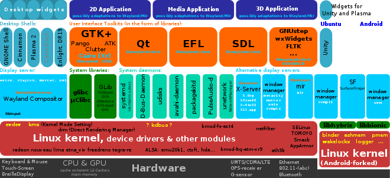

## Linux 应用
### 维基百科
今天各种场合都有使用各种Linux发行版，从嵌入式设备到超级计算机（Super Computer），并且在服务器领域确定了地位，通常服务器使用**LAMP**组合(Linux | Apache | MySQL | Php)或**LNMP**组合(Linux | Nginx | MySQL | Php)。  
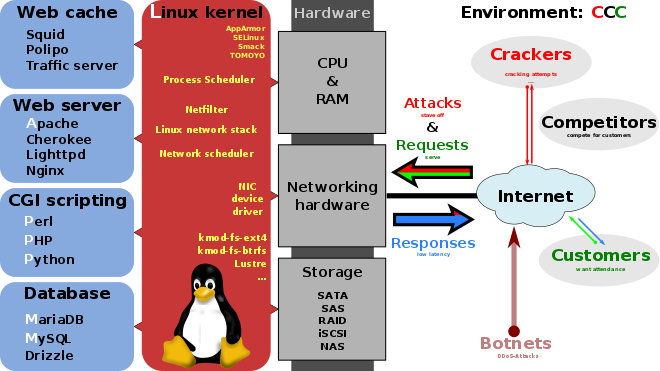

在家庭与企业中使用Linux发行版的情况越来越多。并且在政府中也很受欢迎。  
- 巴西联邦政府由于支持Linux而世界闻名。
- 有新闻报道俄罗斯军队自己制造的Linux发行版的，做为G.H.ost项目已经获取成果。
- 印度的喀拉拉邦计划在向全联邦的高中推广使用Linux。
- 中国为获取技术独立，在龙芯过程中排他性地使用Linux。
- 在西班牙的一些地区开发了自己的Linux发行版，并且在政府与教育领域广泛使用，如埃斯特雷马杜拉地区的gnuLinEx和安达卢西亚地区的Guadalinex。
- 葡萄牙同样使用自己的Linux发行版Caixa Mágica，用于Magalh?es笔记本电脑和e-escola政府软件。
- 法国和德国同样开始逐步采用Linux。

基于其低廉成本与高度可设置性，Linux常常被应用于嵌入式系统。在移动电话上，Linux已经成为IOS的主要竞争者；而在移动设备上，则成为Windows CE与Palm OS外之另一个选择。当前流行的TiVo数字摄影机使用了经过定制后的Linux。此外，有不少硬件式的网络防火墙及路由器，例如部分LinkSys的产品，其内部都是使用Linux来驱动、并采用了操作系统提供的防火墙及路由功能。

### 个人接触
啊上面的呢都是来自于维基百科的，从我个人的接触与了解来看，只要硬件条件允许安装操作系统的地方，几乎就有Linux系统的存在，其可定制、可移植的特点允许其在各种平台上运行。  
我接触的从安卓机、树莓派、STM32等ARM设备，路由器，PC机，服务器(Dell Poweredge R730等)，到虚拟环境(VPS、Docker等)都能够运行各种各样的Linux系统。  

比如我暑假折腾的[路由器](https://phantomt.github.io/2018/08/12/Netgear-OpenWrt/)，用到的是OpenWrt系统，当然我这只是初级的入门，很多路由器刷入OpenWrt是需要自己定制编译的。树莓派这种卡片PC机就不用说了，甚至Windows都出了支持树莓派的IoT系统，Linux也是有很多发行版支持的。STM32的高性能版本是可以运行嵌入式系统的，而Linux也有嵌入式版本，当然实时性和那些实时系统比会差点。其他ARM设备也很多都支持Linux，最著名的变种就是Android系统，还有上网本的Chrome OS。虚拟环境自然是可以运行Linux的了，连Windows都有了Linux子系统(WSL)。  
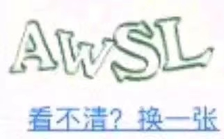

掌握多种环境开发是很必要的，尤其是对于Linux这种强大的工具。在做嵌入式开发可以由Linux完成，机器视觉很多环境是在Linux环境建立的，机器人操作系统ROS基于Linux等等，渗透测试的工具大量部署在Linux上，开源为Linux提供了强大的动力。

## Linux 系统架构
基于Linux的系统是一个模块化的类Unix操作系统。Linux操作系统的大部分设计思想来源于20世纪70年代到80年代的Unix操作系统所创建的基本设计思想。Linux系统使用宏内核，由Linux内核负责处理进程控制、网络，以及外围设备和文件系统的访问。在系统运行的时候，设备驱动程序要么与内核直接集成，要么以加载模块形式添加。

Linux具有设备独立性，它内核具有高度适应能力，从而给系统提供了更高级的功能。GNU用户界面组件是大多数Linux操作系统的重要组成部分，提供常用的C函数库，Shell，还有许多常见的Unix实用工具，可以完成许多基本的操作系统任务。大多数Linux系统使用的图形用户界面创建在X窗口系统之上，由X窗口(XWindow)系统通过软件工具及架构协议来创建操作系统所用的图形用户界面。


已安装Linux操作系统包含的一些组件：  
- 启动程序：例如GRUB或LILO。该程序在计算机开机启动的时候运行，并将Linux内核加载到内存中。
- init程序：init是由Linux内核创建的第一个进程，称为根进程，所有的系统进程都是它的子进程，即所有的进程都是通过init启动。init启动的进程如系统服务和登录提示（图形或终端模式的选择）。
- 软件库包含代码：可以通过运行的进程在Linux系统上使用ELF格式来执行文件，负责管理库使用的动态链接器是“ld-Linux.so”。Linux系统上最常用的软件库是GNU C库。
- 用户界面程序：如命令行Shell或窗口环境。

而有关Linux内核的有关介绍，感兴趣的同学可以去学习一下操作系统的课程，**[哈工大的李治军老师](https://study.163.com/series/1202806603.htm)**的慕课中有Linux内核的实验，可以深入学习操作系统原理和Linux内核的实现。  

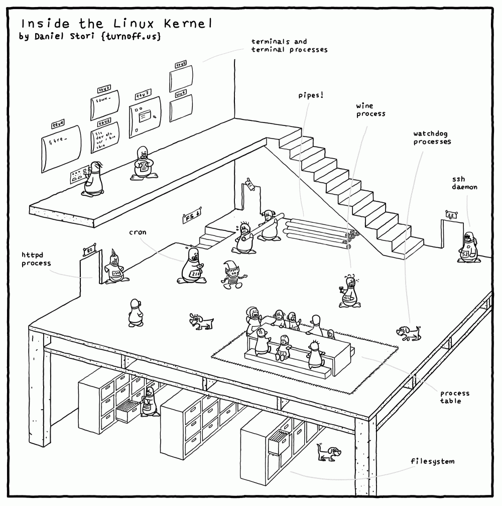
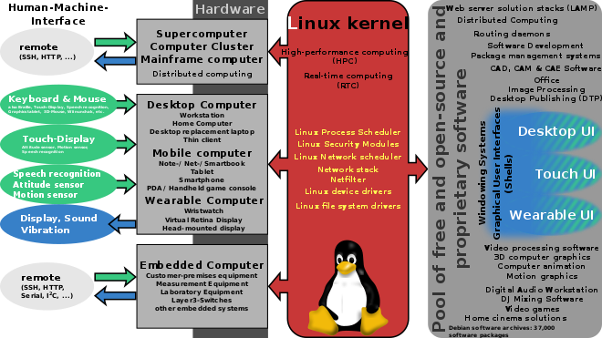

## Linux 著名发行版 | 学习推荐
### [发行版概述](https://zh.wikipedia.org/wiki/Linux%E5%8F%91%E8%A1%8C%E7%89%88%E6%AF%94%E8%BE%83)  
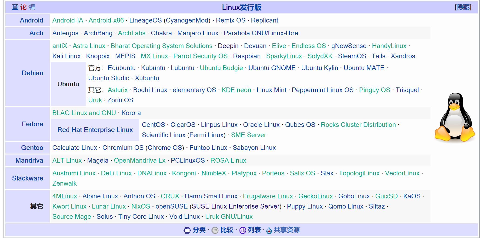

[Linux 发行版](https://zh.wikipedia.org/wiki/Linux%E5%8F%91%E8%A1%8C%E7%89%88)（英语：Linux distribution，也被叫做GNU/Linux 发行版），为一般用户预先集成好的Linux操作系统及各种应用软件。一般用户不需要重新编译，在直接安装之后，只需要小幅度更改设置就可以使用，通常以软件包管理系统来进行应用软件的管理。  
Linux发行版通常包含了包括桌面环境、办公包、媒体播放器、数据库等应用软件。这些操作系统通常由Linux内核、以及来自GNU计划的大量的函数库，和基于X Window的图形界面。有些发行版考虑到容量大小而没有预装 X Window，而使用更加轻量级的软件，如：busybox, uclibc 或 dietlibc。现在有超过300个Linux发行版(Linux发行版列表)。大部分都正处于活跃的开发中，不断地改进。

由于大多数软件包是自由软件和开源软件，所以Linux发行版的形式多种多样——从功能齐全的桌面系统以及服务器系统到小型系统 (通常在嵌入式设备，或者启动软盘)。除了一些定制软件 (如安装和配置工具)，发行版通常只是将特定的应用软件安装在一堆函数库和内核上，以满足特定用户的需求。

这些发行版可以分为商业发行版，比如Ubuntu（Canonical公司）、Fedora（Red Hat）、openSUSE（Novell）和Mandriva Linux；和社区发行版，它们由自由软件社区提供支持，如Debian和Gentoo；也有发行版既不是商业发行版也不是社区发行版，如Slackware。
### 发行版简介
Linux发行版根据软件包管理格式等方式分成各个派系，比如我最熟悉的基于dpkg的Debian系，我不是很熟悉的基于RPM的Red Hat系，还有其他的系比如Android这种apk的等等。
我挑选几个我试过的、见过的发行版进行简介。
#### Debian
Debian以其坚守Unix和自由软件的精神，以及其给予用户的众多选择而闻名。现时Debian提供了超过25,000个软件，超过50,000个软件包，并正式支持10个计算机系统结构。  
作为一个大的系统组织框架，Debian旗下有多种不同操作系统核心的分支计划，主要为采用Linux核心的Debian GNU/Linux系统，其他还有采用GNU Hurd核心的Debian GNU/Hurd系统、采用FreeBSD核心的Debian GNU/kFreeBSD系统等。**众多知名的Linux发行版，**例如Ubuntu、Knoppix和Deepin，也**都建基于Debian GNU/Linux。**(其实我见到的第一个Linux发行版是Knoppix= =，老爸给我做了一个启动盘是Knoppix的，不过。。。默认界面还有程序命名都好难受😑)
- Debian的名称是由其发表者Ian Murdock当时的女友（现在为其前妻）Debra和自己的名字Ian Murdock合并而成的。(Linux的命名都这么浪吗= =)  
- Debian正在开发中的软件会被上传到名为“不稳定”（unstable，代号sid）和“实验性”（experimental）的项目分支上。上传至“不稳定”分支上的软件通常是由软件的原开发者发布的稳定版本，但包含了一些未经测试的Debian内部的修改（例如软件的打包）。而未达到“不稳定”分支要求的软件会被置于“实验性”分支。
- Debian带来了数万个软件包。为了方便用户使用，这些软件包都已经被编译包装为一种方便的格式，开发人员把它叫做deb包。
- Debian系统中，软件包管理可由多种工具协作进行，范围从最底层的dpkg命令直到图形界面的Synaptic工具。推荐在Debian系统中管理软件包的标准工具是**apt工具集。**
- dpkg是Debian中软件包管理的低级别基础工具。dpkg命令行工具并不知晓软件源的配置，其数据库仅存储已安装在当前系统中的软件包的信息。该工具可以操作本地.deb软件包及dpkg数据库内的信息。
- 以上两个软件包管理工具也许就是我熟悉Debian系的原因吧🤔
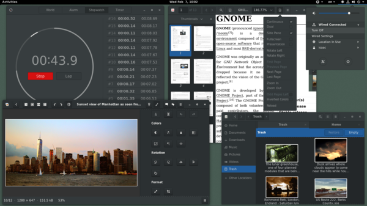

#### Ubuntu
Ubuntu（国际音标：/ʊˈbʊntuː/，uu-buun-too）是以桌面应用为主的Linux发行版，Ubuntu由Canonical公司发布，他们提供商业支持。它是基于自由软件，其名称来自非洲南部祖鲁语或科萨语的“Ubuntu”一词（译为乌班图），意思是“人性”、“我的存在是因为大家的存在”，是非洲传统的一种价值观。
- Ubuntu是**基于Debian发行版**和**GNOME桌面环境**，与Debian的不同在于它每6个月会发布一个新版本（即每年的四月与十月），每2年发布一个**LTS长期支持版本**。 普通的桌面版可以获得发布后18个月内的支持，标为LTS（长期支持）的桌面版可以获得更长时间的支持。
- Ubuntu所有系统相关的任务均需使用**Sudo指令**是它的一大特色，这种方式比传统的以系统管理员账号进行管理工作的方式更为安全，此为Linux、Unix系统的基本思维之一。(这玩意真的麻烦死= =)
- Ubuntu源自Debian，但Debian的创始人Ian Murdock却不满意Ubuntu。他认为，虽然Ubuntu是优秀的Linux发行版，也促进了Debian的全球化，但Ubuntu另建软件包，而不是直接改进Debian已有的软件包，因此出现了与Debian不兼容的问题。他希望Ubuntu能与Debian进行更为紧密的合作，使其改进也可以被Debian所采用。(Ubuntu也一直被各种批评，比如其母公司为巨硬开发WSL的Linux底层被称为卖友求荣)
- Ubuntu的稳定性emmmm，出了问题就知道了。。。
- 不过对新手入门很友好，新版本(18.04LTS)加入了**snap**软件管理，可以进行快速安装|卸载软件，易于使用，很多开发工具都有snap版，比如Intellj IDEA、Pycharm、Qt、VS Code、Atom等等。在Ubuntu软件中心即可搜索安装。
- 目前我在实验室的台式机上安装的是Ubuntu18.04LTS版，自定了Plymouth、grub以及Shell等样式，Gnome的自定义对我来说还是足够的。
- Ubuntu还有Server版本，在实验室的一台服务器上安装的是Server版本，服务器版不建议安装图形界面，会造成内存的浪费，直接通过命令行的方式操作更快一些，远程操作可以使用**SSH工具**连接进行控制。实验室的服务器只有一个显示器和一套键鼠，由于还没有分配IP，加上我水平不咋样，所以只能进行就地登录的方式管理，为了能够避免设备的插拔，我选择在Windows Server上安装**putty**，通过SSH对Linux进行管理，避免了插拔这种多余的步骤，等远程控制搭建好，可以直接通过远程方式管理，避免了跑到机房这种多余的操作。


#### Kali
- Kali Linux是**基于Debian**的Linux发行版，设计用于数字鉴识和渗透测试。由 Offensive Security Ltd 维护和资助。  
- Kali Linux既有32位又有64位的映像。可用于x86指令集的中央处理器。同时还有基于ARM架构的映像，可用于树莓派和三星的ARM Chromebook。
- Kali Linux 拥有**超过600个预装的渗透测试程序**，包括 Armitage(一个图形化网络攻击管理工具， Nmap(一个端口和服务扫描工具), Wireshark, John the Ripper password cracker, Aircrack-ng, Burp Suite 和 OWASP ZAP 网络应用程序安全扫描器。
- 最先由 Offensive Security 的 Mati Aharoni 和 Devon Kearns 通过重写 BackTrack 来完成，BackTrack 是他们之前写的用于取证的 Linux 发行版。
- Kali Linux 是创建在安全的环境中，只有可信的人才可以提交安装包，并且每一个包都**含有开发者的数字签名**。Kali还有一个为802.11无线注入打补丁的定制内核。这主要是因为开发团队发现他们需要进行大量的无线评估。(我记得我以前问老爸一个问题就是如果将恶意程序伪装放入更新的源，大家更新一下会不会凉凉🤔，看来我还是too young啊)
- Kali是我上手的第一个Linux发行版，唔，原因可能是当时看到她预装了Wireshark(= =)，不过现在发现自己还用不到这些工具，倒是在美剧里见的很多(= =)，在美剧《黑客军团》中Kali出现多次，毕竟是预装大量渗透测试工具包的发行版。
- 不过也是由于Kali预装了大量工具包的特点，也带出了大量的“脚本小子”黑客。他们以为自己会用工具包就可以为所欲为于是走上了一条不归路。
- 因此工具是工具，如何利用工具就看使用者了，是成为脚本小子还是成为专业的工程师，也是看使用者的才学的。
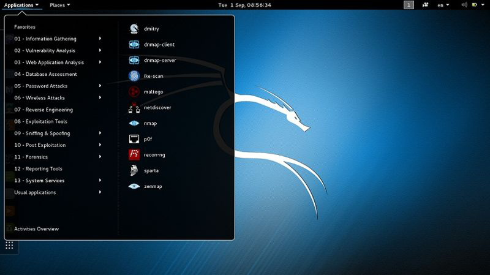

#### Deepin
深度操作系统，亦称为deepin，原名Hiweed Linux及Linux deepin，是武汉深之度科技有限公司开发的开源操作系统。它是**基于Debian的不稳定版本**的一个Linux发行版。它可以在个人计算机和服务器上。据DistroWatch的数据，截至2017年，Deepin是最受欢迎的源自中国的Linux发行版。  
除操作系统外，深度团队也进行桌面环境和配套基础软件的开发，并与第三方厂商合作开发Linux版本应用。当前系统已经拥有很多针对Deepin系统开发的应用程序。此外开发团队也参与Linux内核补丁相关作业。
- Deepin拥有自己的桌面环境，名为Deepin桌面环境（DDE），**使用Qt编写**。除了Deepin，其他Linux发行版（比如Arch Linux）也开始将它包含在软件包中，Manjaro Linux有一个Deepin桌面环境提供的社区支持版本。
- 中国的Linux，我没用过，只见过，在装Gnome的扩展的时候见过Deepin开发的扩展。
- 深度桌面环境的前端使用**Qt框架**，后端使用Go，主要由桌面、启动器、任务栏、控制中心、窗口管理器等组成。
- Deepin系统中**预装了**中国大陆用户常用的WPS Office、搜狗输入法、有道词典、网易云音乐以及专为Deepin开发的应用。
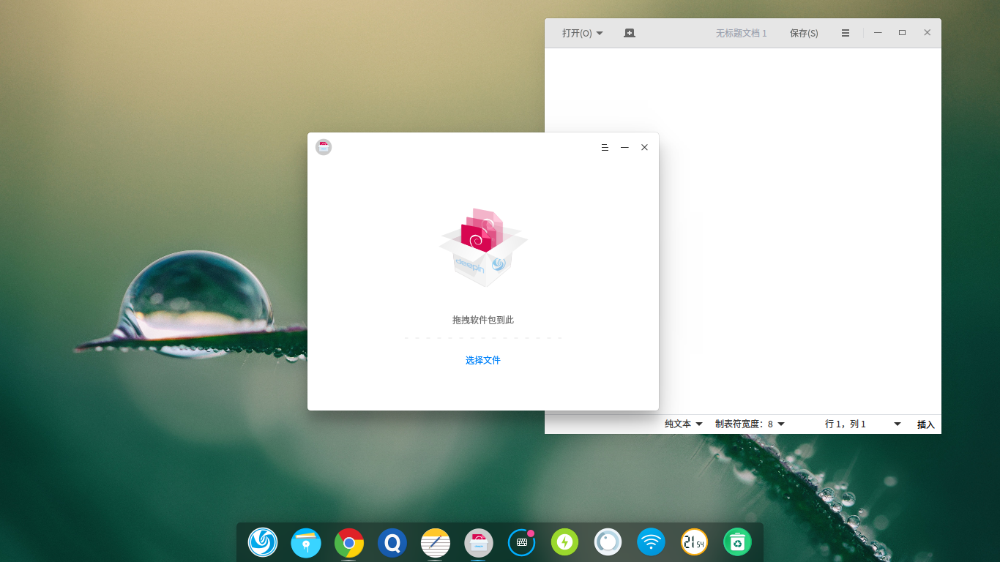

#### CentOS
CentOS（Community Enterprise Operating System）是Linux发行版之一，它是来自于**Red Hat Enterprise Linux**依照开放源代码规定发布的源代码所编译而成。由于出自同样的源代码，因此有些要求高度稳定性的服务器以CentOS替代商业版的Red Hat Enterprise Linux使用。两者的不同，在于CentOS并不包含封闭源代码软件。CentOS 对上游代码的主要修改是为了移除不能自由使用的商标。2014年，CentOS宣布与Red Hat合作，但CentOS将会在新的委员会下继续运作，并不受RHEL的影响。
- CentOS和RHEL一样，都可以使用Fedora EPEL来补足软件。
- 红帽系的发行版我都不怎么用得惯。。应该是接触的太少。我仅仅在VPS中使用过CentOS，6和7的版本差异简直把我坑死= =。
- 很多很多很多很多的教学书籍、视频、教程都是以CentOS为平台来讲的，比如兄弟连的网课，我记得鸟叔好像也是用的这个，当时yum和dpkg看的我一脸懵逼。
- 其实不同系的差异并不是很大，绝大部分的命令是一样的，只是由于软件包管理的不同造成了一些差异。
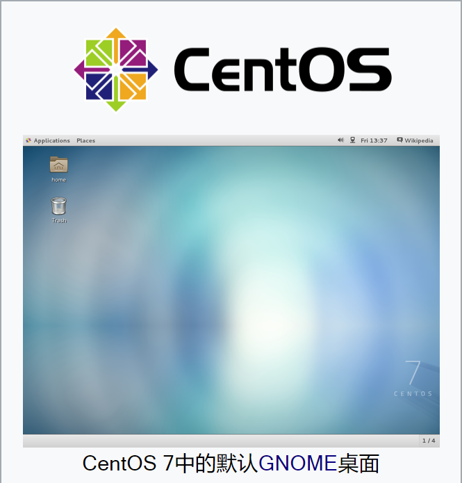

#### Arch Linux
Arch Linux 是通用 x86-64 GNU/Linux 发行版。Arch采用**滚动升级模式**，尽全力提供最新的**稳定版**软件。初始安装的Arch只是一个**基本系统**，随后用户可以根据自己的喜好安装需要的软件并配置成符合自己理想的系统。
- 以下核心原则构成了我们通常所指的 Arch 之道，或者说 Arch 的哲学，或许最好的结词是 Keep It Simple, Stupid（对应中文为“保持简单，且一目了然”）。  
  1. **简洁**：**避免任何不必要的添加、修改和复杂增加。**它提供的软件都来自原始开发者(上游)，仅进行和发行版(下游)相关的最小修改。
  2. **现代**：Arch尽全力保持软件处于**最新的稳定版本**，只要不出现系统软件包破损，都尽量用最新版本。Arch采用滚动升级策略，安装之后可以持续升级。Arch向GNU/Linux用户提供了许多新特性，包括systemd初始化系统、现代的文件系统、LVM2/EVMS、软件磁盘阵列（软RAID）、udev支持、initcpio（附带mkinitcpio）以及最新的内核。
  3. **实用**：Arch 注重实用性，避免意识形态之争。最终的设计决策都是由开发者的共识决定。开发者依赖**基于事实**的技术分析和讨论，**避免政治因素**，不会被流行观点左右。Arch Linux 的仓库中包含大量的软件包和编译脚本。用户可以按照需要进行自由选择。仓库中既提供了开源、自由的软件，**也提供了闭源软件**。**实用性大于意识形态。**
  4. **以用户为中心**：此发行版是为了满足贡献者的需求，而不是为了吸引尽可能多的用户。**Arch 适用于乐于自己动手的用户**，他们愿意花时间阅读文档，解决自己的问题。  
- Arch Linux 是通用发行版，初始安装仅提供命令行环境：用户不需要删除大量不需要的软件包，而是可以从官方软件仓库成千上万的高质量软件包中进行选择，搭建自己的系统。
- Arch的特点决定了其入门门槛较高，因为需要通过命令行环境进行安装，除了基本系统外，包括桌面环境在内的一切软件都需要用户自定义安装。
- Arch很稳定，当然自己版本滚动滚挂了不算，用Arch需要对Linux的结构有一定的了解，她的软件支持很完善，除了专用的软件以外，基本可以替代Windows成为日常使用的系统。
- 如果能够独立完成Arch的安装，可以说对Linux的结构已经有很好的掌握了。
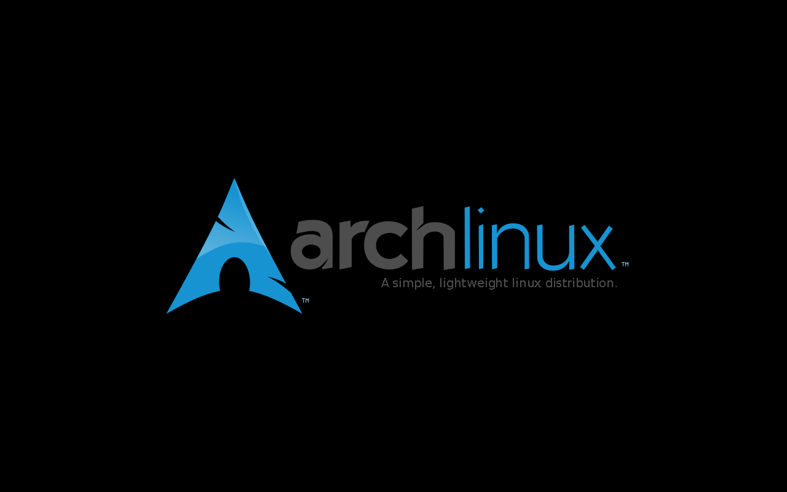

#### Manjaro
Linux**操作系统是工具，是拿来用的，而不是折腾这个工具本身**，普通用户都明白这个道理，DistroWatch排行榜代表的正是千千万万“普通用户”的心声，他们只想要一个好用的操作系统，而**Manjaro恰恰是不折腾、软件多、好看、好用的Linux操作系统的典范。**
- Manjaro**基于ArchLinux**，继承了后者轻快、滚动式更新、AUR软件多的优点，又改善了后者对新手不友好、软件包过于激进、不够稳定的缺点。
- Linux终究是要需要拿来用的，在摸透了这个系统的内核和结构之后，想要日常使用，欢迎加入Manjaro。
- 无论是新手还是高手，Manjaro都适合。


#### OpenWrt/LEDE
OpenWrt是一个在路由器上运行的Linux版本，可以看作是精简的特殊编译版，与其他来自于**Linksys**的**WRT54G/GS**的路由器固件不同，OpenWrt选择了不同的开发道路：从零开始，在功能上趋近于原版功能，但更接近于Linux发行版。(话说这个方式听起来怪熟悉的，仿佛就是Linus利用Minux制作Linux?。更远一点让我想起了西部世界，制作人类意识的副本不是单纯的克隆人的意识而是从零开始学习，使其趋近于人的意识🤔)  
这里使用的大多数Linux实用程序将是iptables，route，hostapd，dnsmasq等网络工具，需要对网络有一定的认识。
这里的链接可以参考一下：[OpenWrt与其他发行版的对比](https://blog.csdn.net/lee244868149/article/details/53572260)  
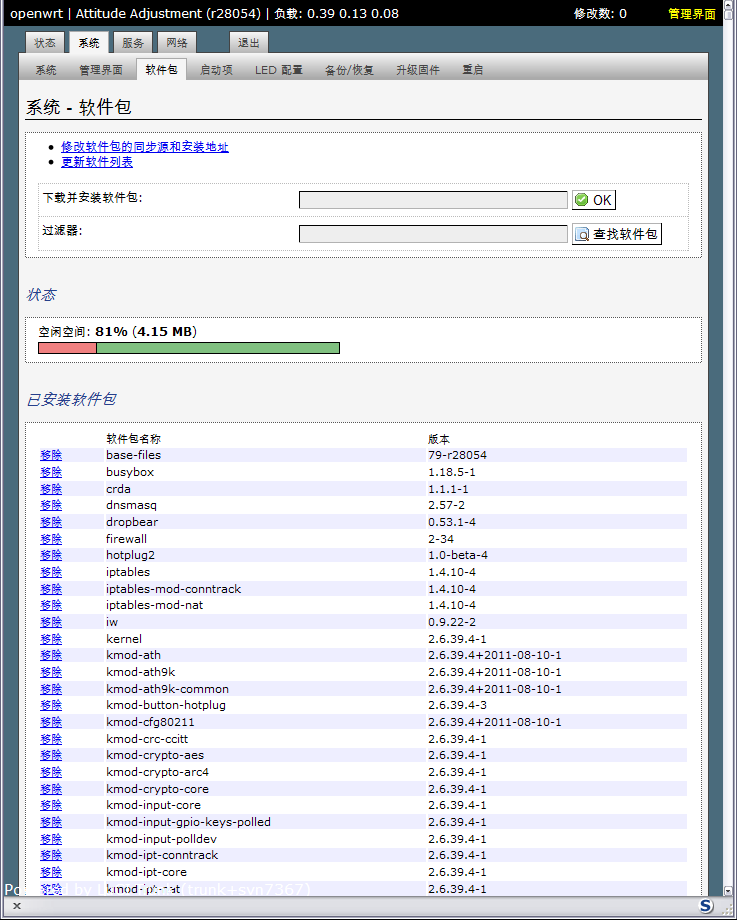
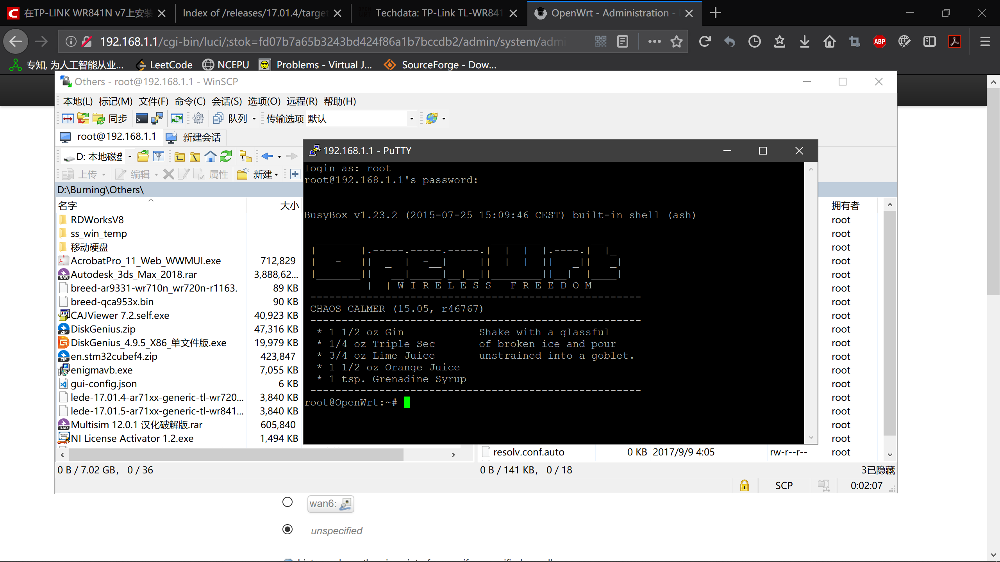
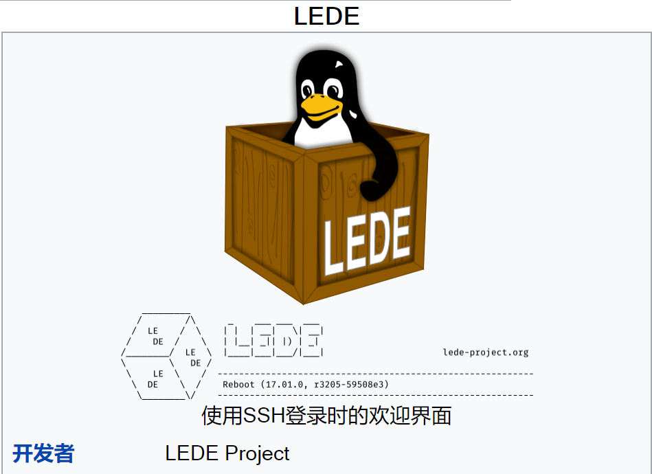

#### Kodachi
Kodachi Linux 是一款**基于 Debian 8.6**的操作系统。它是专为保护用户隐私而设计的，因此具有高度的安全及匿名性，并具备反调查取证的特点。
- Kodachi可以通过USB驱动来在PC上启动。你不需要特别了解或学习Linux的知识，Kodachi都为你准备好了你所需要的！整个操作系统都活动在你的临时内存下。因此，你一旦你关机，任何的操作痕迹都会被清除，避免你的隐私泄露及被追踪调查。
- 匿名使用互联网。所有与Internet的连接，都将被强制通过加密网络。在你使用的计算机上不会留下任何痕迹，除非你要求保留一些数据痕迹。使用先进的加密和隐私工具加密你的文件，电子邮件和即时消息。
- Kodachi是基于实体Debian Linux和定制XFCE，这使得Kodachi系统非常的稳定、安全并且独特。
- 不建议在任何电脑上永久安装Kodachi，因为它会将所有的设置保存在硬盘上，这就违背了该系统反取证的初衷。
- 啊以上就是当时我看到的介绍，然后我就下了一个玩玩，其实也没啥好玩的，这个就是做成一个启动盘，用启动盘启动的系统。
- 加密方式是使用VPN+Tor+DNScry，应该在一定程度上是非常安全的，不过如果要做一些奇怪的事一定要**考虑一下后果**🤔。
- 学习Linux的话，**不建议**用这个版本，这只是介绍一下各种各样的发行版。

#### WSL
对，没错，这个推荐的是Windows10   
的Linux子系统，这个系统巨硬的官方支持，虽然还不是非常完善，但是运行速度很快而且和Windows可以同时运行，文件管理也没有那么麻烦，可以算是轻量化的Linux系统了，目前已经有几个发行版有WSL版本，比如Kali、Debian、Ubuntu等，可以去Windows商店自行获取。
#### 其他
如果对Linux有足够的认识，有足够的热情，有足够的耐心和时间，可以从Linux内核开始构建属于自己的发行版🤔  
有一张网传选择系统的图片  
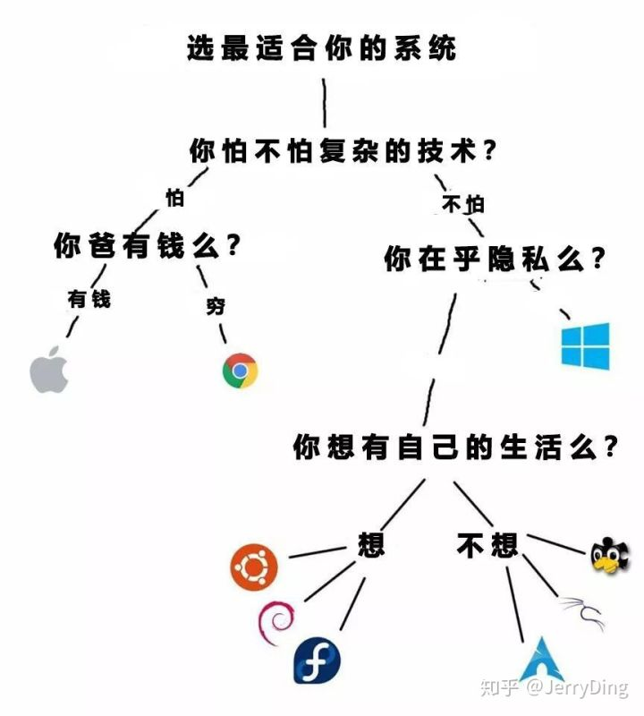

### 关于桌面环境
Linux从命令行开始，随着用户越来越多，使用图形界面也十分必要，因此Linux可以安装各种桌面环境，比如:  
- KDE
- GNOME
- XFCE
- DEEPIN
- (等等)
不过为了提高效率以及学习远程操作等目的，最好还是合理利用桌面环境，有时命令行更方便。
### 学习推荐
Linux的学习首先
- 当然是应该从安装开始了😆，首先要对**文件系统**有一点了解，学习一些分区的知识，在安装时是需要分区的，如何挂载什么的也需要了解一下。
- 然后就是使用了，学习过程自然是要先学习命令如何使用，然后才是系统结构什么的。
- 说到命令，自然要说些常用的命令和工具：(以Debian系的为例)  
  1. ls list命令可以说是我用的最多的命令(可能还没有之一)，后面还有各种参数可以用，这些就看帮助就知道了
  2. man 这个就是帮助命令，还有的帮助是命令后接 --help 参数可以获得当前命令的帮助，这是用的第二多的命令，参数太多，脑子太小记不住= =
  3. cd | rm | mkdir | mv | cp 等等一系列目录的操作，这些是在系统里钻来钻去的必要本领。
  4. vim 这个简直就是神器，没有vi那么难，又非常高效，可以应对一切文本文件。Linux的**一切都是文件**。
  5. sudo 这个是Ubuntu的必要命令，其他系统应该也是这个吧0.0，很多文件 | 文件夹都有权限，最高级的root权限可以打开一切(除非自己把自己锁了🙃)
  6. chmod 更改权限的命令，可以让一些文件获得可执行的权限。
  7. 其他命令太多了，我想不起来大概也是用的不多，毕竟我也是新手。可以在各种过程中学习和搜索。
- 通过ls命令也可以大致了解一下系统的目录结构了，后面自然要好好了解一下每个文件夹都是干什么的。
- 命令学完自然要学Shell，自动执行利器
- 搭建各种环境，学习编译过程，cmake、make 和 makefile 是需要了解的，很多软件都是源码，需要自己编译，甚至有的系统内核也需要在Linux环境编译。
- 远程管理，学会使用SSH连接Linux，这个很简单
- 进阶：
  1. Linux系统结构
  2. Linux系统api调用
  3. Bootloader
  4. 文件系统
  5. Linux系统内核实现与理解
  6. 网络编程
- 之后就是在系统里随便浪，甚至可以写自己的系统。这时基本已经可以熟练的在Linux环境里工作了，了解到了系统本身几乎所有内容。
- 在后面的链接里也附上了知乎上的大佬如何学习Linux编程、深入学习系统的，开发、运维和网络都有。
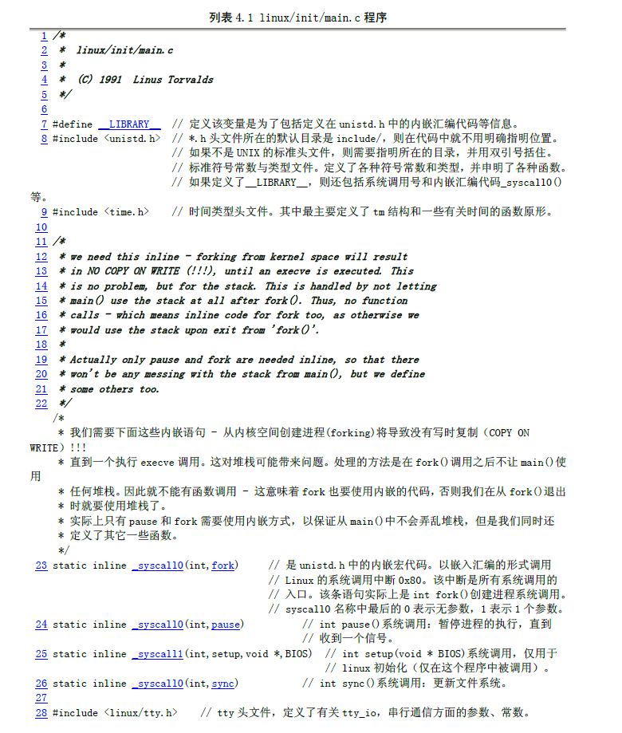

## 总结 | 参考链接
### 总结
其实这个总结是总结我这一周和Windows以及Linux做斗争以及手贱的总结。  
这周在寻找OCR的程序，并自己修改，因此安装环境和编译程序就十分必要。
- 关于安装环境，我有一万句mmp要讲，有的人README写的都是什么东西，要什么都没有，如果没有Issue怕是只有作者才能装上吧。。。  
- 机器学习的门槛除了数学怕是还有安装环境，能完整装完环境并成功hello world的人大概都是有耐心继续完成学习的人。
- 真的恳请有的大佬能把环境要求写一起，没有环境安装脚本哪怕有个list呢TAT
- Windows的环境真的是难伺候，dll可以说是非常反人类的东西了，往注册表里写不进去就更是难受，能用Windows做开发的人才是真的大佬。。
- 明明系统是64位的，搞个32位的库是要搞哪样？？？
- Python 2 和 3的争端可以说是后患无穷了
- Docker、Conda等虚拟环境可以说是手残党救星了，人类的伟大发明。
- Linux命令行真好用= =尤其是在服务器上，不用鼠标找找找+点点点真的美滋滋，能用一句命令解决的绝不多点点点。不好看网页就有点。。。
- Linux的确一切都是文件，自己搞坏了还得修😢。(“我就是电脑丑死、把主板砸了，我也不改引导界面”————“真好看”)
- GNOME不知道比原来的Unity好看到哪里去了，我和Gnome-look谈笑风生。
- 自己剪坏的水晶头，就是跪着也要接好_(:з)∠)__
- **差不多了，祝大家学习Linux顺利。**
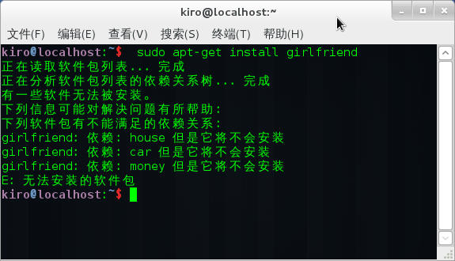
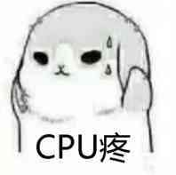

### 参考链接
1. [Linux Wiki](https://zh.wikipedia.org/wiki/Linux)
2. [Linux 内核](https://zh.wikipedia.org/wiki/Linux%E6%A0%B8%E5%BF%83)
3. [GNU](https://zh.wikipedia.org/wiki/GNU%E8%A8%88%E5%8A%83)
4. [GNOME](https://zh.wikipedia.org/wiki/GNOME)
5. [RED HAT中国](https://www.redhat.com/zh)
6. [SUSE Linux](https://zh.wikipedia.org/wiki/SUSE)
7. [Deepin | 中国的Linux发行版](https://zh.wikipedia.org/wiki/%E6%B7%B1%E5%BA%A6%E6%93%8D%E4%BD%9C%E7%B3%BB%E7%BB%9F)
8. [OpenWrt](https://OpenWrt.org/)
9.  [Arch Linux Wiki](https://wiki.archLinux.org/index.php/Main_page_(%E7%AE%80%E4%BD%93%E4%B8%AD%E6%96%87))
10. [Manjaro中文](https://www.manjaro.cn/)
11. [Debian中文](https://www.Debian.org/intro/about)
12. [Linux kernel](https://www.kernel.org/)
13. [Ubuntu index](https://www.Ubuntu.com/index_kylin)
14. [CentOS](https://www.centos.org/)
15. [raspberry pi](https://www.raspberrypi.org/)
16. [Kali Linux](https://www.kali.org/)
17. [自用Linux版学习用品分享](https://www.freebuf.com/sectool/168278.html)
18. [提高Linux安全性：14项检查建立安全的Linux服务器](https://www.freebuf.com/articles/system/131188.html)
19. [为保护隐私而生，反取证操作系统：kodachi](https://www.freebuf.com/sectool/124486.html)
20. [菜鸟教程](http://www.runoob.com/Linux/Linux-intro.html)
21. [常见的Linux操作系统推荐？](https://www.zhihu.com/question/267941005/answer/564103434)
22. [国内的用户都用什么 Linux 发行版？](https://www.zhihu.com/question/270348678/answer/360964322)
23. [你是如何学习 Linux 编程的？](https://www.zhihu.com/question/20730157/answer/82034823)
24. [Linux学习资源整理](https://zhuanlan.zhihu.com/p/22654634)
25. [如何更深入地学习 Linux？](https://www.zhihu.com/question/23564190)
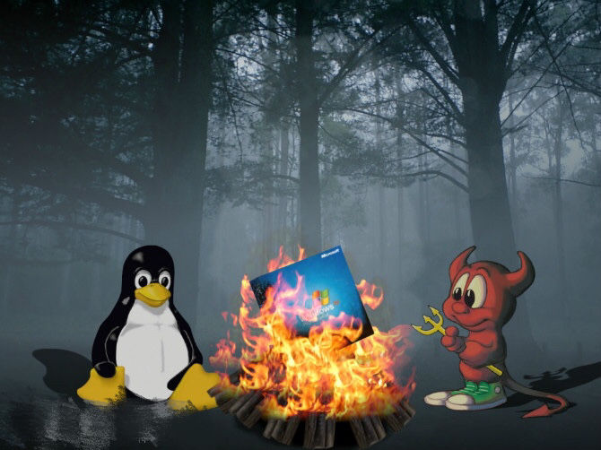
