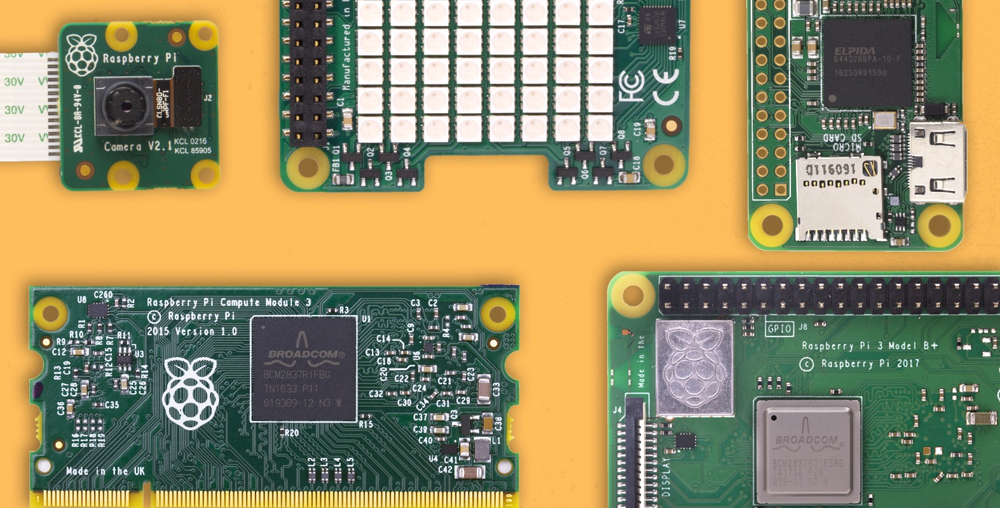
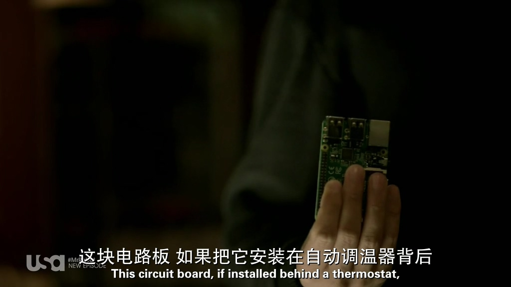
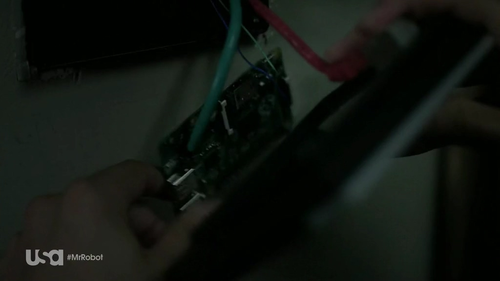
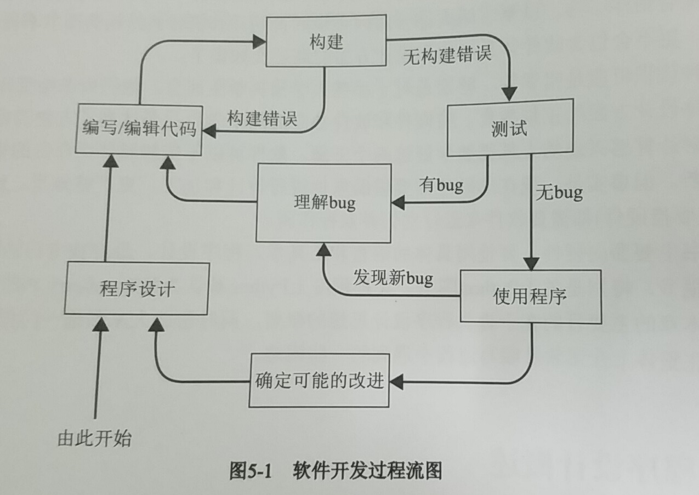
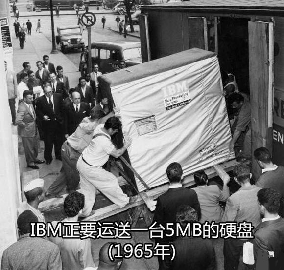
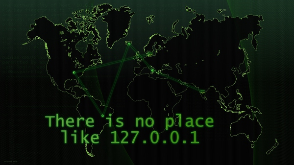
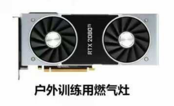
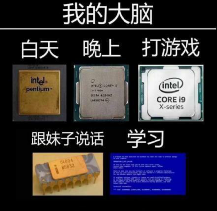

2019-02-01  
## 引
408考研的课本已经学完了第一遍了，对计算机的体系也有一定的认识了，通过这本书从树莓派的实例来重新了解一下体系结构的内容。
顺带回忆一下自己学过的东西(感觉什么也不记得了😒)，争取年前写完ORZ。。。
说实话，翻译的出来的不像中文= =，读起来怪别扭的。。。

 

<!-- more -->
<link rel="stylesheet" href="https://cdn.jsdelivr.net/npm/aplayer/dist/APlayer.min.css">

<meting-js
	server="netease"
	type="song"
	id="4068368"
    autoplay="true">
</meting-js>

> 将硬件和软件独立为两个学科只是达到了方便的目的，任何真正对计算感兴趣的人都需要学好这两个方面。

## WILEY **《Learing Computer Architecture with Raspberry Pi》**
作者:[美]
- Eben Upton  
- Jeff Duntemann
- Ralph Roberts
- Tim Mamtora
- Ben Everard
- 清华大学出版社

## 笔记
看看有什么有趣的东西🧐
### 第1章 | 计算机漫谈  
- “浓缩的都是精品”，这句老话形象地描述了Raspberry Pi，也同样强调了计算机体系结构的一个发展方向————**System-on-a-Chip**(SoC)。
- 树莓派的主要创新在于降低了进入嵌入式Linux的门槛：低廉的价格解决了价格门槛，SoC解决了复杂性门槛。
- 树莓派以其能够连接PC机所不能连接的设备而备受人们的喜爱，能够控制现实世界可以说是非常愉快了。
- 当然能够连接现实世界设备不是Pi独有的特性，嵌入式计算机设备都可以做到，比如STM32、Arduino等。
- 嵌入式设备变得越来越普及，树莓派不仅激励着刚刚学习的人，同样也是接触过计算机的人能够了解更多，在嵌入式时代，能够连接实体设备的需求会变得越来越重要，树莓派可以帮你从头开始。
  

### 第2章 | 计算概述
> 程序是计算机要执行的东西，数据就是计算机知晓的东西”————Tom Swan

> “程序就是数据”————John Von Neumann

- [操作系统的主要工作]  
  1. 进程管理
  2. 存储器管理
  3. 文件管理
  4. 外设管理
  5. 网络管理
  6. 用户管理
  7. 系统安全
  8. 交互界面管理 | Shell
- Linux内核拥有对计算机硬件的完全控制权，它通过具体的设备代码以**可加载内核模块(Loadable Kernel Modules, LKM)**的形式扩展内核，以此来适应硬件的差异性。

### 第3章 | 电子存储器
**`~~计组+操作系统~~`**  
#### **CPU为中心 | 存储器为中心？**
- 存储器的处理速度限制和决定了整个系统运行的速度，所以是存储器为中心？？？🤔
- 电子存储器是受物理学支配的，基础研究决定上层技术？？🤔

#### SRAM  
  1. 基本逻辑元件是触发器，除了一些要求访问时间尽可能短的特殊领域，SRAM已经被DRAM取代。[魔鬼数电0.0]
  2. 速度很快，是迄今为止设计出的市场上畅销的**速度最快的**存储器技术。**[作为缓存使用]**
  3. 每个数位占用的空间很大 | 不能更好地压缩

#### DRAM  
  1. 需要周期性刷新——>动态
  2. 刷新在工作时序中的位置影响效率
  3. 异步DRAM的主要缺点是一次只能执行一次存储器访问操作。
  4. 同步DRAM(SDRAM)使用了流水线技术，能够避免吞吐量浪费
  5. 对于SDRAM，工作延迟的时间参数会**以设备在最高时钟频率工作时的若干时钟周期来描述**，而不是直接以纳秒的形式来描述。
- 地址线——>多维寻址，少变多——>译码器 | 位扩展 | 字扩展
- SDR | DDR | DDR2 | DDR3 | DDR4  
  1. SDR：每个时钟周期只传输一个**数据字** (上升沿传输)
  2. DDR：传输速率翻倍(上升沿+下降沿传输)
  3. DDR之后通过预取相邻的几个地址，进行短时突发式运行，以解决内部工作速度不够快的问题。
  4. 若后面的地址内数据字不需要，存储控制器会取消他们。
  5. 随着CPU缓存容量的增加，“随机”读取变得罕见，现代计算机绝大部分从系统存储器内读取到的内容是以缓存行的形式加载到CPU缓存中的。
  6. 更低的操作电压：发热量更低，节能
  7. 难道和操作系统文件管理中的分页与分段有关？？🤔
  8. 单纯依靠时钟频率提速~~吃枣💊~~(摩尔定律)
- 纠错码存储器  
  1. 事实上，存储器中的位值有时会毫无征兆地自己改变(这可太贱了= =)
  2. 来自宇宙的高速中子撞击也会造成出错？？？
  3. **汉明码**，ECC纠错码存储器，第九个芯片(汉明码真的强😐)
- 树莓派采用球栅阵列(Ball-Grid Array, BGA)的封装技术。

#### 程序的**局部性原理**：空间局部性 | 时间局部性
- 访问的局部性：  
  1. 当前访问的数据在不久之后还会被再次访问
  2. 短时间内，数据访问（读|写）更倾向于聚集在同一块存储器区域内。
  3. 存储器地址倾向于按顺序读写。  

#### 缓存映射：(令人头大的计组🤒)  
  1. **直接映射**的严格数学描述是：系统存储器中的给定块总是存储在高速缓存的相同位置。[极端1:高速而紧凑+毫无灵活性]
  2. 替换策略的主要目的是避免缓存颠簸，**通用的策略**：FIFO | LRU | RANDOM | NMRU
  3. 在大多数情况下替换策略是随机的，有违直觉但最廉价也最有效
  4. **相联存储器**技术用来解决依次查找缓存行会耗尽性能的问题，其存储位置通过存储的信息来编址的。[极端2:灵活+占用超大宝贵空间]
  5. 上面那玩意儿需要大量的专用逻辑电路，会大量占用CPU的裸片空间。
  6. 在大规模芯片设计中，裸片空间和芯片功能之间的权衡是一项最古老的挑战😐
  7. [折中的灵活度+高速紧凑]->**组相联映射**

#### 虚拟存储器
- 高速缓冲存储器和虚拟存储器都是因为RAM的局限性而产生的：  
  1. 高速缓存的出现是因为RAM很慢
  2. 虚拟存储器的出现则是因为RAM容量很小
  3. (RAM：怪我咯🤨)
- 虚拟存储器由OS和几乎与CPU处在同一片芯片上的MMU共同管理
- 树莓派使用SD卡，SD卡在设计上就不是为了频繁写入写出设计的，因此树莓派的交换空间应被看成是一种防止冲击的安全机制(内存冲击？？)，而不是性能提升机制。有关工具->vmstat(cli)
- 交换分区(也就是swap)来自于分页的机制，同样使用替换策略，同样的[四种常见方式](#swap)
- 假装每个进程都感觉拥有了独立于其他进程的属于自己的专用系统存储器空间(俗称内存)

### 第4章 | ARM处理器与片上系统
- 晶体管预算限制芯片设计师实现功能

#### 系统栈
- 少量数据结构使用非常频繁，以至于一些CPU对于它们的机器指令有硬件上的支持，其中最重要的就是栈
- 栈在管理嵌套子程序调用时非常有用

#### 时钟与流水线 | 超标量与并行
- 时序电路中运行的一切，都需要和一个称为时钟的脉冲发生器同步(数电😒)
- 更多的晶体管预算允许更多的硬线指令。
- CPU架构的终极目标就是将所有的机器指令在一个时钟周期内执行完毕😯
- 大多数架构都会试图通过两个互相关联的机制来缓和流水线阻塞的影响：分支预测和预测执行
- 哈佛结构通过分离数据和指令缓存来缓解资源冲突
- 在超标量CPU中，指令的执行超越了重叠方式，真正实现了**并行化**。
- 具有**数据依赖**关系的指令不能同时发送
- 现代CPU可以支持另一种并行：同时操作多个数据项的指令——>SIMD指令  
  1. SIMD指令在向量的基础上操作。在很多计算机架构中，SIMD指令可以一次并行地完成4个操作(+-×÷)，在一些架构中也可能超过4个操作。
  2. SIMD的核心优势在于(从时间和能耗成本看)取指和译码的SIMD指令能够在多个计算过程中共享。
  3. SIMD不需要昂贵的互锁逻辑来检测不会再发生的依赖性问题。
  4. SIMD指令可以从根本上提高代码性能，使其能够胜任诸如音视频的编码解码工作以及3D图像的管理任务。

#### CPU架构与指令集
##### CISC | RISC
  1. 二八法则：20%的指令会在80%的时间用到，而很多指令根本用不到🤨
  2. 有趣的是，编译器使用的“精简指令集”与CPU内部提供的微指令有相似之处
  3. RISC的一个显著特征是几乎所有的指令都有硬连线逻辑实现。
  4. RISC指令集的扩展与CISC加入类似RISC的微指令，使得二者曾经最明显的界限————代码密度，被完全模糊了。
  5. 哈佛型架构性能提升的原因在于[访问的局部性](#smallpart)，相互独立的代码和数据高速缓存允许实现不同的[替换策略](#swap)以及适合每种高速缓存访问模式的缓存行大小。
  6. 包括CISC的主导架构————Intel x86，也拥有很多RISC的特征。

##### ARM
- 第一款**艾康RISC架构**(**Acorn Risc Machine, ARM**)CPU诞生于1985年中期。
- 1990年，ARM CPU的开发被剥离出来，成为一家独立的公司。从那时起，ARM的全程变为Advanced RISC Machine(高级RISC机器)。1998年，它成为ARM控股公司。(向ARM势力低头😳)
- Thumb指令集是32位ARM指令集的16位实现，是为了更有效地利用16位的系统总线(低端设备使用的)。
- Thumb指令在存储器或高速缓存中被预取后，会被CPU内部的专用逻辑扩展为普通的ARMv6指令。进入指令流水线后，它们就不再是Thumb指令了(!!!???🤨)
- RISC CPU设计的一条基本准则是将尽可能多的寄存器放到CPU内(唔🤔)
- ARM协处理器接口的首要目标之一是不能拖慢CPU内核的速度(。。。)

##### SoC
- 库和内核会以知识产权(**Intellectual Property, IP**)的形式授权，而IC设计师会习惯性地将任何数字逻辑区块授权成为“**IP**”。

### 第5章 | 程序设计
- **将硬件和软件独立为两个学科只是达到了方便的目的，任何真正对计算感兴趣的人都需要学好这两个方面。**
- [这部分已经了解的东西相对多一些，就没太多笔记🤔]
- 软件开发过程遵循一张漂亮而又和谐的流程图:
  

- [敏捷软件开发](https://zh.wikipedia.org/wiki/%E6%95%8F%E6%8D%B7%E8%BD%AF%E4%BB%B6%E5%BC%80%E5%8F%91)的目标：
  1. 人员和交互而不是过程和工具
  2. 软件的可用性而不是泛泛的文档
  3. 消费者协作而不是合同约定
  4. 响应变化而不是遵循计划
- FORTRAN、COBOL、BASIC代表了深深根植于计算的三种文化：科学、商业和教育。
[我直接跳到了5.8-GNU编译器工具集概览]
- Linux make：一般而言，make工具是一项软件机制，它协调编译过程并将多个源代码文件链接成单个可执行文件。

### 第6章 | 非易失性存储器
[这部分感觉。。不是很重要就略了]
#### 分区和文件系统
- 分区设备的第一个扇区包含MBR(Master Boot Record)，MBR包含被称作引导装载程序(bootloader)的简短的可执行代码。

#### FLASH
- FLASH存储设备在结构上与DRAM拥有很多相似之处
- FLASH存储器单元具有在SRMA或DRAM存储器单元中未曾出现的局限性：**FLASH存储器单元可以被写入或擦除的次数是有限的。**(1000-100000次写入/擦除次数之间)
- 多层单元通过多个电压等级可以在一个单元中存储多个位(编码)，但寿命低于单层单元。
- NOR Flash：擦写速度慢，存储密度低，读取速度快————>嵌入式设备固件存储
- NAND Flash：擦写速度快，存储密度高，读取速度慢————>大容量存储器
- 防止Flash单元的任何单个存储块过快地接近耐久性极限点，同时从Flash设备的可用存储空间中移除不安全的存储块，采取了被称作Flash转换层(Flash Translation Layer, FTL)的机制。
- 非易失性存储器的总体发展趋势很明显：旋转磁盘正在衰落，**无移动部件的固态存储设备**正在兴起。

### 第7章 | 有线和无线以太网
[精简版的计算机网络🤔]
- 1971年，美国夏威夷大学成功部署了ALOHAnet网，并利用无线电信号连接了大学里遍布多个岛屿的计算机。
- ALOHAnet是最早的分组网络之一，当然也是第一个**无线网络**😳
- ALOHAnet是以太网的灵感之一。
- 由于48位可以识别281万亿台不同设备，因此MAC地址不会很快耗尽。即便如此，错误还是导致MAC地址的重复，对于一些设备，改变MAC地址去模仿另一台设备是可能的。
**[哦，以太网编码系统看起来就像电力系统的电力线路模型一样难吃🤨]**
- 冲突不会通过网桥传播，允许两个桥接网段中的每一个具有比单个网段可处理的更多节点(**<————这念出来是中国话???**)
- Wi-Fi系列标准使用各种扩频技术来应对干扰。与不扩频相比，使信号跨越更宽的带宽，提供改进的抗干扰性，并且减少功率谱密度。
  1. 跳频扩频(FHSS)
  2. 直接序列扩频(DSSS)
  3. 正交频分复用(OFDM)
  4. (我记得网通考试的时候我这个选错了，没在书上看到这个啊🤨)

### 第8章 | 操作系统
- 操作系统是控制计算机的工作方式并确保其他程序正常运行的计算机主程序。
- 操作系统组成：
  1. 内核
  2. 网络子系统
  3. 安全子系统
  4. 用户界面
- 外行或几十年来受到不良科幻小说影响的人，往往认为CPU是计算机的“大脑”。事实并非如此，真正的老板是操作系统————控制来自其他软件的输入输出请求，将其转换为数据处理指令并填鸭到CPU。(emmm😯)
- 如今的多核CPU锦上添花……使得任务的各个部分可以并行处理，以此提升速度。(CPU每个核都开花🐵)
- 成百上千件事看起来在同一时刻发生————嗯，就是这样。
- 我记得操作系统的目标之一就是提高有效性，其中包括了提高系统吞吐量。
- 并发是操作系统的**基本特性**之一，并发和并行的区别在于，并发是在同一**时间间隔**，而并行是在**同一时刻**  
`帕金森定律：“你给程序再多内存，程序也会想尽办法耗光”`  
- 当然，时间分片是关键。
- 那些被设计出来进行控制、监视和处理各类数据并且嵌入到设备中的非易失性存储媒介中的软件被称作固件。

### 第9、10、11章 | 视频编解码器和视频压缩 | 3D图形 | 音频
#### 视频编解码器和视频压缩
- H.264还允许更高效的熵编码方法，包括基于上下文的自适应二进制算术编码(Context Adaptive Binary Arithmetic Coding, CABAC)和基于上下文的自适应可变长编码(Context Adaptive Variable Length Coding, CAVLC)。
- 与H.264相比，H.265的目标是将恒定质量的比特率降低50%，而不显著增加解码过程的计算复杂度。
- 为了实现↑目标，H.265使用了一种新的结构来存储信息。为了取代宏块，它使用了编码树单元(Coding Tree Unit, CTU)。
- 我们需要一种可计算的方法来估计质量，最常见的方法是峰值信噪比(Peak Signal to Noise Ratio, PSNR)。
- PSNR想计算机一样看图像：作为网格数据。结构相似性(Structural SImilarity, SSIM)索引是一种尝试像人一样看待图像的替代方法(亮度、对比度和结构)

#### 3D图形
图形学，我真的是。。。一脸懵逼好吧😐AWSL
- 毫不起眼的GPU已经从简单的线条绘图加速器一跃成为高度并行的多线程独立子系统，其计算能力是如此强大，以至于已经成为现代计算机体系结构中必不可少的组成部分。
- OpenGL与Direct X的爱恨纠葛。。。
- OpenGL既不要求通过专用硬件对任何功能加速，也不指定任何最低性能目标，他只是规定了任何应用都必须满足的规范要求。
- 计算机图形学中的变换基本上是对每个对象所在坐标系的改变。
- 为了应对减小的带宽和更小的功率包络，设计了基于瓦片的渲染(移动端)

#### 音频
- 嗯。。里面还有Adobe Audition CC 2015，这很硬核😐
- I2S的四种写法。。。这是一种彼此连接数字音频设备的串行总线接口标准。
- 多媒体设备这三张看起来真是难受啊。。。划了划了。。。

### 第12章 | 输入/输出
- 两个发明改变了计算机的面貌：GUI和现在无所不在的鼠标
- 有点令人惊讶的是先出现的是鼠标，他曾经是一个军事秘密！(what???🤨)
- SATA和。。。PATA???(还有这玩意???🤨)
- GPIO，连接现实世界的大门。(单片机时间)
  1. `sudo apt-get install rpi.gpio`
  2. `import RPI.GPIO as GPIO`
  3. ……
  4. **小心短路**

## 总结
看完一遍感觉就像看嵌入式三级的书一样???🤔  
不过里面还是有很多硬核的内容的，太硬核了，计算机体系结构好难吼😟  
鉴于内容太多太杂还是基本了解下知识框架，更多具体的实现细节可以去学习相关的书。(其实是这个翻译的太难受了)  
里面对ARM结构的介绍好多看着真让人头大= =，幸好考过嵌入式还有一丢丢印象😟

