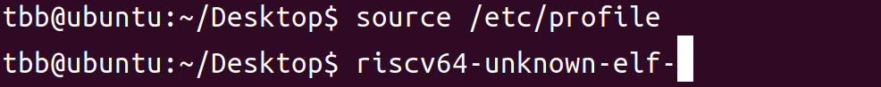
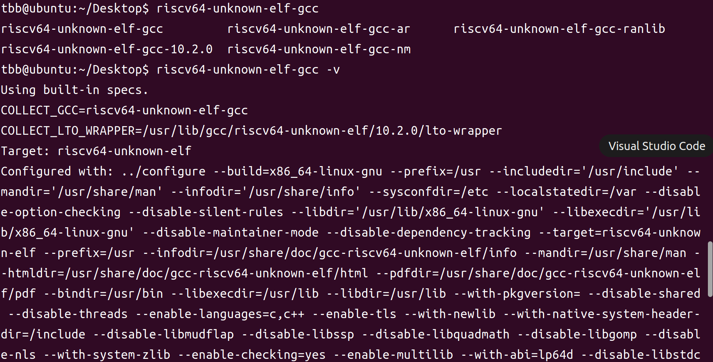
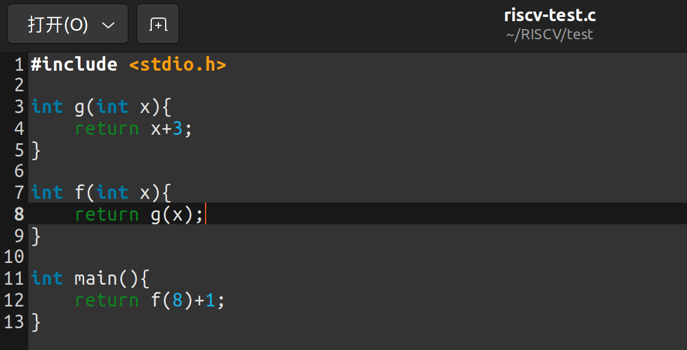
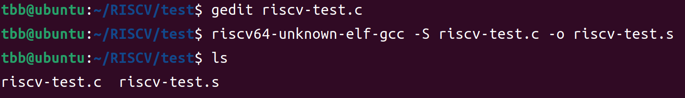

参照x86和ARM64的做法，以ISA的寄存器、寻址方式、常用指令、堆栈操作等为基础，理解C代码编译成RISC-V汇编代码后是如何一步步执行的

<!-- more -->

# 分析C代码编译成RISC-V汇编后如何执行

## 环境搭建

1. 环境Ubuntu 22.04LTS

2. 新建文件夹RISCV并进入

3. 使用git下载工具链`git clone --recursive https://github.com/riscv/riscv-gnu-toolchain`

4. 安装依赖`sudo apt-get install autoconf automake autotools-dev curl python3 libmpc-dev libmpfr-dev libgmp-dev gawk build-essential bison flex texinfo gperf libtool patchutils bc zlib1g-dev libexpat-dev`

5. 配置编译选项`./configure --prefix=/opt/riscv --enable-multilib`

6. 编译`make -j4`，根据自己设备的核心数设置多线程

7. 修改`/etc/profile`将`/opt/riscv/bin`添加到`PATH`，并使用`source /etc/profile`重新加载

8. 在终端中输入`riscv64`并使用tab补全，若能出现补全则为配置完成。

   

9. 安装GCC`sudo apt install gcc-risc64-unknown-elf`

   

## 编译

1. 编写测试代码

   

2. 编译成汇编代码`riscv64-unknown-elf-gcc -S riscv-test.c -o riscv-test.s`

   

   > -S：生成汇编代码*.s文件
   >
   > -o：把输出文件输出到指定文件里

## 分析

1. 打开汇编代码

   ```assembly
   	.file	"riscv-test.c"
   	.option nopic		# 与位置有关代码段
   	.attribute arch, "rv64i2p0_m2p0_a2p0_f2p0_d2p0_c2p0"
   	.attribute unaligned_access, 0	#我猜是禁止非对齐访问
   	.attribute stack_align, 16	# 堆栈16字节对齐
   	.text				# 代码段
   	.align	1			# 按2^1字节对齐
   	.globl	g			# 声明g为全局符号
   	.type	g, @function # 将g定义为一个函数
   g:
   	addi	sp,sp,-32	# 修改栈指针sp=sp-32，push
   	sd	s0,24(sp)		# 把s0保存到sp+24，s0表示帧指针fp
   	addi	s0,sp,32	# 栈底保存到s0，s0=sp+32
   	mv	a5,a0			# 将a0存放的参数值存入a5
   	sw	a5,-20(s0)		# 将a5中的字保存到s0-20
   	lw	a5,-20(s0)		# 将s0-20的字存入a5
   	addiw	a5,a5,3		# a5=a5+3，按word加
   	sext.w	a5,a5		# 将a5标记为扩展字(Sign extend word)
   	mv	a0,a5			# 将a5的值返回a0
   	ld	s0,24(sp)		# 恢复s0
   	addi	sp,sp,32	# 恢复sp
   	jr	ra				# 跳转到ra地址返回
   	.size	g, .-g		# 为了源代码兼容性
   	.align	1			# 按2^1字节对齐
   	.globl	f			# 声明f为全局符号
   	.type	f, @function # 将f定义为一个函数
   f:
   	addi	sp,sp,-32	# 修改栈指针sp=sp-32，push
   	sd	ra,24(sp)		# 将ra值保存到sp+24
   	sd	s0,16(sp)		# 将s0值保存到sp+16
   	addi	s0,sp,32	# 栈底保存到s0，s0=sp+32
   	mv	a5,a0			# 将a0存放的参数值存入a5
   	sw	a5,-20(s0)		# 将a5中的字保存到s0-20
   	lw	a5,-20(s0)		# 将s0-20的字存入a5
   	mv	a0,a5			# 将a5的值返回a0
   	call	g			# 调用函数g
   	mv	a5,a0			# 将返回来的值a0移入a5中
   	mv	a0,a5			# 将a5中的值移入返回值a0中
   	ld	ra,24(sp)		# 恢复ra
   	ld	s0,16(sp)		# 恢复s0
   	addi	sp,sp,32	# 恢复sp
   	jr	ra				# 跳转到ra地址返回
   	.size	f, .-f		# 为了源代码兼容性
   	.align	1			# 按2^1字节对齐
   	.globl	main		# 声明main为全局符号
   	.type	main, @function	 # 将main定义为一个函数
   main:
   	addi	sp,sp,-16	# 修改栈指针sp=sp-16，push
   	sd	ra,8(sp)		# 将ra值保存到sp+8
   	sd	s0,0(sp)		# 将s0值保存到sp+0
   	addi	s0,sp,16	# 栈底保存到s0，s0=sp+16
   	li	a0,8			# 立即数赋值a0=8
   	call	f			# 调用函数f
   	mv	a5,a0			# 将返回来的值a0移入a5中
   	addiw	a5,a5,1		# a5=a5+1，按word加
   	sext.w	a5,a5		# 将a5标记为扩展字(Sign extend word)
   	mv	a0,a5			# 将a5的值返回a0
   	ld	ra,8(sp)		# 恢复ra
   	ld	s0,0(sp)		# 恢复s0
   	addi	sp,sp,16	# 恢复sp
   	jr	ra				# 跳转到ra地址返回
   	.size	main, .-main # 为了源代码兼容性
   	.ident	"GCC: () 10.2.0"	# 为了源代码兼容性(accepted for source compatibility)
   ```
