2018-02-02  
**STM32**作为常见的MCU与嵌入式开发的基础，也是作为苯宝宝接触计算机层次思想的平台，是值得学习下甚至是好好学习下的>_<
[更新]因为**Cube MX**更新到了5.1.0甚至更高，因此也对一些影响较大的界面截图做出了更新。  
苯宝宝常用的芯片大概有
- STM32F103C8T6
- STM32F429IGT6
- STM32F429BIT6
<!-- more -->

## 说在前面的历程和没什么太大用的东西
### 学习单片机的开始
苯宝宝在大一时加入了学院的创新创业俱乐部，并接触了单片机和一些电子技术，一开始学的TI的MSP430G2553，使用的CSS，哎，当时真是什么都不懂，什么中断之类的东西，一头雾水，430也着实给我留下了不小的心理阴影。。

### 接触STM32
大一上的寒假，实验室里的大佬们给我们萌新布置了一个叫风力摆的任务，当时小组里还是15级的学长强力carry，用430移植的STM32的 MPU6050的读取、解算的程序，后来有几个学长学姐用了当时对我们来说还比较陌生的STM32来制作，我就在好奇心的驱使下，在寒假买了一个32的F1的开发板。

### 懵逼的开始
那个板子也不是那两大家的，例程什么的也不是很详细，虽然有视频但是我最终还是没有看下去，也不了解流程，只看到了GPIO的部分，也不知道怎么验证，只能跟着做Keil的仿真，最后可以说算是半途而废了。

### 重拾智慧
大一下在纠结要不要转到CS中茫然度过，又到了计算机等级考试的时间，思索许久，决定同时报名嵌入式和网络技术两门三级考试（最后居然都过了），树立了以学习知识为主，考试考着玩的想法。那个暑假还意外的加入了学长的电赛小组，一同准备电赛。  
这个暑假可以说是一个转折点，不仅初步认识了**嵌入式开发的概念**和基于ARM的嵌入式设备的从底层电路到**嵌入式系统的组成结构**，还在比赛中经历了完成一整个作品的过程，包括设计机械结构、设计程序框架、完成函数编写再到最后调试参数（话说PID简直就是玄学？？？？！！！）

### 开启新的学习过程
大二上开始了我们大创项目的实质性的工作，我们选择了STM32F429IGT6（某火）的核心板，这也是自己第一次独立完成一个不是很完善的简单项目，苯宝宝从PWM输出开始，根据三级时所学基础理论结合店家基于标准库的例程，修改、编写自己需要的函数，一直写到可以同时输出四路/八路同频率不同占空比的PWM波并可以使用蓝牙遥控。  
到了寒假（也就是最近），接触了使用HAL层的工具（可能这么说不太准确= =）ST的CubeMX，目前用起来还挺简单的，如果对系统的效率没有很高的要求的话，这个工具还是值得推荐的，使用HAL层、走向嵌入式系统也是现在的一种趋势吧。

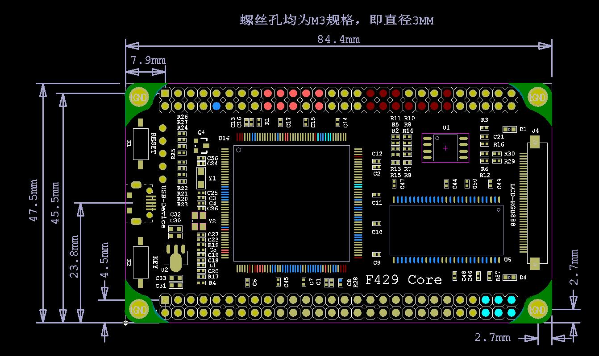

如果不知道什么是HAL，可以参考以下:[百度百科](https://baike.baidu.com/item/%E7%A1%AC%E4%BB%B6%E6%8A%BD%E8%B1%A1%E5%B1%82/9084603?fr=aladdin&fromid=9201&fromtitle=HAL)

## 正式开始介绍STM32CubeMX
首先，是获取软件，个人还是比较推荐从官网下载:[ST官网](http://www.st.com/content/st_com/zh/products/development-tools/software-development-tools/stm32-software-development-tools/stm32-configurators-and-code-generators/stm32cubemx.html)
[注意:在安装前需要安装JAVA]

> STM32Cube 是一个全面的软件平台，包括了ST产品的每个系列。平台包括了STM32Cube硬件抽象层(一个STM32抽象层嵌入式软件，确保在STM32系列最大化的便携性)和一套的中间件组件(RTOS, USB, FatFs, TCP/IP,  Graphics, 等等).

> - 直观的STM32微控制器的选择和时钟树配置
> - 微控制器图形化配置外围设备和中间件的功能模式和初始化参数
> - C代码生成项目覆盖STM32微控制器的初始化符合IAR™，Keil的™和GCC编译器。

这个软件简单的说就是可以自己生成芯片的配置代码，并且支持多种编译器，对于想要了解STM32 HAL库的同学，推荐使用这个软件，如果对标准库完全没有了解的话还是建议从标准库开始学习，否则可能在移植代码时出现问题或者直接写代码时不知道写在哪。

好，现在开始以429为例建立一个工程（由于电脑的分辨率问题，可能有图标不是很清楚的问题）
### 新建工程[更新]
打开软件，点击'New Project'，建立一个新的工程
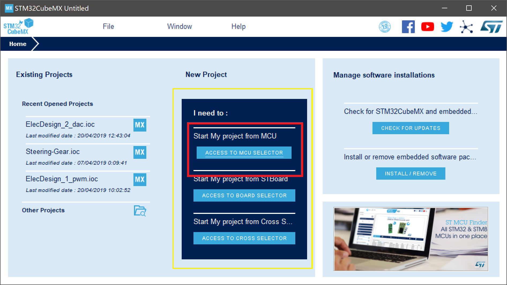
然后选择使用的芯片，可以通过先选'Series'再选'Lines'的方法找到所需MCU，此处以STM32F429IGT6为例
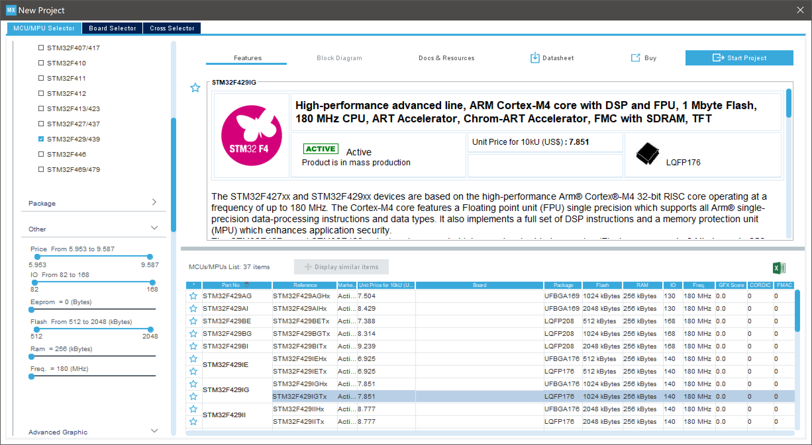
建立工程后的画面如下，芯片引脚可以通过左边的'Categories'栏里所列进行自动配置也可以通过在右边直接点击进行手动配置
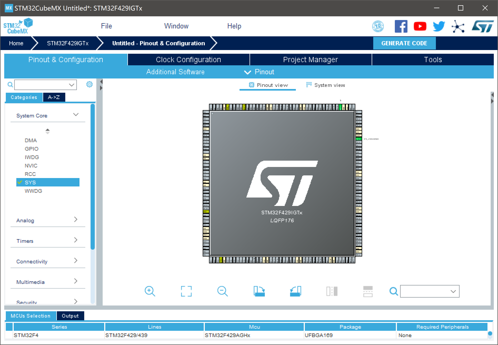
不过我们首先要先对项目进行设置，点击'Project Manager'，选择'Project'，在窗口中设置'Project'里的项目名称和项目地址，并选择**MDK-ARM V5**作为IDE，最后生成的代码会用项目名称作为一个完整的文件夹出现，里面的结构和Keil5的项目模板差不多。其他选项保持默认即可。
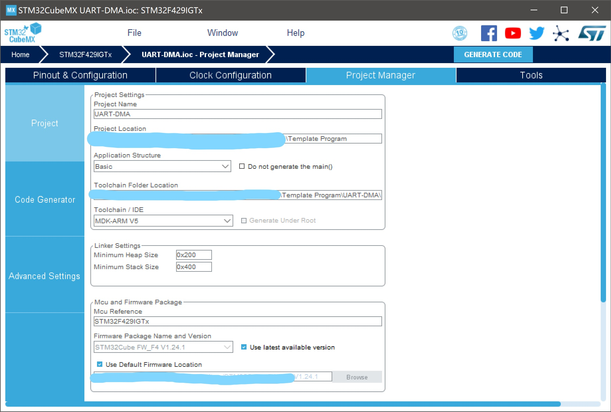
然后设置'Code Generator'里的选项，选择拷贝所有libraries到项目文件夹或只拷贝必须的libraries其实区别不大，毕竟每次新配置完都要重新生成代码，库也会被复制过去。
然后选择为外设初始化建立对应的'.h'和'.c'文件
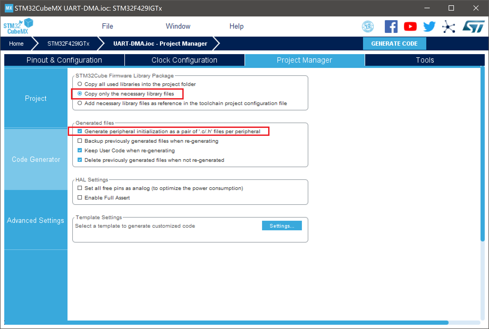
设置完成即可开始配置MCU

### 配置MCU
**[更新]即使CubeMX更新到了5.1.0，但是这部分配置方式仍然没有变化，因此就不做出更改了**  
首先是'Pinout'栏里对引脚和外设进行设置
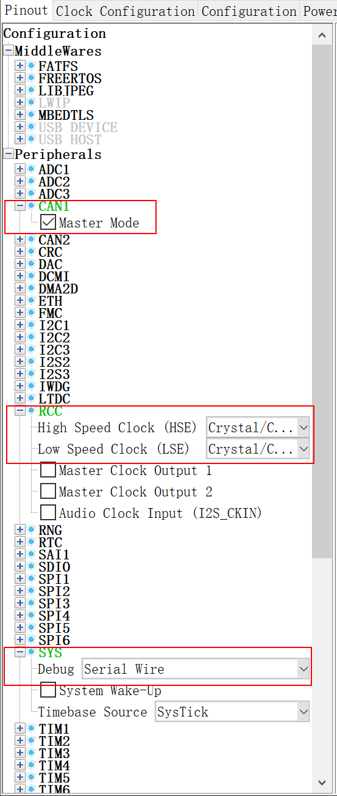
由于以使用Robomodule CAN总线驱动器的麦克纳姆轮小车为例，配置了CAN总线、UART、RCC和系统调试方式（SW）
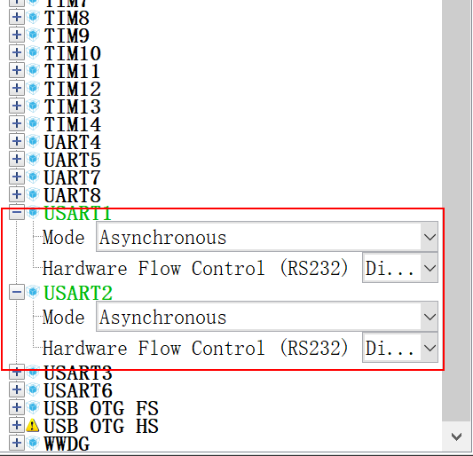
根据店家所给的说明书，HSE选择'Crystal'外部晶振

然后对时钟'Clock Configuration'进行设置
这里的时钟设置来自于卖家给的核心板说明，由于HSE设置了外部晶振，因此会有下面那条时钟线，此处推荐按照熟悉的参数进行配置（参考卖家的标准库例程）
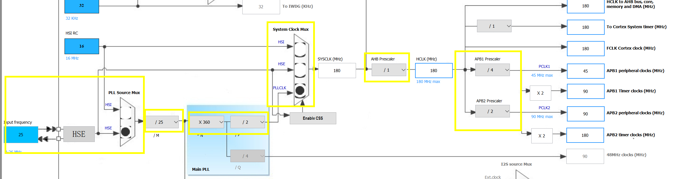

最后在'Configuration'一栏中对各个外设进行配置，比如通信波特率、帧结构、端口的开启方式等，此处不进行细致介绍，后面可能会在项目中进行介绍
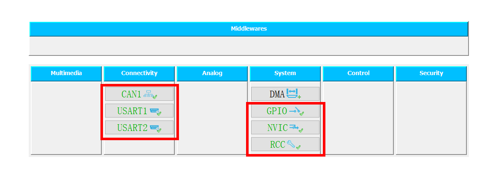

### 使用软件生成项目文件夹
STM32Cube的其中一个优点就是可以自动生成项目代码
点击右上角的`GENERATE CODE`按钮自动生成**配置**代码
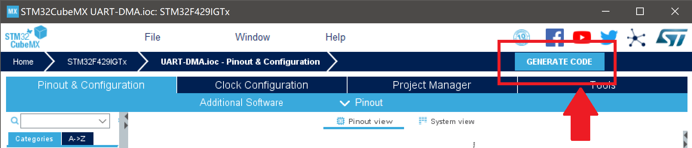
生成完毕后可以选择打开项目，打开后即可使用Keil5对函数进行编写
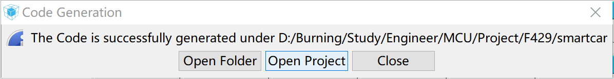
需要注意的是，生成的代码中会为用户编写函数预留位置，所有用户函数  
**必须**  
**必须**  
**必须**  
写在**规定的范围**内，如'USER CODE 1 BEGIN'和'USER CODE 1 END'之间，否则，下次此项目生成新配置代码，在不合法位置的用户函数将全部被覆盖！  
由于苯宝宝对编译方式啥的理解还不是很好，所以自己的头文件的内容也就加在它已经有的'.h'文件里了  
基本上生成的代码中都会为用户代码预留位置，看好注释就行  
生成的代码中即使是'***_hal.h'的头文件中也会有大量注释解释函数的作用，不用担心看不懂。  
将标准库代码移植过来时要注意对库函数的替换以及新函数的参数与使用方式~  

## 结尾
祝大家在STM32CubeMX中开启新世界~
嘿嘿嘿~