> 即便把我关在果壳之中，仍然自以为无限空间之王
> I could be bounded in a nutshell and count myself a king of infinite space.

这是一个**非常简易**的shell，是一个学习用的项目
其中使用`flex`和`bison`以及语法树构建的代码改自《工程化C》[课程源码模板](https://csslab-ustc.github.io/courses/sysprog/lab1/index.html)

[项目地址](https://github.com/phantomT/T-Shell)

<!-- more -->

# T-Shell project

## 已经实现功能
- 内建命令：`cd/about/history/exit/quit`等，`history`命令只能带参数执行
- Program指令：`ls/pwd/vi/grep`等在`PATH`中的程序
- 用`;`分段的多命令执行
- `< > >>`输入输出重定向
- `|`管道
- `&`后台运行
- 带颜色的提示符
- 简单的信号处理：Ctrl+C/Z，`INT`和`STOP`
## 主要文件
- `main.c`主函数
- `main.h`主函数的头文件，包含大部分函数声明
- `scanner.l`使用`flex`编写的规则
- `parser.y`使用`bison`的分词器
- `read_cmd`包含命令树构建的代码
- `type_prompt.c`生成命令行开头的提示符
- `exec_cmd.c`包含主函数执行的执行命令函数和具体操作的执行命令函数
- `builtin_cmd.c`包含比较复杂的内建命令实现，如`cd`，`history`
- `sig_handle.c`包含简单的信号处理函数

# Shell简介
## 什么是Shell
Shell 在计算机科学中指“为用户提供用户界面”的软件，通常指的是命令行界面的解析器。一般来说，这个词是指操作系统中提供访问内核所提供之服务的程序。

Shell也用于泛指所有为用户提供操作界面的程序，也就是程序和用户交互的层面。因此与之相对的是内核（Kernel），内核不提供和用户的交互功能。

Shell一般通过系统调用的方式为用户提供和内核的交互。

## 常见的Shell
- bash: 是GNU的Bourne Again Shell，是GNU操作系统上默认的Shell
- Korn Shell: 是对Bourne Shell的发展，在大部分内容上与Bourne Shell(Bash)兼容
- C Shell: 是SUN公司Shell的BSD版本
- Z Shell: Z是最后一个字母,也就是终极Shell.它集成了Bash ksh的重要特性,同时又增加了自己独有的特性.

## 简易版的Shell的功能
Shell解释器是一个程序，接受用户输入并且分析输入的字符串，分割出命令与参数，自建命令直接执行，PATH中的命令使用`fork()`出的子进程执行。

对于一个Shell还需要在每次命令输入前显示一段提示信息，提示当前的用户与路径，例如：


简易版的Shell需要能够运行Linux系统已经提供在`/bin`目录中的命令，并且至少能够运行自建的`cd`和`exit`命令。在此基础上添加管道`|`功能与输入输出重定向功能`<`和`>`。

# 主要架构设计
## 最初始的设计框架
```
#define TRUE 1
while(TRUE){
    type_prompt();
    read_command(command, parameters);
    if(fork()!=0)
        waitpid(-1,&status,0);
    else
        execve(command,parameters,0);
}
```
主函数是一个循环结构，每次通过`type_prompt()`功能实现输入前的提示符显示，使用`read_command()`功能读取并切分命令，最后判断命令的运行方式。

## 设计框架
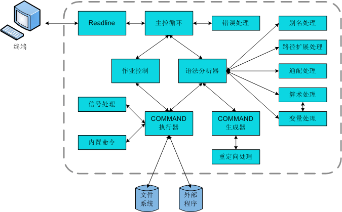
Linux上`bash` Shell的命令读取使用了`Readline`库，这个库提供了包括使用上箭头调取上一条命令、使用tab键补全等功能。而简易版的仅仅需要支持读取分析部分指令的功能即可。

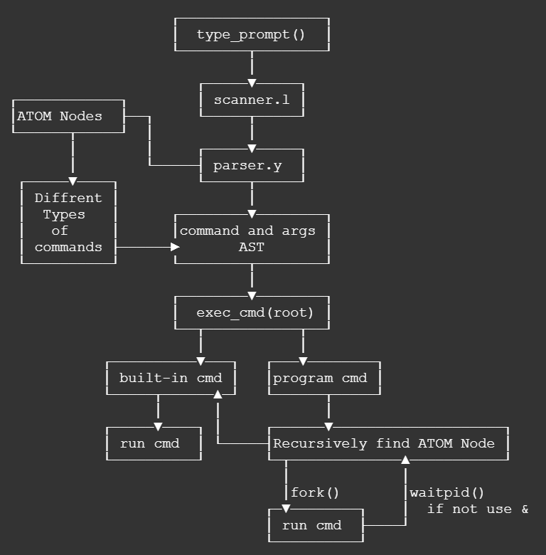
shell的命令通过使用`flex`和`bison`进行语法分析，将输入字符串分割并按照命令格式建立不同的命令类型结点，其中`ATOM`类型的命令能够直接使用系统调用执行，因此在输入完成后需要从命令树的`root`结点开始递归查找`ATOM`类型命令。

在主函数的一次循环中，如果读取到的是一个`ATOM`类型的命令，则需要判断是否是内建的，是的话可以直接进行，这个判断在递归查找命令树时还需要再进行一次。

如果要记录shell的命令历史记录，则需要在`exec_cmd(root)`前，使用`save_history(root)`遍历命令树并保留本次的命令

## 输出shell提示符
shell的提示符输出由`type_prompt()`函数实现，我单独开了一个源文件。

提示符主要由用户的用户名、主机名和路径组成，最后根据`uid`判断使用`$`或`#`。例如：
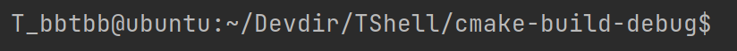
其中`T_bb`是项目额外添加的字符前缀。

要获取以上信息需要通过`getpwuid(getuid())`函数获取当前的`pwd`结构变量。

- 用户名从获取的`pwd`变量中的`pw_name`获得
- 主机名通过`gethostname()`获得
- 路径名通过`getcwd()`获得，并且需要判断路径中是否包含了该用户的`home`路径，使用`~`将路径压缩。
- 最后根据`uid`判断普通用户使用`$`提示符，`root`用户使用`#`提示符。

## 建立语法树
### flex
`flex`是用于生成扫描器的工具。 扫描器是识别文本中的词汇模式的程序。

`flex`描述采用成对的正则表达式和C代码（称为规则）的形式。 默认情况下会生成一个C源文件`lex.yy.c`作为输出，该文件定义了例程`yylex()`。 可以编译此文件并将其与`flex`运行时库链接以生成可执行文件。 运行可执行文件时，它将分析其输入以查找与正则表达式的匹配。 只要找到一个，它就会执行相应的C代码。

具体而言，在`scanner.l`中，定义了文件结束符EOF和描述命令与参数的正则表达式
```c
%%
<<EOF>>     {return 0;}
"&"|";"|"|" {return yytext[0];}
">>"        {return yytext[0];}
">"         {return yytext[0];}
"<"         {return yytext[0];}
"\n"        {return yytext[0];}
[ ]*        {}
{ID}+       {yylval = strdup(yytext); return T_ARG;}
.           {printf("lex err:[%s]", yytext); return 0;}
%%
```

### bison
`bison`是一个语法分析器的生成器，`bison`和 `flex`配合使用，它可以将用户提供的语法规则转化成一个语法分析器。简单来说，通过给定语法的产生式开始，`bison`会通过算法，最终构造得到动作表，然后利用这个动作表去解析句子。具体来说，`bison`读取用户提供的语法的产生式，生成一个 C 语言格式的 LALR(1) 动作表，并将其包含进一个名为`yyparse()`的 C 函数，这个函数的作用就是利用这个动作表来解析 `token`流 ，而这个`token`流 是由`flex`生成的词法分析器扫描源程序得到的。

在`parser.y`文件中需要包含对命令结点的定义和构造函数的声明，还需要包含其他操作需要用到的头文件，并对后面用到的变量进行声明。
```c
%{
//#define YYSTYPE
#include <stdio.h>
#include <string.h>
#include <stdlib.h>
#include "main.h"

int yylex();
void yyerror(const char* msg);

cmd_t cmd;
extern cmd_t root;
%}
```
后面主要定义了符号的结合性与动作表
```c
%left '|' ';'
%left '<'
%left '&'
%left '>'
%left ">>"

%%
line            :  command '\n'	    		{ root = $1; $$ = 0; return 0; }
		        | '\n'       		        { root = 0; $$ = 0; return 0; }
                ;

command	        :  basic_command		    { $$ = $1;}
		        |  command ';' command  	{ $$ = cmd_list_new($1, $3);}
		        |  command '&'			    { $$ = cmd_back_new($1);}
		        |  command '|' command 		{ $$ = cmd_pipe_new($1, $3);}
		        |  command '<' command      { $$ = cmd_redi_new($1, $3, 0);}
		        |  command '>' command		{ $$ = cmd_redo_new($1, $3, 1);}
		        |  command ">>" command     { $$ = cmd_redor_new($1, $3, 1);}
		        ;

basic_command   :  T_ARG args			    { struct Node *t = make_node($1, $2); $$ = cmd_atom_new(t);}
		        ;

args		    : T_ARG args			    { $$ = make_node($1, $2);}
		        |                           { $$ = (struct Node *)0;}
		        ;
%%
```
到这里建立命令树的基本框架已经完成，只需要后续填充每种结点的构造函数即可。

## 命令树的构造
shell使用了多种不同类型的命令，可以分为：
- 原子型，可以直接前往执行的命令
- 后台型，使用了`&`进行标记，使命令在后台运行
- 列表型，使用了`;`间隔多个命令，这些命令需要一次执行
- 管道型，使用了`|`标记，将左侧的命令结果作为右侧命令的输入
- 输入重定向，使用了`<`将右侧文件内容作为左侧命令的输入
- 输出重定向，使用了`>`将左侧命令输出到右侧文件
- 输出重定向追加 **【未能完成】**

使用一个枚举体来表示多个不同的命令类型，节省空间。
```c
enum cmd_type_t{
    CMD_ATOM,
    CMD_BACK,
    CMD_LIST,
    CMD_PIPE,
    CMD_REDI,
    CMD_REDO,
    CMD_REDOR
};
```
具体命令结构参见源码，其中`ATOM`类型中包含了可以执行的命令与参数信息，由`Node`结点保存，一个命令和参数列表由一个`Node`链表组成，第一个`Node`即为命令的名称，后面接续命令的参数。
```c
typedef struct Node *node;
struct Node{
    char *data;
    struct Node *next;
};
```
`read_cmd`中定义的`cmd_print`仅仅是检测命令树是否正确生成用的，实际运行并不执行。

## 命令历史的保存
命令的历史保存要开辟一块缓存区域，我设置的区域大小是`[50][128]`的，将这块区域作为环形缓冲区，设置一个`history_cnt`记录目前缓冲区中的命令数和一个`history_queue_start`记录目前缓冲区的起始位置。

在`save_history(root)`函数中，处理以上两个变量并计算当前可以记录的位置`cur_line`，将当前可以记录的位置使用`memset()`清空，并调用`write2history()`递归遍历当前的命令树并将记录命令和参数的`Node`链表中的字符串追加写入缓冲区。

```c
char history_buff[50][128] = {};
int history_cnt = 0;
int history_queue_start = 0;

//...

void save_history(cmd_t _root){
    int cur_line;
    if(history_cnt == 50){
        cur_line = history_queue_start;
        ++history_queue_start;
        history_queue_start %= 50;
    }else{
        cur_line = history_cnt % 50;
        ++history_cnt;
    }

    memset(history_buff[cur_line], 0, sizeof(history_buff[cur_line]));
    write2history(_root, cur_line);
}
```

要注意使用`snprinrf()`前获取的字符串长度有没有作废，**如果字符串发生了修改，需要重新获取字符串长度。**

## 命令的执行
### 内建命令
T-shell设置了6个内建命令，其中主要的命令是`cd, about, exit/quit, history`，每次识别`node->data`，先判断是否是内建命令。
#### exit/quit
直接执行`exit(0)`，参数为`0`表示正常退出

#### about
`about`与剩余两个命令大同小异，都是直接打印字符串信息

```c
        else if(!strcmp(_node->data, "about"))
            printf("This is a simplified version of shell on Linux.\n");
        else if(!strcmp(_node->data, "can_you_hear_me?"))
            printf("Hell yeah!\n");
        else if(!strcmp(_node->data, "who_am_i"))
            printf("How could I know\n");
```

#### history
`history`命令使用了之前设置的命令历史缓存区。`history`命令需要带参数执行，指定需要显示的历史记录数量（上限50）
- 获取`history`的参数
- 识别参数有效性
- 从`history_buff`中输出历史记录

#### cd
`cd`主要的核心是使用`chdir(cd_path)`来切换目录
- 传入`cd`的参数是希望进入的目录，因此这个`node`的后面不能再有其他`node`，如果有需要报错。
- `cd`命令需要获得路径名称，如果参数中包含了`~`需要进行路径扩展，类似`type_prompt()`中的路径压缩，其中`pw`是已经在`typt_prompt()`中已经获取的`pwd`结构变量。
- `cd_path`字符串使用完需要`free()`释放资源。

### 程序命令
如果当前执行的命令类型是可以直接执行的`ATOM`类型，但是不是内建的命令，需要使用`fork()`出一个子进程执行，使用`fork()`需要识别返回值控制运行流程：
- 返回`-1`时出错
- 返回`0`是子进程
- 返回子进程`pid`是父进程，直接使用`default`接收，父进程需要使用`waitpid()`等待子进程运行结束（除非是后台）

当直接输入的命令不是可以执行的，也需要通过`fork()`出一个子进程来处理。

后面对不同类型的命令采用不同的执行方式
#### ATOM
原子型的命令负责命令的最终执行
- 判断内建命令
- 读取`node`链表，获得命令名称与参数，字符串指针依次保留在`arg[]`中
    - 使用`execvp()`执行命令，之所以选择`execvp()`而不是`execv()`主要是因为可以直接执行已经在`PATH`中的命令（主要是`/bin`中的程序命令），不需要自己寻找命令的地址。
    - 如果命令执行失败，向`stderr`输出错误信息。

**【更新】添加一个运行命令的路径**
    如果命令在`PATH`中没有找到，则在当前目录中查找，利用了`type_prompt()`中获得的`pathName`，注意要在路径中加入`/`否则会出错，在代码中包含了一行检查命令路径的输出信息。
    
   ```c
if(execvp(arg[0], arg) == -1) {
    char *curPath = malloc(strlen(pathName)+strlen(arg[0])+2);
    if(curPath == NULL){
        printf("execv in curPath malloc failed.\n");
        exit(1);
    }
    strncpy(curPath, pathName, strlen(pathName)+1);
    strncpy(curPath+ strlen(pathName), "/", 2);
    strncpy(curPath+ strlen(pathName)+1, arg[0], strlen(arg[0])+1);
    printf("%s\n", curPath);
    if(execv(curPath, arg) == -1)
        fprintf(stderr, "Cannot run command, check your input.");
}
   ```

#### BACK
之前提到父进程需要等待子进程完成之后才能继续运行，而后台命令则可以让父进程不需要等待子进程运行完成就可以继续运行。

为了屏蔽键盘和控制台，子进程的标准输入、输出映射成`/dev/null`。子进程调用`signal(SIGCHLD,SIG_IGN)`，使得`Linux`接管此进程。 因此Shell可以避免调用`wait/waitpid`直接运行下一条命令。

```c
switch (pid = fork()) {
//...
    case 0:{
        freopen("/dev/null", "w", stdout);
        freopen("/dev/null", "r", stdin);
        signal(SIGCHLD, SIG_IGN);
        cmd_run(_back);
    }
    default:
        break;
}
```

#### LIST
命令列表需要将命令顺序执行，列表型的命令结点将`;`两端的命令分别记录为`left`和`right`，执行时在子进程中处理`left`，在父进程中处理`right`。
```c
switch(pid = fork()){
        //...
    case 0:{
        cmd_run(left);
        printf("List Command Error\n");
        exit(1);
    }
    default:{
        int status;
        waitpid(pid, &status, 0);
        cmd_run(right);
        //...
    }
}
```

在这种运行流程中，前一个进程的运行结果一般不影响后面的命令，例如运行`cd ..;ls`后依然只是在当前目录运行`ls`而不是上一级目录，因为运行`cd ..`的是子进程而不是父进程，父进程的路径并没改变。

#### PIPE
管道类型的命令类型结构与列表型类似，使用`|`分隔命令，并将前面一个进程(指令)的输出（`stdout`）直接作为下一个进程的输入（`stdin`）。

实现管道需要用到`pipe(int fd[2])`函数创建一个匿名管道，将文件描述词由参数`fd`数组返回，`fd[0]`为管道里的读取端, `fd[1]`则为管道的写入端。返回值为`0`代表创建成功，为-`1`代表创建失败。

**【需要注意的是】**: `pipe`是一个半双工管道, 意思就是说读管道和写管道这两个行为同一时间内只能进行一个，因此父进程需要等待子进程结束后才能运行。

具体的实现流程大致如下：
- 建立一个匿名管道
- 在子进程中关闭管道的读取并将输出（`stdout`）重定向到管道写入，然后运行`left`的命令
- 在父进程中等待子进程执行，子进程退出后，父进程关闭管道的写入并将输入（`stdin`）重定向到管道读取，然后运行`right`的命令

```c
int pd[2];
//...
switch (pid = fork()) {
    //...
    case 0:{
        close(pd[0]);
        dup2(pd[1], STDOUT_FILENO);
        cmd_run(left);
        if(pd[1] != STDOUT_FILENO)
            close(pd[1]);
        break;
    }
    default:{
        int status;
        waitpid(pid, &status, 0);
        //...
        close(pd[1]);
        dup2(pd[0], STDIN_FILENO);
        cmd_run(right);
        if(pd[0] != STDIN_FILENO)
            close(pd[0]);
        break;
    }
}
```

#### REDI（输入重定向）
`Linux`为每个进程赋予键盘输入和控制台输出的文件描述符默认为`0`和`1`, 在宏定义中中分别为`STDIN_FILENO`和`STDOUT_FILENO`。

输入重定向的思路为: 子进程装载程序前，调用`dup2(fd, STDIN_FILENO)`将某个打开文件的文件描述`fd`映射到标准输出。
- 从`right`的命令中获得要打开的文件的名称
- 使用`open(File, O_RDONLY, 0777)`指定文件打开方式和权限
- 使用`dup2()`重定向
- 运行`left`的命令

#### REDO（输出重定向）
与输入重定向大同小异，只是将输出重定向到`STDOUT_FILENO`，使用`open(File, O_WRONLY|O_CREAT|O_TRUNC, 0777)`打开文件。

## 信号的处理

Linux的信号通过`signal(sig, sig_handle)`绑定接收到的信号和信号处理函数，为了处理`SIGINT`和`SIGTSTP`两个信号，需要在主函数中分别绑定两个信号处理函数。

```c
int main() {
    //...
    signal(SIGINT, sigint_handler);
    signal(SIGTSTP, sigtstp_handler);
    while(1){
        //...
    }
```

然后准备信号处理函数，在两个函数中打印辅助信息，并将收到的信号转发到进程组中PID绝对值与当前进程相同的进程，最后退出进程。

```c
void sigint_handler(int sig){
    printf("Got a INT SIGNAL\n");
    pid_t pid = getpid();
    if(pid != 0)
        kill(-pid, sig);
    exit(0);
}
void sigtstp_handler(int sig){
    printf("Got a STOP SIGNAL\n");
    pid_t pid = getpid();
    if(pid != 0)
        kill(-pid, sig);
    exit(0);
}
```

对于收到的信号，期望的行为是：仅终止当前进程，并不终止父进程，因此我选择了在程序执行函数`exec_cmd()`中修改`fork()`后的分支，为父进程添加信号忽略。之所以选择信号忽略而不是信号屏蔽，首要原因是这是信号的简易处理，并且**没有设置前后台队列，难以区分前后台**；其次是因为对于信号屏蔽来说，**被屏蔽的信号在解除屏蔽后还会执行一次**，因此父进程在接触屏蔽后依然会立即被终止。

如果是按照CSAPP的lab中的实现，需要为正在运行的进程建立前后台队列，并将信号发送到前台队列中的每个进程，并且需要在父子进程设置信号量集的时候设置阻塞，避免同时对同一个信号集进行写。

在这里使用信号忽略可以简化步骤为：在`fork()`之后父进程设置忽略信号，在子进程结束后，父进程设置恢复接受处理信号。当前粗略的认为当前正在执行的程序是唯一的前台进程，父进程都进入后台。

```c
default:{
                    signal(SIGINT, SIG_IGN);
                    signal(SIGTSTP, SIG_IGN);
                    //...
                    waitpid(pid, &status, 0);
                    signal(SIGINT, sigint_handler);
                    signal(SIGTSTP, sigtstp_handler);
                    //...
                }
```

其实当子进程结束后会向父进程发出`SIGCHLD`信号，如有必要也可以设置处理。

# 运行结果

## 启动
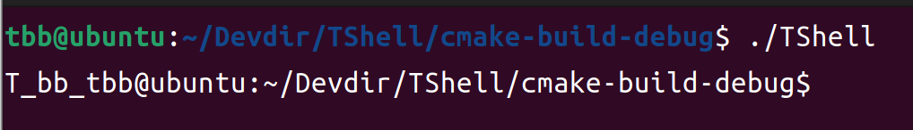

## 自建命令
### 非退出类
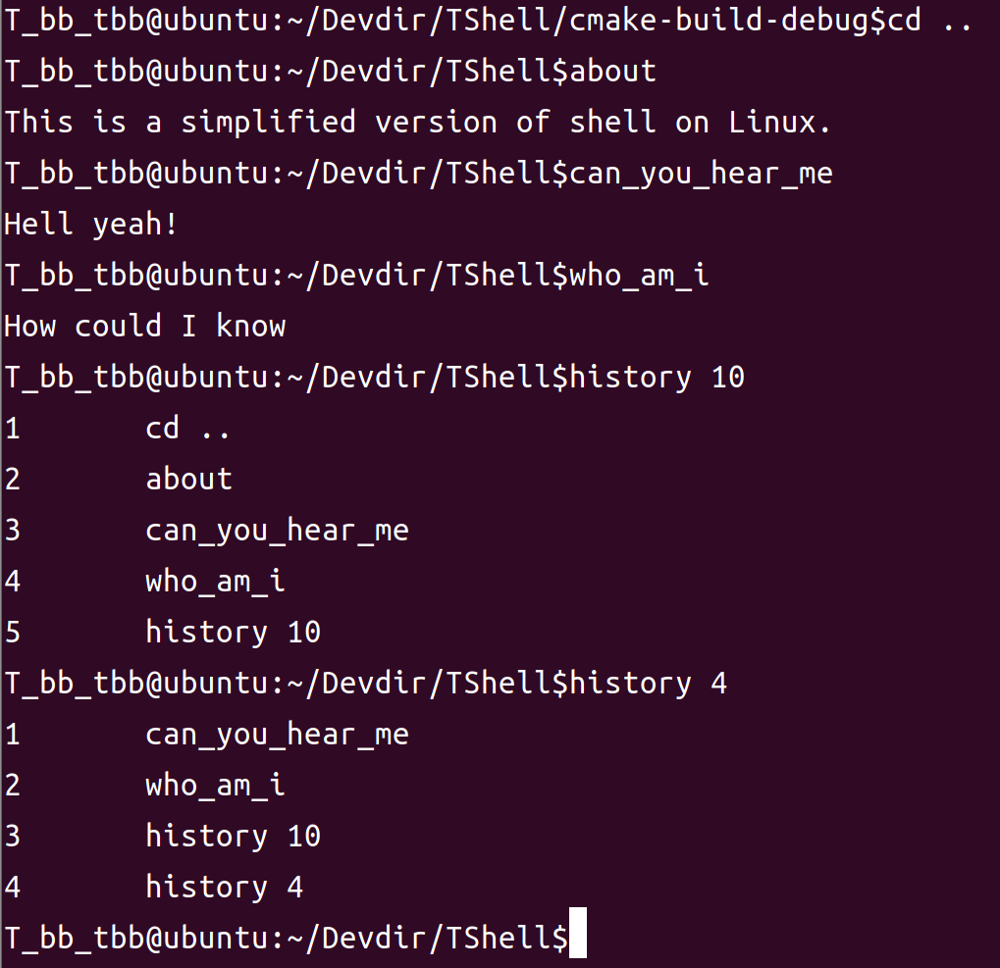

### quit/exit
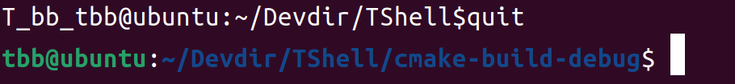

## 程序命令
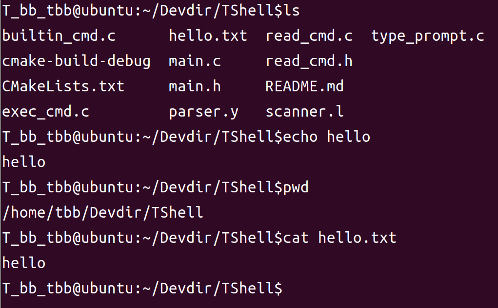

## 重定向
### 输出重定向
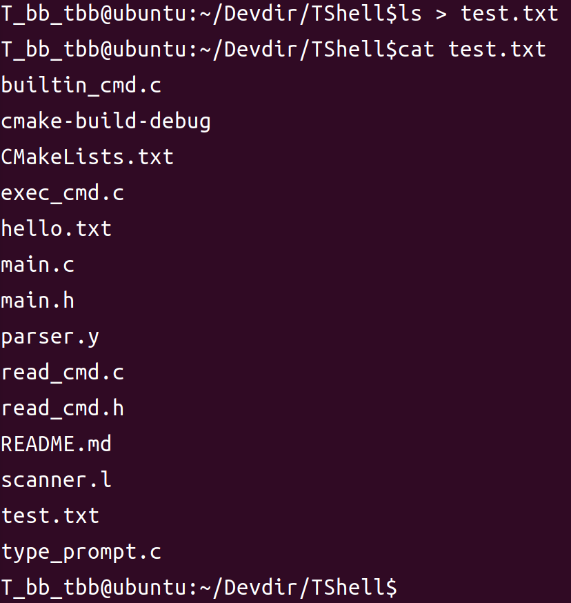

### 输入重定向
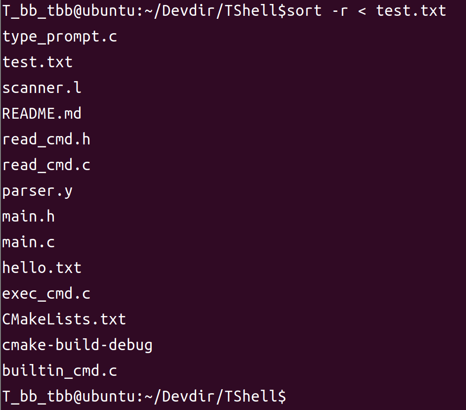

### 输入输出重定向
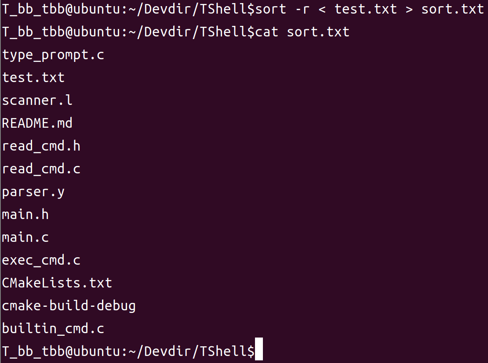

## 管道
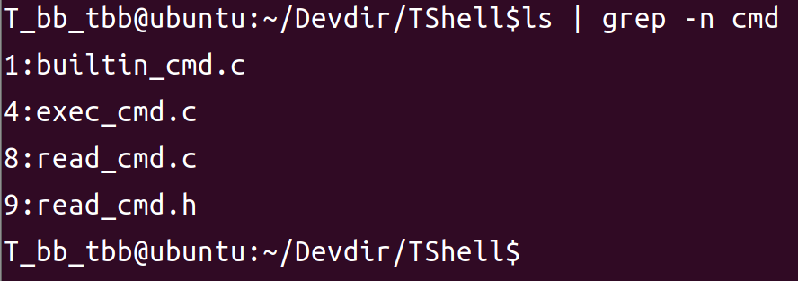

## 连续执行
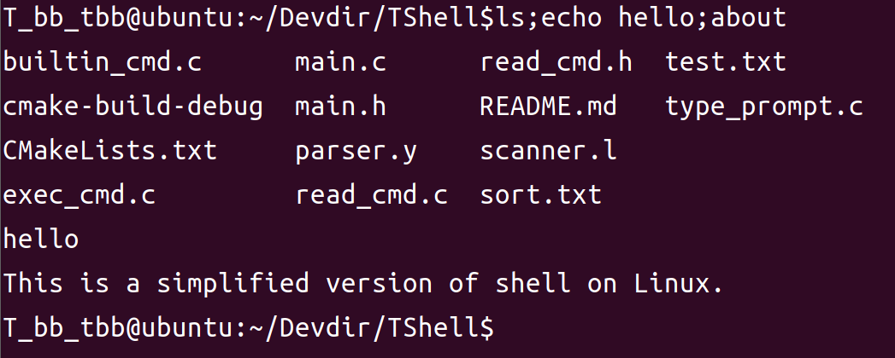

## 运行当前目录中的程序
例如运行自己
在主函数循环开始前加入一行提示语表示程序第一次执行，最后退出时也可以看到第一次退出的是嵌套的TShell
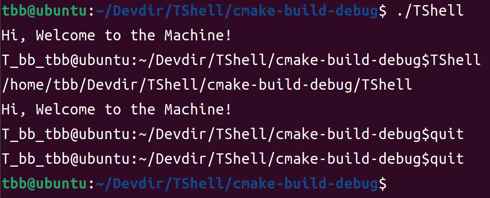

## 【更新】`cd`路径带有`/`或`~`

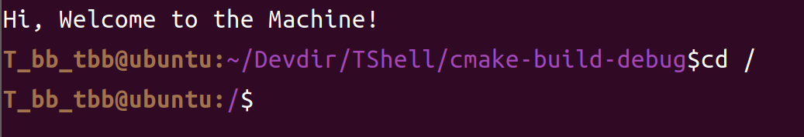

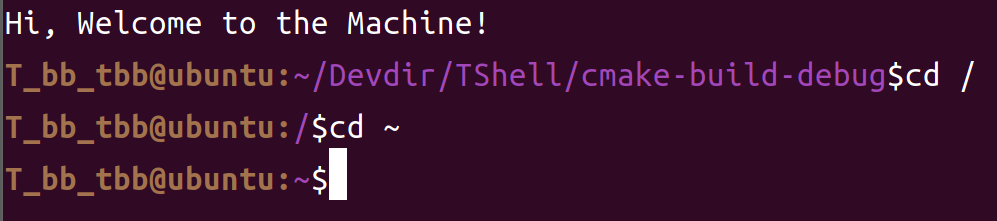

## 【更新】追加输出重定向`>>`

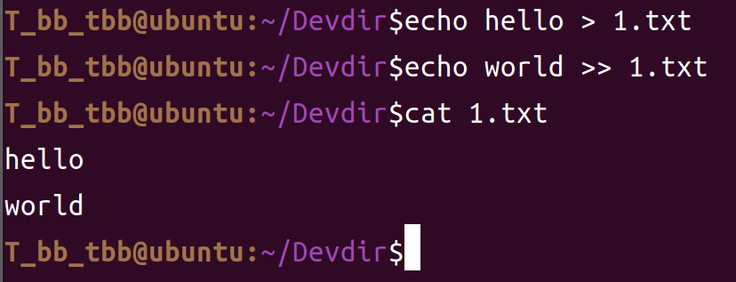

## 【更新】信号处理

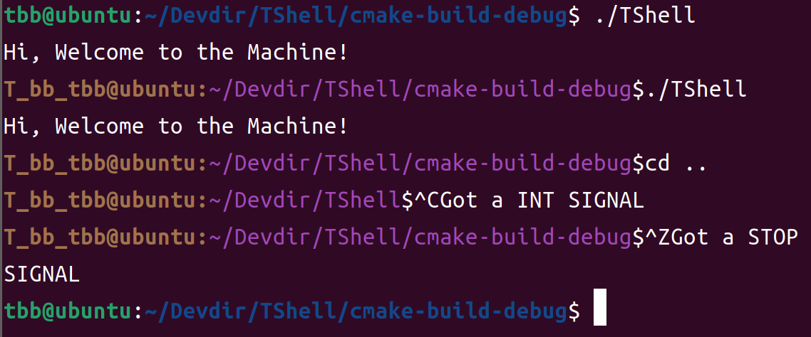

# 遇到的问题

## 词法分析器

### 当输入字符串不合法时会直接退出并显示`Sytax Error`并退出

主要时因为对词法分析器不是很理解，不知道该如何加强稳健性。

### 【解决】`CD`命令不能包含`~`和`/`

修改`scanner.l`中的`ID`正则表达式，将`~`和`/`添加到最前面（因为加在后面会出错，不知道为什么，可能是`/`触发了某种分隔机制）

## 重定向
### 【解决】同时使用输入输出重定向执行会失败
执行`cmd1 < infile > outfile`类型命令，需要改变命令树构建时符号的结合性，将重定向符号`>`和`<`以及还未实现的`>>`设置为右结合。

```c
%left '|' ';'
%left '&'
%right '>'
%right ">>"
%right '<'
```

这样建立的命令树中局部根节点是`CMD_REDO`，其左子树是`CMD_REDI`类型，因此可以实现先执行输入重定向再执行输出重定向。

### 【解决】追加重定向`>>`不知道如何添加到词法分析器中。

感谢助教的引导，因为`>>`是多字符的标志，因此不能直接在`parser.y`中直接使用，需要像`T_ARG`一样声明成标识符。

我在`token`中声明了一个标识符，并在`scanner.l`中添加了正则表达式，设置好规则以后就能识别了。

因为`REDOR`标识符包含了`>`和`>>`两个符号，因此为他包装了一个新的命令构造函数`cmd_redo_check()`，根据`REDOR`选择构造哪个输出重定向命令。

```C
/* in parser.y */
%union{
    int num;
    char *id;
    char *op;
    cmd_t cmd;
    node node;
}

%token<id>      T_ARG
%token<op>      REDOR
//...
%right REDOR
//...
command	        :  basic_command		    { $$ = $1;}
		       //...
		        |  command REDOR command    { $$ = cmd_redo_check($1, $3, 1, $2);}
		        ;
```

```c
/* in scanner.l */
//...
REDO    [>]{1,2}
//...
{REDO}      {yylval = strdup(yytext); return REDOR;}
```

## `history`命令

### 无法不带参数执行。

### 【解决】显示的命令与参数之间没有空格
使用`strncpy()`时指定复制长度时需要计入末尾的`\0`。

### 【解决】包含当前输入的命令
目前方案有：
1. 修改输出时的`history_buff`下标，整体前移一个，需要注意起始位置有效性
2. 改变历史保存记录的运行位置。

我选择了第二种，将`save_history(root)`添加到`exec_cmd()`中除退出外的每个命令后面，对于需要`fork()`执行的进程，添加到父进程等待子进程结束后的位置。

运行结果如下：
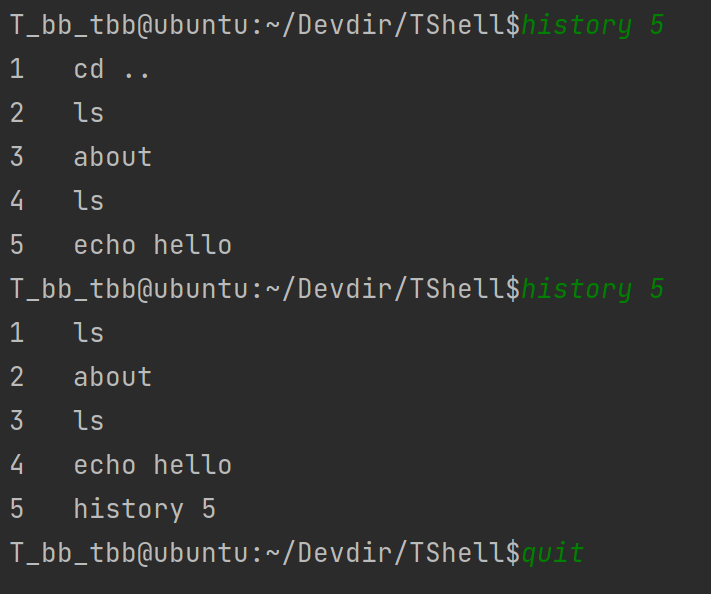

# 参考文章
1. [工程化C的Lab1 ](https://csslab-ustc.github.io/courses/sysprog/lab1/index.html)
2. [自己动手实现linux-->Shell](https://blog.51cto.com/lisea/1788046)
3. [C语言实现一个Shell](https://zhuanlan.zhihu.com/p/360923356)
4. [编译工程附录：flex使用](https://zhuanlan.zhihu.com/p/108167693)
5. [编译工程附录：Bison基础](https://zhuanlan.zhihu.com/p/111445997)